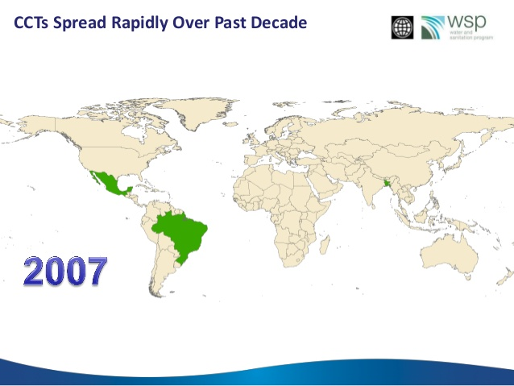
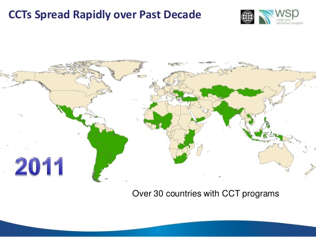

# Intro


## Motivación para el análisis causal {-}

En su breve y sugerente cuento Del rigor en la ciencia, Jorge Luis Borges relata la historia de un imperio en el que los cartógrafos llevaron su arte a un grado de perfección tal, que terminaron por construir un mapa a escala 1:1, tan extenso y detallado como el mismo territorio que pretendía representar. Con el tiempo, ese mapa fue olvidado, y sus ruinas todavía se confunden con las del imperio.

> En aquel Imperio, el Arte de la Cartografía logró tal Perfección que el mapa de una sola Provincia ocupaba toda una Ciudad, y el mapa del Imperio, toda una Provincia. Con el tiempo, estos Mapas Desmesurados no satisficieron y los Colegios de Cartógrafos levantaron un Mapa del Imperio, que tenía el tamaño del Imperio y coincidía puntualmente con él. 
Menos Adictas al Estudio de la Cartografía, las Generaciones Siguientes entendieron que ese dilatado Mapa era Inútil y no sin Impiedad lo entregaron a las Inclemencias del Sol y los Inviernos. En los desiertos del Oeste perduran despedazadas Ruinas del Mapa, habitadas por Animales y por Mendigos; en todo el País no hay otra reliquia de las Disciplinas Geográficas.
(Suárez Miranda, Viajes de Varones Prudentes, Libro Cuarto, Cap. XLV, Lérida, 1658.)
FIN

Sabemos que no podemos capturar la complejidad del mundo en un solo modelo, pero aspiramos a representarlo con la suficiente precisión como para *entenderlo, intervenirlo y mejorarlo*. 

En este sentido, la econometría aplicada moderna se centra en la identificación de relaciones causales. Estas relaciones son fundamentales para comprender cómo funciona el mundo social, y para guiar decisiones informadas en el diseño de políticas públicas.

Como explican Angrist y Pischke en su libro *Mostly Harmless Econometrics*:

> En primer lugar, creemos que la investigación empírica es más valiosa cuando utiliza datos para responder preguntas causales específicas, *como si* se tratara de un ensayo clínico aleatorizado. Esta perspectiva moldea nuestro enfoque hacia la mayoría de las preguntas de investigación. En ausencia de un experimento real, buscamos comparaciones bien controladas y/o cuasiexperimentos naturales. Por supuesto, algunos diseños de investigación cuasiexperimentales son más convincentes que otros, pero .purple[los métodos econométricos utilizados en estos estudios suelen ser bastante simples].
*Mostly Harmless Econometrics*, p. xii 


## Motivación para el análisis causal - ¿Por qué es importante? {-}

¿Cómo lo entendemos? Sin duda, la identificación de relaciones causales es fundamental para entender cómo funcionan las cosas.
Entender la consecuencia de una acción es crucial para entender el mundo que nos rodea. 

Aquí es donde la teoría económica juega un papel central: nos proporciona un marco para interpretar esas relaciones causales, al tiempo que orienta nuestra atención hacia posibles mecanismos. Hacer econometría sin una teoría económica sólida, sin una teoría del cambio ni un esfuerzo por establecer mecanismos, es simplemente machacar datos. 

¿Cómo lo intervenimos? Las relaciones causales nos permiten hacer predicciones sobre el impacto de intervenciones y políticas. Por ejemplo, si sabemos que aumentar la educación de los niños mejora sus ingresos futuros, podemos diseñar políticas educativas que maximicen ese efecto. Sin esta información, el diseño de políticas se convierte en un ejercicio de ensayo y error, muchas veces costoso e ineficaz.

¿Cómo mejoramos? El análisis causal nos permite decir con cierta confianza qué cosas funcionan y bajo qué condiciones. Esto hace posible ajustar intervenciones para maximizar su impacto positivo. Por ejemplo, si sabemos que las transferencias monetarias condicionadas a la asistencia escolar aumentan la matrícula, podemos adaptar ese diseño a otros contextos y poblaciones.

Por esta razón, ha ganado fuerza el enfoque de políticas basadas en evidencia, que busca reemplazar la intuición, la tradición o la ideología con análisis rigurosos del mundo real. La microeconometría aplicada, con su atención al detalle y su vocación por la causalidad, es una herramienta clave en esa transición.

## Microeconometría y política pública {-}

La microeconometría aplicada es una herramienta fundamental para informar y mejorar la formulación de políticas públicas. Sus aportes se pueden clasificar en dos tipos:

**Efectos directos**
Asignación eficiente de recursos: permite identificar qué intervenciones generan mayor impacto por peso invertido.
Mejora de la calidad, eficiencia y efectividad de programas e instituciones.
Focalización en resultados, más allá de insumos o procesos.
Identificación de efectos no previstos, tanto positivos como negativos.
Fortalecimiento de la rendición de cuentas, mediante evaluaciones transparentes.
Efectos indirectos
Alimentar el debate público con evidencia rigurosa que permita contrastar discursos, creencias y enfoques ideológicos.

## Microeconometría y teoría económica {-}

Además de su valor instrumental, la microeconometría contribuye activamente al desarrollo y evaluación de la teoría económica. Entre sus aportes están:

Generar mejor y más información empírica, útil para contrastar modelos.
Reducir el ruido, eliminando hipótesis o mecanismos irrelevantes.
Guiar el diseño de nuevas políticas y experimentos, a partir de evidencia acumulada.
Promover discusiones más transparentes sobre los supuestos, facilitando la crítica constructiva.
Estimular la retroalimentación entre teoría, datos y política.

### Ejemplo exitoso: Progresa (Oportunidades, México, 1990) {-}

Uno de los programas más influyentes y mejor evaluados en América Latina es Progresa, posteriormente conocido como Oportunidades y luego Prospera. Lanzado en México en 1997, su diseño se basó en evidencia empírica y principios de incentivos económicos.

#### 🎯 Objetivo
Reducir la pobreza y mejorar el capital humano de los hogares más vulnerables, especialmente en áreas rurales. Para eso se brindó a los hogares pobres:

- Un ingreso monetario de corto plazo
- Incentivos para invertir en capital humano, especialmente en la educación y salud infantil
- **Mecanismo:** Las transferencias estaban condicionadas a la asistencia escolar de los niños y a visitas regulares a centros de salud

#### Resultados iniciales (2001) {-}

Las evaluaciones experimentales y cuasiexperimentales del programa mostraron efectos significativos:

Shultz (2004): aumento promedio de 0.7 años de escolaridad.
Gertler (2001): reducción del 23% en incidencia de enfermedades.
El programa mostró una focalización efectiva, beneficiando principalmente a los hogares más pobres.


```{r, echo=FALSE, out.width="80%"}


```

## Formulando una buena pregunta causal {-}

Más allá de definir la estrategia empírica, una investigación de calidad comienza por formular preguntas bien planteadas. En el enfoque de Angrist y Pischke, el punto de partida consiste en identificar claramente cuál es la **relación causal de interés**. Esta pregunta guía no solo el análisis, sino también la forma en que interpretamos los resultados y diseñamos la estrategia de identificación. Si no es posible formular de forma precisa y concisa qué efecto queremos estimar, es probable que aún no tengamos un verdadero proyecto de investigación.

Esto no implica que las descripciones sean inútiles: al contrario, los ejercicios descriptivos pueden ser valiosos e incluso necesarios. Pero en la econometría aplicada moderna, la causalidad ocupa un lugar central. Estimar relaciones causales permite poner a prueba directamente teorías sobre cómo funciona el mundo. Además, nos da acceso a contrafactuales, es decir, a estimaciones de qué habría pasado en ausencia de la intervención o del tratamiento.

Para ilustrarlo, pensemos en preguntas clásicas de la literatura:

- ¿Cómo afecta un año adicional de educación al salario?  
- ¿Qué impacto tienen las instituciones democráticas sobre el desarrollo económico?  
- ¿Los hogares pobres se benefician de la limpieza del medio ambiente?  
- ¿Las leyes de control de armas reducen efectivamente la violencia?

Todas estas preguntas comparten una estructura causal: comparan una situación observable con un contrafactual no observado. Y todas ellas podrían, en principio, ser abordadas mediante un diseño experimental o cuasiexperimental adecuado.

## El experimento ideal {-}

Una herramienta útil para clarificar la lógica causal de una investigación es imaginar el **experimento ideal**: aquel que asignaría aleatoriamente la causa de interés —educación, democracia, limpieza ambiental, leyes de armas— y luego compararía los resultados. Aunque muchas veces este experimento es hipotético o inviable, su formulación nos obliga a pensar con precisión: ¿qué grupo recibiría el tratamiento?, ¿qué factores deberíamos mantener constantes?, ¿cómo mediríamos el efecto?

Cuando no es posible siquiera imaginar cómo sería un experimento ideal, puede que estemos enfrentando lo que Angrist y Pischke denominan *preguntas fundamentalmente sin respuesta*. Por ejemplo, preguntas como “¿Qué efecto tiene el género sobre las trayectorias laborales futuras?” o “¿Qué rol juega la raza en los ingresos?” plantean desafíos éticos, conceptuales y metodológicos difíciles de sortear.

En cambio, hay preguntas que, aunque complejas, sí permiten imaginar un experimento. Por ejemplo, si quisiéramos estimar el efecto de comenzar la escuela a una edad más avanzada, podríamos imaginar un diseño en el que a algunos niños se les asigna aleatoriamente empezar el primer grado a los seis años, y a otros, a los siete. Luego, compararíamos sus puntajes en pruebas estandarizadas al final del segundo grado. Aun así, este diseño enfrenta un problema: los niños que comienzan más tarde son también más grandes, y la madurez puede explicar parte de las diferencias. Es decir, la edad y la duración de la escolarización quedarían entrelazadas. Incluso con un experimento ideal, algunos efectos son difíciles de aislar completamente.

## Más allá del diseño: relevancia y aporte científico {-}

Además de identificar con claridad la relación causal y el experimento ideal, una buena investigación causal también debe justificar su importancia. Algunas preguntas clave que los investigadores deben hacerse al definir su objeto de estudio son: ¿por qué esta pregunta es relevante o interesante?, ¿por qué la literatura existente no ha resuelto aún esta cuestión?, y ¿cómo contribuye mi trabajo a avanzar esa frontera?

Estas preguntas ayudan a ubicar el proyecto dentro de un marco más amplio, que no solo busca estimar efectos, sino también producir conocimiento útil, replicable y teóricamente informado.

## 🧰 Checklist para una buena pregunta de investigación causal {-}

```{r checklist-pregunta-causal, echo=FALSE, results='asis'}

library(tibble)
library(knitr)
library(kableExtra)

checklist <- tribble(
  ~Pregunta, ~Descripcion,

  "¿Cuál es la relación causal de interés?",
  "Define con claridad qué variable actúa como causa y cuál como efecto.",

  "¿Puedes describir el experimento ideal?",
  "Imagina cómo se asignaría aleatoriamente el tratamiento y cómo medirías el impacto.",

  "¿Por qué esta pregunta es importante o interesante?",
  "Justifica la relevancia empírica, social o política del tema.",

  "¿Qué aporta respecto a la literatura existente?",
  "Identifica vacíos o limitaciones en estudios previos que tu trabajo busca superar.",

  "¿Qué mecanismos o teoría motivan la hipótesis causal?",
  "Asegúrate de que haya una narrativa teórica detrás de la relación que estudias."
)

kbl(checklist, align = "l", booktabs = TRUE,
    col.names = c("Pregunta", "Descripción"),
    caption = "Checklist para formular una buena pregunta de investigación causal") %>%
  kable_styling(full_width = FALSE, position = "center", bootstrap_options = c("striped", "hover"))
```

## Conceptos Importantes {-}

### El Contrafactual {-}

> ¿Cuál habría sido el resultado para los participantes si **no** hubieran participado?

Este concepto es fundamental en la inferencia causal: cada persona tiene un resultado **observado** y un resultado **potencial no observado**. Este último es el contrafactual, es decir, lo que habría ocurrido si la persona hubiera estado en la otra condición (tratada o no tratada).

---

### Visualizando el Contrafactual {-}

Participante (Tratado)
```{r, ninas1, out.width = "20%", echo = FALSE, fig.align='left'}

```
$Y_1 \Rightarrow$ Resultado observado

No Participante (Control)
```{r, ninas1c, out.width = "20%", echo = FALSE, fig.align='right'}

```
$Y_0 \Rightarrow$ Resultado del contrafactual


### La Banda Sonora {-}

<iframe style="border-radius:12px" src="https://open.spotify.com/embed/playlist/29gLVvN2oYO0p7zB40ts73?utm_source=generator" width="100%" height="352" frameBorder="0" allowfullscreen="" allow="autoplay; clipboard-write; encrypted-media; fullscreen; picture-in-picture" loading="lazy"></iframe>

---

### Resultados Potenciales {-}

Cada individuo tiene dos posibles resultados:

- $Y_i(D=0)$: resultado si **no** recibe el tratamiento
- $Y_i(D=1)$: resultado si **recibe** el tratamiento

Pero solo uno de ellos es observable. 

Por ejemplo, Carolina tiene una pierna rota. Tratamiento: $D=0$ No ir al hospital, $D=1$ Ir al hospital

- $Y_i(0)$: si no va al hospital, su pierna **no** se recupera
- $Y_i(1)$: si va al hospital, su pierna **no** se recupera

Ahora veamos a Camila quien también tiene una pierna rota.

- $Y_i(0)$: si no va al hospital, su pierna **no** se recupera
- $Y_i(1)$: si va al hospital, su pierna **se recupera**

Por últimpo está Mónica  quien también tiene una pierna rota.

- $Y_i(0)$: si no va al hospital, su pierna **se recupera**
- $Y_i(1)$: si va al hospital, su pierna **no** se recupera

Pregunta: ¿a cual de las tres le conviene ir al hospital?

### Problema Fundamental de la Inferencia Causal {-}

Nunca podemos observar los **dos** resultados potenciales para un mismo individuo.

Esto genera un problema de datos faltantes: no sabemos cuál habría sido el resultado bajo la condición alternativa.

Solo observamos **uno** de los dos resultados potenciales. Formalmente:

$$
Y_i = \begin{cases}
  Y_i(D=0) & \text{si } D_i = 0 \\
  Y_i(D=1) & \text{si } D_i = 1 \\
\end{cases}
$$

donde $D_i$ indica si el individuo fue tratado ($D_i=1$) o no ($D_i=0$).


### Establecer Causalidad (Deseo de Clonación) {-}

En el mundo ideal, podríamos clonar personas para observar ambos resultados. Como esto no es posible, buscamos estimaciones mediante grupos de comparación.

Tratado
```{r, ninas1a, out.width = "20%", echo = FALSE, fig.align='center'}

```
$Y_1 \Rightarrow$ Resultado observado


Clon en Control
```{r, ninas1b, out.width = "20%", echo = FALSE, fig.align='center'}

```
$Y_0 \Rightarrow$ Resultado contrafactual


[Ver en YouTube](https://youtu.be/iPBV3BlV7jk)

::: {.video-box}

### 🎥 Video recomendado: *Mastering Metrics*

<iframe width="100%" height="315" src="https://www.youtube.com/embed/iPBV3BlV7jk"
title="Mastering Metrics" frameborder="0"
allow="accelerometer; autoplay; clipboard-write; encrypted-media; gyroscope; picture-in-picture"
allowfullscreen></iframe>

:::


## Ceteris Paribus {-}

> *Todos los demás factores permanecen constantes.*

Este principio es la piedra angular del análisis causal. Para estimar el efecto de una intervención o tratamiento, debemos **aislar su impacto** de todas las demás influencias posibles. Idealmente, quisiéramos comparar un mundo donde algo ocurre con uno donde no ocurre, manteniendo todo lo demás constante.

## Establecer Causalidad {-}

- Nunca observamos ambos estados (tratado y no tratado) para el mismo individuo.
- ¿Qué soluciones existen?
  - Buscar una persona similar en todas las características relevantes.
  - Comparar promedios entre grupos tratados y no tratados (⚠️ puede haber *sesgo de selección*).
  - Comparar antes y después en los mismos individuos (⚠️ puede haber *sesgo de maduración*).


## Solución 1: Buscar una persona similar {-}

### **Ceteris Paribus: ¿Perfecto?**

**Tratada**  
```{r, out.width = "20%", echo = FALSE}

```

- $Y_1 \Rightarrow$ resultado observado


**Control**  
```{r, ninas3, out.width = "20%", echo = FALSE}

```

- $Y_0 \Rightarrow$ resultado del contrafactual


## Efecto Promedio del Tratamiento (ATE) {-}

El **Average Treatment Effect (ATE)** se define como:

\[
ATE = \mathbb{E}[\tau] = \mathbb{E}[Y_i(D=1) - Y_i(D=0)]
\]

Pero si no podemos observar los dos resultados potenciales para un mismo individuo, tampoco podemos calcular directamente este promedio.


---

## Solución 2: Diferencia de Medias= Efecto Causal + Sesgo de Selección

.pull-left[ **Tratados** 
```{r,  out.width = "20%", echo = F}

```
]

.pull-right[ **Controles** 
```{r,  out.width = "20%", echo = F}

```
]

## Solución 2: Diferencia de Medias = Efecto Causal + Sesgo de Selección {-}

Una alternativa común para estimar efectos causales es comparar los promedios de los grupos tratados y no tratados. Sin embargo, esta estrategia suele estar contaminada por **sesgo de selección**: los grupos pueden diferir de manera sistemática en variables que también afectan el resultado.

.pull-left[
**Tratados**  
```{r, out.width = "20%", echo = FALSE}

```
]

.pull-right[
**Controles**  
```{r, out.width = "20%", echo = FALSE}

```
]

---

## Sesgo de Selección {-}

El **sesgo de selección** ocurre cuando las personas que reciben un tratamiento son inherentemente diferentes de aquellas que no lo reciben. Estas diferencias pueden estar asociadas con los resultados que estamos tratando de medir, incluso si no hubieran recibido el tratamiento.

Incluso con muestras grandes, este problema persiste. Por ejemplo, las personas suelen decidir participar en un programa cuando creen que obtendrán beneficios, lo que significa que sus resultados podrían haber sido distintos desde el principio. En otras palabras, $E[Y_i(D=1) - Y_i(D=0)]$ puede ser mayor para quienes se auto-seleccionan.

---

## Solución 3: Comparaciones Antes-Después = Efecto Causal + Efecto de Maduración {-}

Otra estrategia simple consiste en comparar los resultados antes y después del tratamiento para los mismos individuos. Esta comparación, sin embargo, **asume implícitamente que no hay tendencia temporal** en la variable de interés. Es decir, que cualquier cambio entre el "antes" y el "después" se debe exclusivamente al tratamiento.

Esta suposición es débil, especialmente en contextos donde hay aprendizaje, adaptación o efectos acumulativos en el tiempo.

---

## Comparaciones Prohibidas {-}

En el análisis causal riguroso, debemos ser escépticos de dos comparaciones muy comunes:

- **Tratados vs. Controles** sin aleatorización  
- **Pre-tratamiento vs. Post-tratamiento** sin grupo de comparación  

Ambas requieren supuestos extremadamente fuertes —en muchos casos imposibles de verificar o cumplir en la práctica— para identificar un efecto causal válido.

---

## ¿Y Entonces? {-}

Dada la imposibilidad de observar directamente el contrafactual y los riesgos de comparaciones inadecuadas, ¿cómo podemos avanzar en el análisis causal?

.pull-left[
```{r, simon11, out.width = "60%", echo = FALSE}

```

.fuente[Fuente: @banrepcultural]
]

---

## ¿Cómo podemos estimar efectos causales? {-}

Hoy en día contamos con un conjunto robusto de herramientas para abordar esta pregunta. Estas técnicas buscan crear **contrafactuales plausibles**, ya sea mediante diseño experimental o estrategias cuasi-experimentales.

**Entre las principales estrategias se encuentran:**

- **Experimentos aleatorizados**: donde los participantes son asignados aleatoriamente al tratamiento y al control.
- **Métodos cuasi-experimentales**, como:
  - Diferencias en diferencias (DiD)
  - Emparejamiento (Matching)
  - Variables instrumentales (IV)
  - Regresión discontinua (RD)
  - Función de control
  - Controles sintéticos
  - Causal Machine Learning

Cada uno de estos métodos tiene fortalezas y limitaciones, y será explorado en detalle a lo largo del libro.


