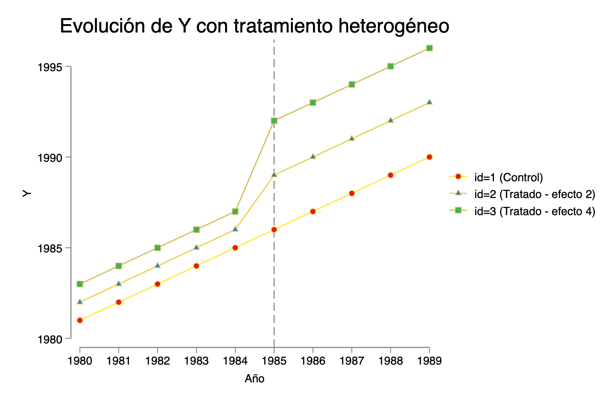
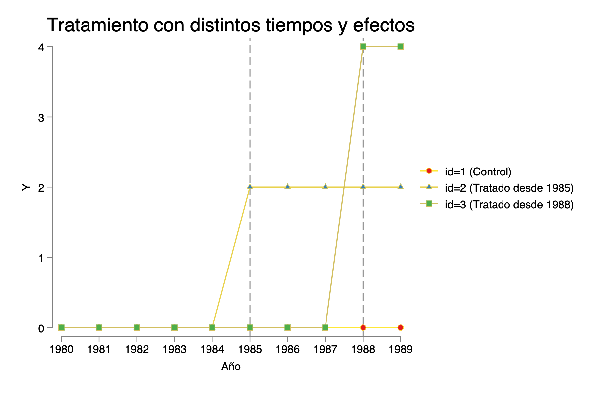

# Datos de Panel, DiD y TWFE en Stata

## Introducción a datos de panel {-}

### ¿Qué es un panel? {-}

Un **panel** (o datos longitudinales) sigue a las **mismas unidades** (individuos, firmas, municipios) a lo largo de **múltiples períodos de tiempo**. La estructura básica es:

$$Y_{it} = \alpha_i + \lambda_t + \beta X_{it} + \varepsilon_{it}$$

donde $\alpha_i$ es un **efecto fijo individual** (todo lo que es constante para la unidad $i$ y que puede estar correlacionado con $X_{it}$) y $\lambda_t$ es un **efecto fijo temporal** (shocks comunes a todas las unidades en el período $t$).

### Comandos básicos en Stata {-}

```stata
xtset id t          // declara el panel: id = unidad, t = tiempo
xtdes               // describe la estructura: ¿balanceado? ¿T mínimo/máximo?
xtsum Y X           // descompone varianza en within y between
xtline Y, overlay   // spaghetti plot: trayectoria de Y por unidad
```

La descomposición de `xtsum` es fundamental:

| Variación | Qué mide | La explota... |
|-----------|----------|---------------|
| **between** | Diferencias entre las medias de cada unidad | OLS pooled |
| **within** | Cambios de cada unidad alrededor de su propia media | FE, FD |
| **overall** | Ambas juntas | — |

### Los cuatro estimadores y cuándo usarlos {-}

| Estimador | Comando Stata | Consistente si... | Observaciones |
|-----------|--------------|-------------------|---------------|
| **OLS pooled** | `reg Y X, cluster(id)` | $\text{Cov}(X_{it}, \alpha_i) = 0$ **y** exog. estricta | Ignora estructura de panel |
| **Efectos fijos (FE)** | `xtreg Y X, fe` | Exog. estricta (aunque $\text{Cov}(X_{it}, \alpha_i) \neq 0$) | Elimina $\alpha_i$ por within; inconsistente si $X_{it}$ endógeno |
| **Primeras diferencias (FD)** | `reg D.Y D.X` | Exog. estricta (aunque $\text{Cov}(X_{it}, \alpha_i) \neq 0$) | Elimina $\alpha_i$ por diferencia; inconsistente si $X_{it}$ endógeno |
| **Efectos aleatorios (RE)** | `xtreg Y X, re` | $\text{Cov}(X_{it}, \alpha_i) = 0$ **y** exog. estricta | Más eficiente que FE si supuesto OK |

**Exogeneidad estricta**: $E[\varepsilon_{it} \mid X_{i1}, \ldots, X_{iT}, \alpha_i] = 0$ — el error idiosincrático no puede estar correlacionado con $X$ en *ningún* período. Si hay endogeneidad en $X_{it}$ (reverse causality, panel dinámico con $Y_{it-1}$), FE y FD también son inconsistentes.

**Test de Hausman** para elegir entre FE y RE:

```stata
xtreg Y X i.t, fe
estimates store fe
xtreg Y X i.t, re
hausman fe ., sigmamore
* p < 0.05 → rechazamos H0 (RE inconsistente) → usar FE
* p > 0.05 → RE es eficiente (no hay correlación entre X y α_i)
```

### La transformación within a mano {-}

FE funciona restando la media individual de cada variable ("demeaning"):

```stata
bysort id: egen media_Y = mean(Y)
bysort id: egen media_X = mean(X)
gen Y_within = Y - media_Y
gen X_within = X - media_X
reg Y_within X_within     // idéntico a xtreg Y X, fe (sin efectos de tiempo)
```

Esto ilustra por qué FE **elimina** cualquier variable constante en el tiempo (no puedes estimar el efecto de género, país de nacimiento, etc. con FE).

### FE vs. FD con T = 2 {-}

Con exactamente **dos períodos**, FE y FD son **algebraicamente idénticos**:

$$\Delta Y_i = \beta \cdot \Delta X_i + \Delta\varepsilon_i$$

es exactamente la regresión within con $T=2$. Esta equivalencia es la base de la conexión entre **DiD y datos de panel** que exploramos a continuación.

---

## DiD = FD = TWFE: la equivalencia en el caso 2×2 {-}

### La equivalencia algebraica {-}

En el caso más simple — **2 grupos** (tratado/control) y **2 períodos** (antes/después) — los siguientes cuatro estimadores producen **exactamente el mismo número**:

1. **DiD manual**: $\hat{\tau} = (\bar{Y}_{T,post} - \bar{Y}_{T,pre}) - (\bar{Y}_{C,post} - \bar{Y}_{C,pre})$
2. **Regresión DiD**: `reg Y trat post D` — coeficiente de $D$ (interacción)
3. **Primeras diferencias**: `reg D.Y D.D` — coeficiente de $\Delta D$
4. **TWFE**: `reghdfe Y D, absorb(id t)` — coeficiente de $D$

No es una aproximación ni un resultado asintótico — es una **identidad algebraica** que se cumple en cada muestra.

```stata
clear
set seed 1234
set obs 400

gen id   = ceil(_n / 2)           // 200 individuos
gen t    = mod(_n - 1, 2)         // t=0 (antes), t=1 (después)
gen trat = (id > 100)             // grupo tratado: id 101–200
gen D    = trat * (t == 1)        // indicador de tratamiento efectivo

gen alpha_i = 2 * id / 200 + rnormal(0, 0.5)
gen eps     = rnormal(0, 1)
gen Y = alpha_i + 1.5 * t + 3 * D + eps    // τ = 3
xtset id t

* ── DiD manual (4 medias) ──────────────────────────────────────────────────────
quietly sum Y if trat==1 & t==0
scalar y_t0 = r(mean)
quietly sum Y if trat==1 & t==1
scalar y_t1 = r(mean)
quietly sum Y if trat==0 & t==0
scalar y_c0 = r(mean)
quietly sum Y if trat==0 & t==1
scalar y_c1 = r(mean)
scalar DiD_manual = (y_t1 - y_t0) - (y_c1 - y_c0)

* ── Regresión DiD clásica: Y = α + βD_i + γt + τ(D_i×t) ──────────────────────
reg Y trat t D, robust
scalar DiD_reg = _b[D]

* ── Primeras Diferencias (T=2): ΔY_i = a + τ·ΔD_i + Δε_i ─────────────────────
reg D.Y D.D, robust
scalar FD_2x2 = _b[D.D]

* ── TWFE: absorbe efectos fijos individual + temporal ──────────────────────────
reghdfe Y D, absorb(id t) vce(robust)
scalar TWFE_2x2 = _b[D]

di "DiD manual    = " %7.4f DiD_manual
di "Regresión DiD = " %7.4f DiD_reg
di "FD            = " %7.4f FD_2x2
di "TWFE          = " %7.4f TWFE_2x2
* → los cuatro deben ser IDÉNTICOS — equivalencia algebraica ✓
```

### Panel largo, adopción simultánea {-}

Con **T > 2** períodos pero todos los tratados adoptando **al mismo tiempo** ($t_0$):

- **DiD manual** (media pre vs. post) = **TWFE** — mismo estimador, mismos pesos
- **FD** ≠ TWFE — FD solo usa las diferencias consecutivas $\Delta Y_t = Y_t - Y_{t-1}$, por lo que solo el período de adopción ($t_0 - 1 \to t_0$) aporta $\Delta D \neq 0$. Con $T$ grande, FD usa mucho menos información y es menos eficiente, aunque sigue siendo consistente para el mismo $\tau$.

```stata
clear
set seed 5678
local inicio = 1980
local fin    = 1990
local tiempo = `fin' - `inicio' + 1
set obs `= 3 * `tiempo''

gen id = ceil(_n / `tiempo')
gen t  = `inicio' + mod(_n - 1, `tiempo')
sort id t
xtset id t

gen D = (id >= 2) * (t >= 1985)   // tratado desde 1985 para id 2 y 3
gen Y = id + 3 * (t - 1980) + 5 * D + rnormal(0, 0.5)

* DiD manual
quietly sum Y if id >= 2 & t >= 1985
scalar post_t = r(mean)
quietly sum Y if id >= 2 & t <  1985
scalar pre_t  = r(mean)
quietly sum Y if id == 1 & t >= 1985
scalar post_c = r(mean)
quietly sum Y if id == 1 & t <  1985
scalar pre_c  = r(mean)
di "DiD manual = " %6.3f (post_t - pre_t) - (post_c - pre_c)   // ≈ 5

reghdfe Y D, absorb(id t) vce(robust)
di "TWFE       = " %6.3f _b[D]     // = DiD manual (equivalencia exacta)

reg D.Y D.D, robust
di "FD         = " %6.3f _b[D.D]   // ≠ TWFE con T>2 (menos eficiente)
```

---

## El supuesto de tendencias paralelas {-}

### ¿Qué dice el supuesto? {-}

DiD identifica el efecto causal $\tau$ bajo el supuesto de **tendencias paralelas**:

> En ausencia de tratamiento, la diferencia entre tratados y controles habría permanecido constante en el tiempo.

Formalmente: $E[Y_{it}(0) - Y_{it-1}(0) \mid D_i = 1] = E[Y_{it}(0) - Y_{it-1}(0) \mid D_i = 0]$

Si el tratado tenía una **tendencia diferente** (crecía más rápido o más lento) antes del tratamiento, DiD captura $\tau$ **más** esa diferencia de tendencias → **sesgo**.

### Diagnóstico en Stata {-}

```stata
* Diagnóstico visual: medias observadas + tendencias lineales pre
xtdidregress (Y) (D), group(id) time(t)
estat trendplots          // gráfico con líneas pre-tratamiento
estat trendplots, omeans  // solo medias observadas
estat trendplots, ltrends // solo tendencias lineales

* Test formal (H0: pendientes pre-tratamiento son iguales)
estat ptrends
* p > 0.05 → no rechazamos H0 → tendencias paralelas plausibles ✓
* p < 0.05 → evidencia contra el supuesto ✗
```

### ¿Qué hacer si se viola? {-}

Opciones en orden de menor a mayor complejidad:

1. **Controlar tendencias lineales por grupo**: `reg Y D i.t c.t#i.trat` — asume que las tendencias pre son lineales y extrapolables
2. **Event study**: estima el efecto en cada período; los coeficientes pre-tratamiento deben ser ≈ 0 si el supuesto se cumple
3. **Diseño alternativo**: buscar un grupo de control más comparable (matching + DiD)

```stata
* Controlar tendencias diferenciales (si se viola levemente)
gen trend = t - t0          // tiempo centrado en adopción
reghdfe Y D c.trend#i.trat, absorb(id t) vce(cluster id)
```

---

##  Contexto rápido: TWFE con adopción escalonada {-}

* **¿Qué verás?** Cómo se comporta el estimador **TWFE** (two-way fixed effects) en distintos escenarios de DiD: 2×2, panel largo, más de dos unidades con **heterogeneidad de efectos**, y **adopción escalonada**.
* **¿Por qué importa?** Con heterogeneidad y/o timing escalonado, TWFE puede promediar **mal** (incluso con **pesos negativos**), sesgando el estimador.
* **¿Cómo lo detectamos?** Con la **descomposición de Bacon** y estudios de eventos.
* **¿Qué alternativas hay?** Estimadores modernos: **CSDID (Callaway & Sant’Anna)**, **did\_imputation (BJS)**, **eventstudyinteract (Sun & Abraham)**, **did\_multiplegt**, **did2s**, **stackedev**, etc.

> 💡 **Nota de ejecución**: Algunas secciones usan comandos/paquetes de SSC. Debes instalarlos al menos una vez (abajo incluyo la instalación con `ssc install …, replace`).

---

## Más unidades, **mismo** año de inicio, **efectos heterogéneos** {-}

* **3 unidades** (id=1 control; id=2 y 3 tratados desde 1985), con **distinto tamaño de efecto**: id=2 → τ=2, id=3 → τ=4.
* Muestra qué promedia TWFE cuando los efectos difieren entre tratados: el **ATT verdadero** (ponderado por obs. tratadas) = 3, y TWFE coincide porque no hay heterogeneidad dinámica.

```stata
clear
local unidades = 3
local inicio   = 1980
local fin      = 1989
local tiempo   = `fin' - `inicio' + 1
local obs      = `unidades' * `tiempo'
set obs `obs'

gen id = .
gen t  = .
forvalues i = 1/`unidades' {
    forvalues j = 0/`=`tiempo'-1' {
        local obsnum = (`i' - 1)*`tiempo' + `j' + 1
        replace id = `i' in `obsnum'
        replace t  = `inicio' + `j' in `obsnum'
    }
}
sort id t
xtset id t
label variable id "Unidad"
label variable t  "Año"

gen D = 0
replace D = 1 if id >= 2 & t >= 1985
label variable D "Tratamiento desde 1985 (id≥2)"

gen Y = 0
replace Y = id + t + cond(D==1, 0, 0) if id == 1
replace Y = id + t + cond(D==1, 2, 0) if id == 2
replace Y = id + t + cond(D==1, 4, 0) if id == 3
label variable Y "Variable dependiente"

twoway ///
    (connected Y t if id==1, msymbol(circle)   lcolor(blue)   lwidth(medium)) ///
    (connected Y t if id==2, msymbol(triangle)  lcolor(red)    lwidth(medium)) ///
    (connected Y t if id==3, msymbol(square)    lcolor(orange) lwidth(medium)) ///
    , xline(1984.5, lpattern(dash) lcolor(gray)) ///
      xlabel(`inicio'(1)`fin') ///
      legend(order(1 "id=1 (Control)" 2 "id=2 (Tratado, τ=2)" 3 "id=3 (Tratado, τ=4)") pos(6) row(1)) ///
      title("Caso 4: heterogeneidad entre tratados, mismo timing") ///
      xtitle("Año") ytitle("Y") name(g4_hetero, replace)

xtreg Y D i.t, fe
reghdfe Y D, absorb(id t) vce(robust)
* ATT verdadero = (5×2 + 5×4) / 10 = 3
di "ATT verdadero (ponderado) = 3 — TWFE debería dar ≈ 3"
```



## Más unidades, **distinto tiempo de tratamiento** (staggered) y **distinto efecto** {-}

* **id=2** se trata desde **1985**; **id=3** desde **1988** (escalonado).
* Los **tamaños de efecto** difieren (2 vs 4).
* Estimamos varias especificaciones y usamos **Bacon decomposition** para ver **qué comparaciones** y **con qué peso** componen el β̂ TWFE.
* Finalmente, estimamos pares 2×2 (id 1–2 e id 1–3) para ver los **componentes** del promedio.


```stata
clear
local unidades = 3
local inicio   = 1980
local fin      = 1989
local tiempo   = `fin' - `inicio' + 1
local obs      = `unidades' * `tiempo'
set obs `obs'

gen id = .
gen t  = .
forvalues i = 1/`unidades' {
    forvalues j = 0/`=`tiempo'-1' {
        local obsnum = (`i' - 1)*`tiempo' + `j' + 1
        replace id = `i' in `obsnum'
        replace t  = `inicio' + `j' in `obsnum'
    }
}
sort id t
xtset id t
label variable id "Unidad"
label variable t  "Año"

* Tratamiento escalonado: id=2 desde 1985 (τ=2), id=3 desde 1988 (τ=4)
gen D = 0
replace D = 1 if id==2 & t >= 1985
replace D = 1 if id==3 & t >= 1988
label variable D "Tratamiento escalonado"

gen Y = id + t + D * 2 * (id==2) + D * 4 * (id==3)
label variable Y "Variable dependiente"

twoway ///
    (connected Y t if id==1, msymbol(circle)   lcolor(blue)   lwidth(medium)) ///
    (connected Y t if id==2, msymbol(triangle)  lcolor(red)    lwidth(medium)) ///
    (connected Y t if id==3, msymbol(square)    lcolor(orange) lwidth(medium)) ///
    , xline(1984.5 1987.5, lpattern(dash) lcolor(gray)) ///
      xlabel(`inicio'(1)`fin') ///
      legend(order(1 "id=1 (Control)" 2 "id=2 (trata 1985, τ=2)" 3 "id=3 (trata 1988, τ=4)") pos(6) row(1)) ///
      title("Caso 5: adopción escalonada") ///
      xtitle("Año") ytitle("Y") name(g5_staggered, replace)

* TWFE y comparaciones por par
reghdfe Y D, absorb(id t) vce(robust)
xtreg Y D i.t if (id==1 | id==2), fe robust   // par 1-2 (limpio)
xtreg Y D i.t if (id==1 | id==3), fe robust   // par 1-3 (limpio)

* Descomposición de Bacon
* ssc install bacondecomp, replace   // instalar si no está
bacondecomp Y D, ddetail
* Ref: Goodman-Bacon (2021), Journal of Econometrics
```



##Descomposición de Bacon y “efecto real” en DiD con adopción escalonada {-}

Cuando el tratamiento se **adopta en momentos distintos** (staggered DiD), el coeficiente de un modelo **TWFE** (efectos fijos de unidad y tiempo) **no** es un simple DiD clásico.  
Goodman-Bacon muestra que ese coeficiente es un **promedio ponderado de muchos DiD 2×2** construidos a partir de las comparaciones disponibles en tus datos.

En concreto, TWFE se puede escribir (a nivel intuitivo) como:

\[
\widehat\beta^{\text{TWFE}} \;=\; \sum_{k} w_k \,\widehat\beta^{(2\times2)}_k,
\]

donde cada \( \widehat\beta^{(2\times2)}_k \) es un DiD “pequeño” entre dos grupos y dos periodos relevantes, y \( w_k \) es su **peso** (depende de tamaños muestrales y de cuánta variación en tratamiento aporta esa comparación).


## Las tres familias de comparaciones 2×2 {-}

1. **Tratados vs. nunca tratados (T vs. U)**  
   - Comparas una cohorte **tratada** con una **nunca tratada** (usando pre vs. post del tratado).

2. **Tratados temprano vs. tratados tarde (Te vs. Cl)** — *antes* de que los tardíos reciban el tratamiento  
   - Los **tardíos** (aún no tratados) actúan como **control provisional** para los **tempranos**.

3. **Tratados tarde vs. tratados temprano (Tl vs. Ce)** — *después* de que los tempranos ya están tratados  
   - Los **tempranos** (ya tratados) sirven como “control” **no válido** para los **tardíos** porque ya tienen efecto del tratamiento.

> **Clave:** En (2) y (3) estás comparando **tratados con tratados** en momentos distintos.  
> Si el **efecto varía por cohorte** (entre unidades) o **en el tiempo desde la adopción** (dinámico), esas comparaciones **no** miden el efecto causal que normalmente te interesa.


## ¿Cuál es “el efecto real” que queremos reportar? {-}

En DiD moderno, el objetivo suele ser el **promedio de efectos entre las observaciones tratadas** en los periodos post, ponderando por su tamaño:

\[
\textbf{ATT}_{\text{overall}}
\;=\;
\frac{\displaystyle\sum_{g,t:\,D=1} N_{g,t}\cdot \text{ATT}(g,t)}
     {\displaystyle\sum_{g,t:\,D=1} N_{g,t}},
\]

donde:
- \( g \) es la **cohorte** (grupo que adopta en un mismo momento),
- \( t \) es el **periodo**,
- \( \text{ATT}(g,t) \) es el efecto en la cohorte-tiempo,
- \( N_{g,t} \) es el número de observaciones tratadas en esa celda.

A esto lo llamamos aquí el **“promedio del tratamiento”** (o **ATT overall**).  
**TWFE** coincide con este promedio **solo si** el efecto **no varía** ni por cohorte ni en el tiempo (homogeneidad).


## ¿Por qué TWFE puede fallar con heterogeneidad? {-}

- **Heterogeneidad entre cohortes**: el tamaño del efecto **difiere por unidad/grupo** (p. ej., id=2 tiene +2; id=3 tiene +4).  
- **Heterogeneidad dinámica**: el efecto **cambia con el tiempo desde la adopción** (p. ej., crece cada periodo post).

En ambos casos, TWFE **mezcla** comparaciones de tipo **Te vs Cl** y **Tl vs Ce**, que **no** capturan el \(\text{ATT}(g,t)\) “puro” porque los “controles” ya tienen (o tendrán) efecto en parte de la ventana.  
El promedio ponderado resultante puede **alejarse** del **ATT overall** que quieres reportar.


## Mini-ejemplos para fijar ideas {-}

### Caso 3 (tu ejemplo con tres unidades, mismo inicio y efecto por cohorte)

- Cohortes tratadas desde 1985:  
  - id=2 con efecto **+2** (constante post)  
  - id=3 con efecto **+4** (constante post)  
- Ambos tienen **el mismo número de periodos post** (1985–1989: 5 cada uno).

**ATT overall (promedio del tratamiento)**  
Promedio entre todas las **observaciones tratadas post**:
\[
\frac{5\cdot 2 \;+\; 5\cdot 4}{5+5} \;=\; \frac{10+20}{10} \;=\; \mathbf{3}.
\]

> Aquí el promedio “intuitivo” **sí** es 3.  
> TWFE puede aproximarlo cuando solo hay heterogeneidad entre cohortes pero no dinámica y las ventanas son simétricas. Aun así, **Bacon** te dirá qué pesos están usando tus comparaciones.

---

###  Caso con **adopción escalonada** y **efectos dinámicos** {-}

- id=2 adopta en 1985 y su efecto **crece** con \(t-\text{timing}\).  
- id=3 adopta en 1988 y su efecto también **crece** con \(t-\text{timing}\).

**ATT overall correcto**:  
haz el promedio de \(\text{ATT}(g,t)\) solo sobre **celdas tratadas** \((g,t)\), ponderado por \(N_{g,t}\).

**TWFE**:  
promedia **también** comparaciones **tratado vs tratado** (tempranos vs tardíos y viceversa) ⇒ si los efectos crecen, esas comparaciones **miden diferencias de efectos**, no el efecto verdadero, y el promedio puede **sesgarse** (incluso con **pesos negativos** en ciertas descomposiciones).

---

## Cómo leer la salida (intuición) {-}

- **`T vs U`**: comparaciones “limpias” (tratados vs nunca tratados).  
- **`Te vs Cl`** y **`Tl vs Ce`**: comparaciones **entre tratados** en distintos momentos.  
- Si los pesos se concentran en estas dos últimas y sospechas **heterogeneidad**, **no confíes** en TWFE como estimador del ATT overall.


## Buenas prácticas (en una lista corta) {-}

- **Define tu parámetro objetivo**: normalmente, **ATT ** (promedio sobre celdas tratadas).  
- **Estima \(\text{ATT}(g,t)\)** con métodos modernos (p. ej., Callaway-Sant’Anna, Sun-Abraham, did-imputation, did2s).  
- **Promedia correctamente**: construye el **ATT ** ponderando por \(N_{g,t}\) solo sobre celdas tratadas.  
- **Usa Bacon como diagnóstico**: revisa qué comparaciones y pesos aporta TWFE; si domina “tratado vs tratado” y hay heterogeneidad, reporta el estimador moderno.

---


- **Qué quieres**: el **promedio del tratamiento** entre las observaciones tratadas (ATT overall).  
- **Qué hace TWFE**: un **promedio ponderado** de múltiples DiD 2×2, incluyendo **tratado vs tratado**.  
- **Cuándo coincide**: solo con **efectos homogéneos** (sin variación por cohorte ni en el tiempo).  
- **Qué hacer**: estima \(\text{ATT}(g,t)\) y promedia **sobre tratadas**; usa Bacon para **auditar** a TWFE.


## ¿Cómo interpretar la salida de `bacondecomp`? {-}


```

Computing decomposition across 3 timing groups
including a never-treated group
-------------------------------

```
       Y | Coefficient  Std. err.      z    P>|z|     [95% conf. interval]
-------------+----------------------------------------------------------------
         D |   2.709677   .3030118     8.94   0.000     2.115785     3.30357
```

**Bacon Decomposition:**

| Tipo                | Beta         | TotalWeight   |
|---------------------|--------------|---------------|
| Early_v_Late        | 2            | 0.2419354906  |
| Late_v_Early        | 4            | 0.0967741935  |
| Never_v_timing      | 2.780487813  | 0.6612903158  |

```

---

##  ¿Qué significa cada fila? {-}

- **Early_v_Late (β=2, peso=0.2419)**  
  Compara **tratados tempranos** vs **tratados tardíos** **en los períodos en que los tardíos aún no están tratados**.  
  → Identifica el efecto de la cohorte **temprana** (≈ 2 en tu simulación).

- **Late_v_Early (β=4, peso=0.0968)**  
  Compara **tratados tardíos** vs **tratados tempranos** **cuando los tempranos ya están tratados**.  
  → Usa **tratados** como “control” (no ideal si hay heterogeneidad). En tu caso rinde ≈ **4** (efecto de la cohorte tardía).

- **Never_v_timing (β≈2.7805, peso=0.6613)**  
  Compara **cohortes tratadas** (temprana y tardía) vs **nunca tratados**.  
  → Es un promedio (con pesos internos) de las comparaciones “tratados vs nunca tratados” a través de los distintos timings; por eso el β cae **entre 2 y 4** y está más cerca de 2 porque la cohorte temprana aporta más periodos post.

> **Idea clave**: El coeficiente **TWFE** final es la **media ponderada** de estos DiD 2×2.

---

## ¿Cuadra el promedio ponderado con el β de TWFE?  {-}

Sí. Los **pesos** suman 1:
- 0.2419354906 + 0.0967741935 + 0.6612903158 = **1.0000** (≈)

Promedio ponderado:
- Aporte Early_v_Late: 2 × 0.2419354906 = **0.483871**
- Aporte Late_v_Early: 4 × 0.0967741935 = **0.387097**
- Aporte Never_v_timing: 2.780487813 × 0.6612903158 = **1.838710**

**Suma**: 0.483871 + 0.387097 + 1.838710 = **2.709677**  
→ Coincide con el **β̂ de TWFE = 2.709677**.

---

## ¿Por qué este β̂ puede **no** ser “el efecto real promedio”?  {-}

Lo que normalmente quieres reportar es el **ATT overall**: el **promedio del efecto entre las observaciones tratadas** (cohorte-tiempo) ponderado por su tamaño:

\[
\text{ATT}_{\text{overall}}
=
\frac{\sum_{g,t: D=1} N_{g,t}\cdot \text{ATT}(g,t)}
     {\sum_{g,t: D=1} N_{g,t}}.
\]

- En **adopción escalonada** (tempranos con más años post que tardíos) y/o con **efectos que difieren por cohorte** o en el **tiempo desde el tratamiento**, **TWFE** mezcla **tres tipos de comparaciones** (incluyendo **tratado vs tratado**), y su promedio ponderado **puede alejarse** del **ATT overall**.

**Ejemplo mental (ilustrativo):**  
Si la cohorte temprana vale **2** (más años post) y la tardía **4** (menos años post), el **promedio correcto entre celdas tratadas** puede ser algo como  
\[
\frac{5\cdot 2 + 2\cdot 4}{5+2} = \frac{18}{7} \approx 2.571,
\]
mientras que **TWFE** te dio **2.7097** porque **incluye** las comparaciones **Early_v_Late** y **Late_v_Early** con pesos 24% y 9.7%.


## ¿Cómo usar esta descomposición en la práctica?  {-}

- Si **Never_v_timing** concentra **casi todo el peso** y los efectos son **homogéneos**, **TWFE** suele estar cerca del **ATT overall**.  
- Si hay **peso relevante** en **Early_v_Late** o **Late_v_Early** **y** sospechas **heterogeneidad** (por cohorte o dinámica), **no** confíes en TWFE para el efecto promedio.

**Recomendación**: Estima \(\text{ATT}(g,t)\) con métodos modernos (p. ej., **csdid**, **eventstudyinteract**, **did_imputation**, **did2s**) y luego construye el **ATT overall** promediando **solo sobre celdas tratadas** con pesos \(N_{g,t}\).


## Resumen en una línea  {-}

**Tu tabla dice**: el β̂ de TWFE (=**2.7097**) es un **promedio ponderado** de tres DiD 2×2; la mayor parte (66.1%) viene de **tratados vs nunca tratados** (≈2.78), y el resto de **tratados vs tratados** (2 y 4).  
**Conclusión**: Para reportar “el efecto real promedio”, usa el **ATT overall** (promedio sobre observaciones tratadas), no el β̂ de TWFE cuando hay heterogeneidad o adopción escalonada.


## Simulación grande (30 unidades × 60 periodos) con **timings y efectos crecientes**  {-}


* Asignamos a cada unidad una **cohorte** (0–5), un **timing de adopción** aleatorio, y un **tamaño de efecto** aleatorio.
* El outcome `Y` crece con el tiempo y **acumula** efecto post-tratamiento: `effect * (t - timing)`.
* Graficamos las trayectorias y estimamos **TWFE** + **Bacon**.


```stata
*********************************************************

clear
local units = 30
local start = 1
local end   = 60

local time = `end' - `start' + 1
local obsv = `units' * `time'
set obs `obsv'

egen id	   = seq(), b(`time')  
egen t 	   = seq(), f(`start') t(`end') 	

sort  id t
xtset id t

lab var id "Panel variable"
lab var t  "Time  variable"
set seed 13082021


cap drop Y
cap drop D
cap drop cohort
cap drop effect
cap drop timing

gen Y 	   = 0		// outcome variable	
gen D 	   = 0		// intervention variable
gen cohort = .  	// total treatment variables
gen effect = .		// treatment effect size
gen timing = .		// when the treatment happens for each cohort
levelsof id, local(lvls)
foreach x of local lvls {
	local chrt = runiformint(0,5)	
	replace cohort = `chrt' if id==`x'
}

levelsof cohort , local(lvls)  //  let all cohorts be treated for now
foreach x of local lvls {
	
	// (a) effect
	
	local eff = runiformint(2,10)
		replace effect = `eff' if cohort==`x'
		
	// (b) timing	
	
	local timing = runiformint(`start' + 5,`end' - 5)	
	replace timing = `timing' if cohort==`x'
		replace D = 1 if cohort==`x' & t>= `timing' 
}

replace Y = id + t + cond(D==1, effect * (t - timing), 0)


levelsof cohort
local items = `r(r)'

local lines
levelsof id

forval x = 1/`r(r)' {
	
	qui summ cohort if id==`x'
	local color = `r(mean)' + 1
	colorpalette tableau, nograph
		
	local lines `lines' (line Y t if id==`x', lc("`r(p`color')'") lw(vthin))	||
}

twoway ///
	`lines', legend(off)
	
	
	xtreg Y i.t D, fe
	reghdfe Y D, absorb(id t)  


bacondecomp Y D, ddetail
```

> 🔍 **Claves**: Este es el entorno “realista” donde TWFE más sufre: **heterogeneidad + escalonamiento** + **dinámicas** → pesos complicados (a veces negativos).


## “Soluciones”: estimadores modernos y gráfico comparativo de estudios de evento  {-}

### Explicación didáctica  {-}

* Simulamos nuevamente con **first\_treat** y **rel\_time** para construir **leads** (`F_#`) y **lags** (`L_#`).
* Definimos cohortes de **nunca tratados** y variables de **cohorte/gvar** para los métodos que lo requieren.
* **Instalamos** paquetes (hazlo una sola vez; luego puedes comentar estas líneas).
* Estimamos:

  * **TWFE** (con `reghdfe`),
  * **csdid**,
  * **did\_imputation**,
  * **did\_multiplegt\_dyn**,
  * **eventstudyinteract**,
  * **did2s**,
  * **stackedev**;
    y graficamos todos juntos con `event_plot`.

> ⚠️ **Detalle técnico**: en `reghdfe Y L_* F_*, absorb(id t) cluster(i)`, tu código agrupa por `i`. Si tu panel es `id`, lo más habitual es `cluster(id)`. **Mantengo tu comando exactamente** (como pediste), pero sugiero revisar el cluster según tu diseño.


```stata
**********************************************************************************************
*Soluciones

clear

local units = 30
local start = 1
local end 	= 60

local time = `end' - `start' + 1
local obsv = `units' * `time'
set obs `obsv'

egen id	   = seq(), b(`time')  
egen t 	   = seq(), f(`start') t(`end') 	

sort  id t
xtset id t


set seed 20211222

gen Y 	   		= 0		// outcome variable	
gen D 	   		= 0		// intervention variable
gen cohort      = .  	// treatment cohort
gen effect      = .		// treatment effect size
gen first_treat = .		// when the treatment happens for each cohort
gen rel_time	= .     // time - first_treat

levelsof id, local(lvls)
foreach x of local lvls {
	local chrt = runiformint(0,5)	
	replace cohort = `chrt' if id==`x'
}


levelsof cohort , local(lvls) 
foreach x of local lvls {
	
	local eff = runiformint(2,10)
		replace effect = `eff' if cohort==`x'
			
	local timing = runiformint(`start',`end' + 20)	// 
	replace first_treat = `timing' if cohort==`x'
	replace first_treat = . if first_treat > `end'
		replace D = 1 if cohort==`x' & t>= `timing' 
}

replace rel_time = t - first_treat
replace Y = id + t + cond(D==1, effect * rel_time, 0) + rnormal()


// generate leads and lags (used in some commands)

summ rel_time
local relmin = abs(r(min))
local relmax = abs(r(max))

	// leads
	cap drop F_*
	forval x = 2/`relmin' {  // drop the first lead
		gen F_`x' = rel_time == -`x'
	}

	
	//lags
	cap drop L_*
	forval x = 0/`relmax' {
		gen L_`x' = rel_time ==  `x'
	}
	
	
// generate the control_cohort variables  (used in some commands)

gen never_treat = first_treat==.

sum first_treat
gen last_cohort = first_treat==r(max) // dummy for the latest- or never-treated cohort


// generate the gvar variabls (used in some commands)
gen gvar = first_treat
recode gvar (. = 0)
*************************************

*Los colegas creativos
// supporting packages
ssc install schemepack, replace
ssc install avar, replace 
ssc install reghdfe, replace
ssc install event_plot, replace
ssc install palettes, replace
ssc install colrspace, replace

// DiD packages
ssc install drdid, replace
ssc install csdid, replace
ssc install did_imputation, replace
ssc install eventstudyinteract, replace
ssc install did_multiplegt, replace
ssc install stackedev, replace
ssc install did2s, replace


************
*** TWFE ***
************

reghdfe Y L_* F_*, absorb(id t) cluster(i)

estimates store twfe 

*************
*** csdid ***
*************

csdid Y, ivar(id) time(t) gvar(gvar) notyet

estat event, window(-10 10) estore(csdd) 

***********************
*** did_imputation  ***
***********************

did_imputation Y i t first_treat, horizons(0/10) pretrend(10) minn(0) 

estimates store didimp	
	
***********************
*** did_multiplegt  ***
***********************

did_multiplegt_dyn Y id t D, effects(10) placebo(10) cluster(id)

matrix didmgt_b = e(estimates) 
matrix didmgt_v = e(variances)

*****************************
***  eventstudyinteract   ***
*****************************

eventstudyinteract Y L_* F_*, vce(cluster id) absorb(id t) cohort(first_treat) control_cohort(never_treat)	

matrix evtstint_b = e(b_iw) 
matrix evtstint_v = e(V_iw)

***************		
*** did2s   ***
***************

did2s Y, first_stage(id t) second_stage(F_* L_*) treatment(D) cluster(id)

matrix did2s_b = e(b)
matrix did2s_v = e(V)

******************
*** stackedev  ***
******************

	
stackedev Y F_* L_* ref, cohort(first_treat) time(t) never_treat(never_treat) unit_fe(id) clust_unit(id)
	
matrix stackedev_b = e(b)
matrix stackedev_v = e(V)


colorpalette tableau, nograph	

event_plot    twfe	csdd    didimp  dcdh_b#dcdh_v   sa_b#sa_v   stackedev_b#stackedev_v did2s_b#did2s_v , 	///
	stub_lag( L_#   Tp#     tau#    Effect_#        L_#         L_#                     L_# 			) 		///
	stub_lead(F_# 	Tm#     pre#    Placebo_#       F_#         F_#                     F_# 			)		///
		together perturb(-0.30(0.10)0.30) trimlead(20) trimlag(20) noautolegend 									///
		plottype(scatter) ciplottype(rspike)  																	    ///
			lag_opt1(msymbol(+)   msize(1.2) mlwidth(0.3) color(black)) 	lag_ci_opt1(color(black)     lw(0.15)) 	///
			lag_opt2(msymbol(lgx) msize(1.2) mlwidth(0.3) color("`r(p1)'")) lag_ci_opt2(color("`r(p1)'") lw(0.15)) 	///
			lag_opt3(msymbol(Dh)  msize(1.2) mlwidth(0.3) color("`r(p2)'")) lag_ci_opt3(color("`r(p2)'") lw(0.15)) 	///
			lag_opt4(msymbol(Th)  msize(1.2) mlwidth(0.3) color("`r(p3)'")) lag_ci_opt4(color("`r(p3)'") lw(0.15)) 	///
			lag_opt5(msymbol(Sh)  msize(1.2) mlwidth(0.3) color("`r(p4)'")) lag_ci_opt5(color("`r(p4)'") lw(0.15)) 	///
			lag_opt6(msymbol(Oh)  msize(1.2) mlwidth(0.3) color("`r(p5)'")) lag_ci_opt6(color("`r(p5)'") lw(0.15)) 	///	 
			lag_opt7(msymbol(V)   msize(1.2) mlwidth(0.3) color("`r(p6)'")) lag_ci_opt7(color("`r(p6)'") lw(0.15)) 	///		
					graph_opt(												///
								title("DiD event study plot") 						///
								xtitle("") 									///
								ytitle("Average effect") xlabel(-20(2)20)	///
								legend(order(1 "TWFE" 3 "csdid (CS 2020)" 5 "did_imputation (BJS 2021)" 7 "did_multiplegt (CD 2020)"  9 "eventstudyinteract (SA 2020)" 11 "stackedev (CDLZ 2019)" 13 "did2s (G 2021)") pos(6) rows(3) region(style(none))) 	///
								xline(-0.5, lc(gs8) lp(dash)) ///
								yline(   0, lc(gs8) lp(dash)) ///
							 ) 
```


## Puntos de aprendizaje (resumen)  {-}

* **TWFE** funciona bien en **2×2** simples, pero con **heterogeneidad** y **timing escalonado** puede:

  * Promediar comparaciones no deseadas,
  * Asignar **pesos negativos**,
  * Usar como “controles” unidades ya tratadas.
* La **descomposición de Bacon** ayuda a entender **quién compara con quién** y **con qué peso**.
* Estimadores modernos (**csdid, eventstudyinteract, did\_imputation, did2s, did\_multiplegt, stackedev**) estiman **ATT(g,t)** y permiten **event studies** consistentes, evitando sesgos típicos de TWFE en estos contextos.

---

## Notas prácticas de ejecución {-}

* **Instalación**: Ejecuta una vez las líneas `ssc install …, replace` (están comentadas en el do-file para no reinstalar cada vez).
* **Clustering**: El cluster correcto es el nivel donde varía el tratamiento — normalmente `cluster(id)` en DiD con unidades de panel.
* **`xtdidregress`**: En Stata 17/18 el comando oficial es `xtdidregress` (no `xtdidreg`).
* **Semillas**: Todos los DGPs del do-file incluyen `set seed` para garantizar replicabilidad.

---

## Descarga los archivos {-}

**Descargar Stata do file:**
[Descargar Stata](https://raw.githubusercontent.com/adiazescobar/libro_cortes/main/dofile/11_TWFE/11_stata.do)

