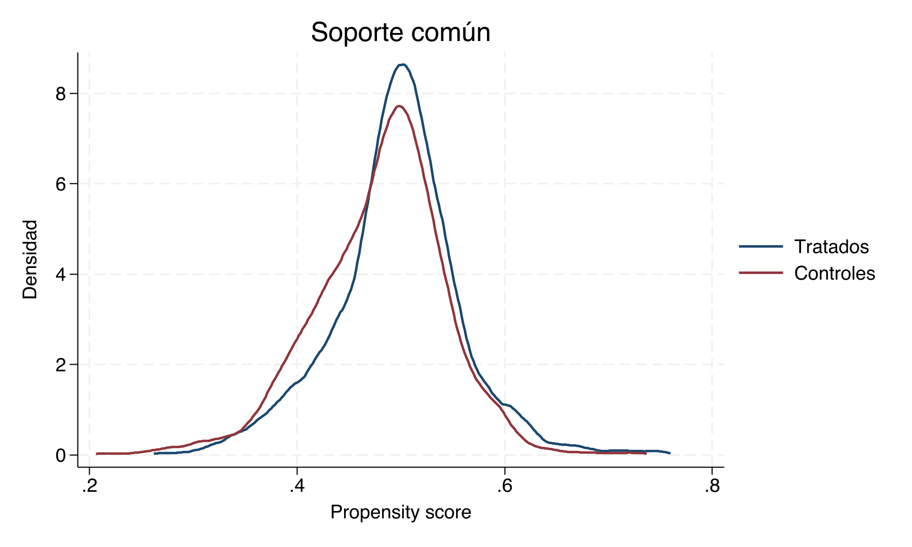
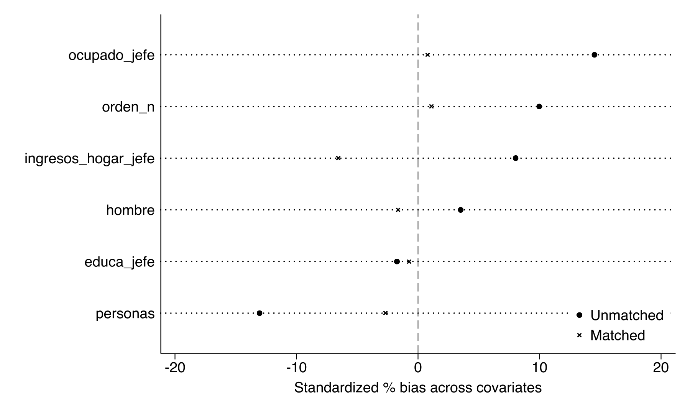

# Propensity score matching — Clase empírica {#psm-stata}

::: {.boxinfo}
**Metas de aprendizaje**

- Implementar el flujo principal con `psmatch2`.
- Diagnosticar selección, soporte y balance antes de interpretar el ATT.
- Replicar el estimando con `teffects psmatch` y explicar diferencias.
- Usar LASSO como herramienta de alta dimensión sin delegarle la selección causal.
:::

## Materiales de la clase {-}

Descarga los archivos antes de comenzar:

- [Do-file guiado de PSM](dofile/16_PSM_IPW_Sinteticos/01_psm_stata_CLASSROOM.do)
- [Base de datos de la práctica](dofile/16_PSM_IPW_Sinteticos/base6.dta)
- [Log completo de Stata](dofile/16_PSM_IPW_Sinteticos/psm_classroom.log)

Instala `psmatch2` una sola vez:

```stata
ssc install psmatch2
help psmatch2
```

`pstest` y `psgraph` se instalan con el mismo paquete.

## Pregunta causal y estimando {-}

La práctica pregunta: **¿cuál es el efecto del tratamiento sobre quienes efectivamente lo recibieron?** El estimando principal es

$$ATT=E[Y(D=1)-Y(D=0)\mid D=1].$$

Antes de ejecutar un comando, clasificamos las variables:

```stata
global Xmust "personas orden_n ocupado_jefe educa_jefe ingresos_hogar_jefe hombre"
global Xflex "c.personas#c.personas c.educa_jefe#c.educa_jefe ///
              c.ingresos_hogar_jefe#c.ingresos_hogar_jefe ///
              i.ocupado_jefe#i.hombre"
```

`Xmust` contiene los **confusores obligatorios** justificados antes de estimar. `Xflex` reúne términos pretratamiento candidatos para capturar no linealidades. Ninguna variable postratamiento puede entrar en cualquiera de los dos grupos.

::: {.boxwarning}
LASSO no descubre los confusores. Una variable causalmente necesaria no se vuelve opcional porque su coeficiente predictivo sea pequeño.
:::

## Mirar la selección antes de corregirla {-}

```stata
use base6.dta, clear
table D, statistic(count D) statistic(mean y2 personas ocupado_jefe educa_jefe)
logit D $Xmust
predict double pscore, pr
```

Salida inicial de la base heredada:

```text
Tratamiento       N       Media de Y
D=0            2,048       -0.976
D=1            1,952       -0.644
Diferencia cruda              0.332

Logit de D: LR chi2(6) = 64.57; p < 0.001
```

La prueba conjunta confirma selección observable, pero la diferencia cruda todavía mezcla efecto y composición. No interpretamos $0.332$ como causal.

## Visualizar soporte común {-}

```stata
twoway (kdensity pscore if D==1, lcolor(navy) lwidth(medthick)) ///
       (kdensity pscore if D==0, lcolor(maroon) lwidth(medthick)), ///
       legend(order(1 "Tratados" 2 "Controles")) ///
       xtitle("Propensity score") ytitle("Densidad")
graph export pscore_distribution.png, replace
```



La figura muestra superposición amplia. Eso permite construir contrafactuales observables, pero también anticipa que el ajuste puede ser modesto. La clase discutirá por qué un ejemplo con selección estadística no necesariamente tiene gran sesgo en el resultado.

## Estimación principal con `psmatch2` {-}

Usamos logit, ATT, un vecino, reemplazo y soporte común:

```stata
psmatch2 D $Xmust, outcome(y2) logit neighbor(1) common ties
scalar att_psm = r(att)
psgraph
pstest $Xmust, treated(D) both graph
graph export psm_balance.png, replace
```

```text
Variable   Muestra       Tratados    Controles    Diferencia
y2         Sin ajustar    -0.644      -0.976         0.332
           ATT            -0.643      -0.936         0.294

Tratados fuera del soporte: 5 de 1,952
```

Aquí el ATT cambia poco. Esa es una conclusión sustantiva del ejemplo, no una prueba de que PSM siempre sea innecesario: las covariables predicen participación, pero en esta base explican poca parte de la diferencia en $Y$.

### Diagnóstico de balance {-}

```text
Muestra       Pseudo R2    MeanBias    MedBias
Sin ajustar      0.012        8.5         9.0
Emparejada       0.001        2.3         1.4
```

<p></p>

Leemos la tabla covariable por covariable. Buscamos diferencias estandarizadas pequeñas —como guía, menores a 10%— y también revisamos varianzas y distribuciones. No decidimos balance con los $p$-valores de pruebas t.

::: {.boxkey}
El matching mejora el diseño observado, pero el balance solo se refiere a las covariables medidas e incluidas. No prueba CIA.
:::

## Decisiones del algoritmo y sensibilidad {-}

```stata
* Cinco vecinos: menor varianza potencial, mayor distancia promedio
psmatch2 D $Xmust, outcome(y2) logit neighbor(5) common ties

* Kernel: usa más controles con pesos por cercanía
psmatch2 D $Xmust, outcome(y2) logit kernel kerneltype(epan) ///
    bwidth(0.06) common

* Caliper expresado en la escala elegida por psmatch2
psmatch2 D $Xmust, outcome(y2) logit neighbor(1) ///
    caliper(0.02) common ties
```

| Especificación | Qué cambia | Diagnóstico obligatorio |
|---|---|---|
| NN(1), reemplazo | Prioriza cercanía | Reutilización de controles |
| NN(5) | Usa más información | Distancia del quinto vecino |
| Kernel | Suaviza con muchos controles | Sensibilidad al bandwidth |
| Caliper | Rechaza matches lejanos | Tratados descartados y nuevo estimando |

No escogemos la fila con menor $p$-valor. Una especificación es defendible cuando sus decisiones estaban justificadas, conserva una población relevante y mejora el balance.

## Verificación con `teffects psmatch` {-}

Para comparar debemos alinear el **mismo estimando**, modelo del tratamiento y número de vecinos:

```stata
teffects psmatch (y2) (D $Xmust, logit), atet nneighbor(1)
estimates store te_psm
```

```text
Estimando: ATET
Método: propensity-score matching, logit, un vecino
ATET estimado: 0.288 (frente a 0.294 con psmatch2 alineado)
Inferencia: errores estándar ajustados por la estimación del propensity score
```

No esperamos igualdad mecánica. `psmatch2` y `teffects psmatch` pueden resolver de manera distinta los empates, el soporte, la reutilización de controles y la estimación de la varianza. Si los coeficientes difieren, primero comprobamos estimando, muestra, enlace logit/probit, vecinos, caliper y empates; no concluimos automáticamente que uno está “mal”.

::: {.boxexam}
**Ejercicio tipo examen 1.** `psmatch2` entrega 0.294 y `teffects psmatch` 0.288. Enumere cinco decisiones que debe armonizar antes de interpretar la diferencia. ¿Exigiría que los errores estándar coincidieran? Justifique.
:::

## Machine learning con disciplina causal {-}

### La estrategia incorrecta {-}

```stata
* NO usar como selector causal automático
lasso logit D $Xmust $Xflex
```

Esta regresión optimiza predicción de $D$. Puede omitir un predictor importante de $Y(D=0)$ o $Y(D=1)$ y seleccionar un predictor casi exclusivo del tratamiento que empeore la superposición. Por eso no usamos el conjunto seleccionado como si fuera una lista descubierta de confusores.

### Estrategia recomendada: `telasso` {-}

`telasso` estima conjuntamente modelos de resultado y tratamiento con LASSO y construye un estimador ortogonal y doblemente robusto. Los confusores obligatorios permanecen sin penalizar; LASSO opera sobre candidatos pretratamiento de alta dimensión.

```stata
telasso (y2 $Xflex, ainclude($Xmust)) ///
        (D  $Xflex, ainclude($Xmust)), ///
        atet selection(plugin) xfolds(5) resample(3) rseed(1298)
estimates store te_lasso
```

```text
ATET telasso = 0.335
Error estándar robusto = 0.034
Controles candidatos = 7; seleccionados = 6
```

> La sintaxis exacta de las opciones puede variar con la versión de Stata. Antes de la clase se verifica con `help telasso`; el do-file registra la versión utilizada.

La comparación tiene tres columnas conceptualmente distintas:

| Estimador | Función en la clase | Qué no debemos afirmar |
|---|---|---|
| `psmatch2` | Diseño visible, soporte y balance | Que el matching elimina confusión no observada |
| `teffects psmatch` | Verificación nativa e inferencia ajustada | Que replica exactamente cada decisión de `psmatch2` |
| `telasso` | Benchmark de alta dimensión, ortogonal y doblemente robusto | Que LASSO conoce el DAG o descubre causalidad |

::: {.boxexam}
**Ejercicio tipo examen 2.** Una estudiante permite que LASSO elimine educación porque su coeficiente en el modelo de tratamiento es pequeño. Educación predice fuertemente el resultado. Explique por qué esa decisión puede aumentar sesgo y proponga una especificación causalmente defendible.
:::

## Cuando PSM puede empeorar el diseño {-}

King y Nielsen advierten que podar observaciones únicamente por distancia en el propensity score puede aumentar desequilibrios en otras dimensiones de $X$. En el laboratorio repetimos el diagnóstico para cada algoritmo y comparamos la distribución conjunta de covariables, no solo la del puntaje.

::: {.boxwarning}
Si el balance empeora, el soporte se vuelve muy estrecho o el efecto depende fuertemente del algoritmo, el resultado correcto no es ocultar esa especificación. Es reconocer que el diseño observacional no sostiene una conclusión robusta.
:::

## Lista de verificación para entregar {-}

1. Definir ATT o ATE antes de estimar.
2. Justificar confusores obligatorios y excluir variables postratamiento.
3. Mostrar soporte común y describir unidades descartadas.
4. Reportar balance antes y después, no solo el efecto.
5. Presentar `psmatch2` como estimación principal y `teffects psmatch` como contraste armonizado.
6. Si se usa LASSO, separar selección predictiva de razonamiento causal y reportar `telasso` como extensión.
7. Discutir sensibilidad a algoritmo, vecinos, caliper y población con soporte.

## Lecturas y ayuda de Stata {-}

- Leuven, E. y Sianesi, B. (2003). `PSMATCH2`, módulo de Stata disponible en SSC.
- `help teffects psmatch` y `help tebalance`.
- `help telasso` y la documentación de Stata sobre *Treatment-effects estimation using lasso*.
- King, G. y Nielsen, R. (2019). “Why Propensity Scores Should Not Be Used for Matching”, *Political Analysis*.
