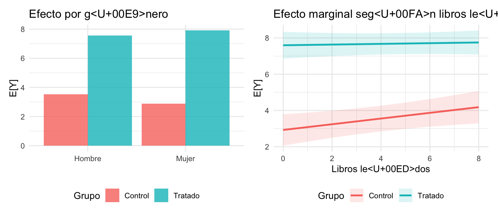
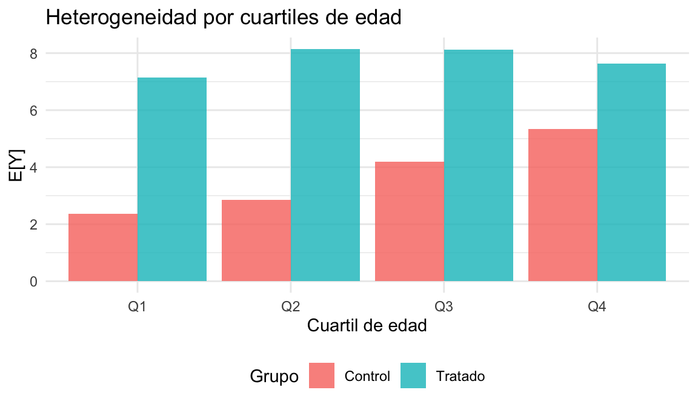

# Experimentos Aleatorizados en Stata

::: {.boxinfo}
**Objetivo del capítulo**

En el capítulo anterior formalizamos la teoría de resultados potenciales, la descomposición del sesgo de selección, su conexión con el sesgo por variable omitida, y los **cuatro escenarios de diseño** experimental. Ahora implementamos todo esto paso a paso en Stata, usando datos reales de un experimento de aula replicado en cuatro semestres.

- Implementar los **cuatro escenarios de regresión** (simple, con controles, estratificado, estratificado + controles).
- Ejecutar **diagnósticos de balance**, **efectos heterogéneos** y el **truco de centrar** de Wooldridge.
- Manejar **inferencia estadística** (SE robustas, clusters, bootstrap).
- Producir **reporte reproducible** exportable a Excel/PDF.

### Lecturas {-}

- **Paper Alert:** [When Should You Adjust Standard Errors for Clustering? (NBER w24003)](https://www.nber.org/papers/w24003)
- **Teoría:** [Jakiela & Ozier — Handout](http://economics.ozier.com/econ626/lec/econ626-L07-handout-2019.pdf)
- **Herramienta:** [J-PAL — Power calculations](https://www.povertyactionlab.org/resource/power-calculations)
:::


## Recordatorio teórico (del capítulo anterior) {-}

*1) Setup*

- Unidades: \(N\).
- Tratamiento: \(D_i \in \{0,1\}\). Asignado de manera aleatoria.
- Resultados potenciales: \(Y_i(D=1),\, Y_i(D=0)\).
- Resultado observado:
  \[
  Y_i \;=\; D_i\,Y_i(D=1) \;+\; (1-D_i)\,Y_i(D=0).
  \]
- Tamaños de muestra:
  - Tratados: \(N_1 = \sum_i \mathbb{1}\{D_i=1\}\).
  - Control: \(N_0 = \sum_i \mathbb{1}\{D_i=0\}\).

 *2) Supuestos*

1. **Asignación aleatoria:** cada unidad \(i\) es asignada de manera independiente al tratamiento con probabilidad \(p\).
   \[
   D_i \;\perp\; \{Y_i(1), Y_i(0)\}.
   \]
2. **SUTVA** (Stable Unit Treatment Value Assumption): no hay interferencia entre unidades ni versiones del tratamiento.
   En español: no hay externalidades ni efectos de equilibrio general que cambien los resultados potenciales de otros individuos.

*3) Parámetros y equivalencias clave*

- **ATE:** \(\tau = \mathbb{E}[Y(1)-Y(0)]\).
- **ATT:** \(\mathbb{E}[Y(1)-Y(0) \mid D=1]\).
- **ATU:** \(\mathbb{E}[Y(1)-Y(0) \mid D=0]\).

Bajo aleatorización: \(ATE = ATT = ATU\), porque los grupos son comparables en todo (observable y no observable).

- **Identificación con aleatorización:**
  \[
  \mathbb{E}[\,Y \mid D=1\,] - \mathbb{E}[\,Y \mid D=0\,] \;=\; \tau.
  \]
- **Estimador por diferencia de medias:**
  \[
  \hat{\tau} \;=\; \bar{Y}_{D=1}-\bar{Y}_{D=0}.
  \]
- **Descomposición (sin aleatorización):**
  \[
  \underbrace{\mathbb{E}[Y \mid D=1] - \mathbb{E}[Y \mid D=0]}_{\text{naïve}}
  \;=\;
  \underbrace{\tau}_{\text{efecto causal}}
  \;+\;
  \underbrace{\mathbb{E}[Y(0)\mid D=1] - \mathbb{E}[Y(0)\mid D=0]}_{\text{sesgo de selección}}.
  \]

::: {.boxnote}
**Conexión con variable omitida (cap. anterior):** en regresión, el sesgo de selección es exactamente el sesgo por variable omitida: \(\text{sesgo} = \gamma \cdot \text{Cov}(D,M)/\text{Var}(D)\). La aleatorización garantiza \(\text{Cov}(D,M)=0\) para **cualquier** variable \(M\), observable o no.
:::


## Paso a Paso para un RCT {-}

### PASO 1) Diseñar el experimento {-}
- Definir la **población objetivo** y el **tratamiento**.
- Determinar el **tamaño de muestra** necesario para detectar un efecto significativo (usando `power` en Stata/R).


### Paso 2) Aleatorizar la asignación (Stata) {-}

Abajo tienes varias formas de asignar tratamiento en Stata. Incluyo opciones con `runiform()` (base) y con el comando de SSC `randtreat` (estratificado, proporciones desiguales, clusters y manejo de *misfits*).

> **Regla de oro:** fija una semilla reproducible y *guárdala* en el log/notas del proyecto.
```stata
* Reproducibilidad
set seed 20250813
local RNGSTATE = c(rngstate)   // guardar estado; opcionalmente escríbelo en tu log
display as text "Seed guardada: `RNGSTATE'"
```

*Bernoulli simple (50/50) con `runiform()`*

Asigna tratamiento con probabilidad 0.5 a cada unidad.

```stata
* Supón que tienes un id por fila
sort id
gen double u = runiform()
gen byte D = (u < 0.5)           // 1=tratado, 0=control
tab D
drop u
```

**Cambio de proporción (p=0.30):**

```stata
gen double u = runiform()
gen byte D = (u < 0.30)
tab D
drop u
```

**Asignación con conteo exacto de tratados (p.ej., 40% exacto)**

Asegura exactamente `round(N*0.40)` tratados.

```stata
count
local N      = r(N)
local Ntr    = round(`N'*0.40)   // número exacto de tratados
gen double u = runiform()
sort u
gen byte D   = (_n <= `Ntr')
tab D
drop u
```

**Estratificada** (bloques) con `runiform()`

Mantén la proporción deseada **dentro de cada estrato** (ej., por `mujer` × `programa`).

> Con `round()` obtienes conteo **exacto por estrato**; globalmente puede variar levemente si los tamaños de estrato son impares.

```stata
egen long strata = group(mujer programa), label
bys strata: gen double u = runiform()
bys strata (u): gen byte D = (_n <= round(_N*0.50))   // 50/50 exacto en cada estrato
tab D
by strata: tab D
drop u
```

**Proporción distinta por estrato (p.ej., 40%):**

```stata
bys strata: gen double u = runiform()
bys strata (u): gen byte D = (_n <= round(_N*0.40))
by strata: tab D
drop u
```

**Cluster** (aleatoriza a nivel del cluster y la pasa a individuos)

Ej.: clusters en `escuela`.

```stata
* Una fila por cluster
preserve
keep escuela
duplicates drop

gen double u = runiform()
sort u
* 50% de escuelas tratadas
count
local C = r(N)
local Ctr = round(`C'*0.50)
gen byte D_cluster = (_n <= `Ctr')
tempfile cl
save `cl', replace
restore

* Trae la asignación al nivel individual
merge m:1 escuela using `cl', keep(match master) nogen
gen byte D = D_cluster
tab D
```

Usando **`randtreat`** (SSC): multi-brazos, proporciones desiguales, estratos y *misfits*

**Instalación**

```stata
ssc install randtreat, replace
```

**Binario 50/50 (sin estratos)**

```stata
randtreat, generate(D) multiple(2) setseed(20250813)
tab D
```

**Binario 50/50 dentro de estratos (`mujer` × `programa`)**

```stata
randtreat, generate(D) multiple(2) strata(mujer programa) setseed(20250813)
by mujer programa: tab D
```

** Proporciones desiguales (30% tratado, 70% control)**

```stata
randtreat, generate(D) multiple(2) unequal(0.30 0.70) setseed(20250813)
tab D
```

** Multi-brazo (T1/T2/C = 0.4/0.4/0.2) con estratos**

```stata
randtreat, generate(arm) multiple(3) unequal(0.40 0.40 0.20) ///
    strata(mujer programa) setseed(20250813)
tab arm
by mujer programa: tab arm
```

**Manejo de *misfits***
Cuando el tamaño de estrato no es divisible por los brazos/proporciones, usa `misfits()`:

* `misfits(strata)` o `misfits(wstrata)`: resuelve dentro de cada estrato (ponderado o no).
* `misfits(global)` o `misfits(wglobal)`: resuelve a nivel global priorizando las proporciones totales.
* `misfits(missing)`: deja *misfits* sin asignar para que los decidas manualmente.

```stata
randtreat, generate(arm) multiple(3) unequal(0.40 0.40 0.20) ///
    strata(mujer programa) misfits(wstrata) setseed(20250813)
```

**Forzar número exacto de tratados totales** (binario)

> Útil si necesitas exactamente `N_t` tratados (no solo proporción).

```stata
* Por ejemplo, exactamente 50 tratados en total:
randtreat, generate(D) multiple(2) ntreated(50) setseed(20250813)
tab D
```

**Cluster + `randtreat`**
Ejecuta `randtreat` sobre los **clusters únicos** y luego une a individuos.

```stata
preserve
keep escuela mujer programa
duplicates drop

* 2 brazos 50/50 por estratos de escuela (y opcionalmente otras):
randtreat, generate(Dcl) multiple(2) strata(mujer programa) setseed(20250813)
tempfile cl
save `cl', replace
restore

merge m:1 escuela using `cl', nogen
gen byte D = Dcl
tab D
```

### PASO 3) Verificar el balance de covariables {-}

Nuestra base `data.dta` contiene datos de un experimento de aula replicado en **cuatro semestres**. En cada semestre, a un grupo se le entregaron **definiciones de palabras difíciles** (tratamiento) y al otro un **texto crítico de economía** (control), y luego todos presentaron el mismo quiz de vocabulario.

```stata
use "data.dta", clear

* Tratamiento 1=B (definiciones), 0=A (texto crítico)
gen D = (grupo == "B")
label define Dlbl 0 "Control" 1 "Tratado"
label values D Dlbl

* Outcome y controles
gen y        = resultado
gen mujer    = (genero == "Mujer")
gen pregrado = (programa == "Pregrado")
gen maestria = (programa == "Maestría")

* Semestre como estrato (variable clave para escenarios 3 y 4)
tab semestre D

global X edad mujer libros pregrado maestria
```
* Programa de diferencia de medias con t-test y opción de guardar resultados en un archivo .dta**

1. **Pruebas univariadas (t‐tests):** comparar medias de cada covariable \(X\) entre \(D=1\) y \(D=0\).  
   Objetivo: **no rechazar** que las medias son iguales.
2. **Prueba conjunta (F‐test):** regresión de \(D\) sobre \(X\) (LPM) y test conjunto de significancia de \(X\).
3. **Modelos binarios:** `logit/probit` de \(D\) sobre \(X\); evaluar razón de verosimilitud o \(\chi^2\) conjunta.
4. **Si se rechaza balance:** revisar procedimiento (bloqueos/estratos, reasignación, control por \(X\) pretratamiento en la estimación).

```stata
cap program drop difmedias
program define difmedias, rclass
    version 18
    syntax varlist(min=1) [, BY(varname) SAVEPOST(string asis)]
    if ("`by'"=="") {
        di as err "Necesitas especificar , by(varname)."
        exit 198
    }
    local vars `varlist'

    local do_post = 0
    if ("`savepost'"!="") local do_post = 1
    tempname posth
    if `do_post' {
        postfile `posth' str32 variable ///
            double mean_T mean_C diff tstat pval se sd_T sd_C N_T N_C ///
            using "`savepost'", replace
    }

    di as txt "Var{col 22}Mean_T{col 33}Mean_C{col 44}Diff{col 55}t{col 66}p"
    foreach v of local vars {
        qui ttest `v', by(`by')

        local mu1 = r(mu_1)
        local mu2 = r(mu_2)
        local sd1 = r(sd_1)
        local sd2 = r(sd_2)
        local N1  = r(N_1)
        local N2  = r(N_2)
        local t   = r(t)
        local se  = r(se)
        local p   = r(p)

        local mean_T = `mu2'
        local mean_C = `mu1'
        local diff   = `mu2' - `mu1'

        di as res "`v'" "{col 22}" %9.3f `mean_T' "{col 33}" %9.3f `mean_C' "{col 44}" %9.3f `diff' "{col 55}" %9.3f `t' "{col 66}" %9.3f `p'

        if `do_post' {
            post `posth' ("`v'") (`mean_T') (`mean_C') (`diff') (`t') (`p') (`se') (`sd2') (`sd1') (`N2') (`N1')
        }
    }
    if `do_post' postclose `posth'
end


* Balance de X
difmedias $X, by(D) savepost("Table_Balance_raw.dta")

use "Table_Balance_raw.dta", clear
order variable mean_T mean_C diff tstat pval se sd_T sd_C N_T N_C
export excel using "Table_Balance_raw.xlsx", firstrow(variables) replace

* ALTERNATIVAS 
cap which iebaltab
if _rc ssc install ietoolkit, replace

iebaltab $X, grpvar(D) control(0) rowvarlabels ftest ///
     savexlsx("Table_Balance.xlsx") replace format(%9.3f)

eststo clear
eststo: reg   D $X, vce(robust)
test $X
eststo: logit D $X, vce(robust)
eststo: probit D $X, vce(robust)

esttab, se star(* 0.10 ** 0.05 *** 0.01) ///
    stats(N r2, fmt(%9.0g %9.3f) labels("N" "R2")) ///
    nomtitle compress

```

**Resultados del balance (con nuestros datos):**

<table class="table table-striped table-condensed" style="width: auto !important; margin-left: auto; margin-right: auto;">
<caption>(\#tab:balance-table)(\#tab:balance-table)Balance de covariables (t-tests)</caption>
 <thead>
  <tr>
   <th style="text-align:left;">  </th>
   <th style="text-align:left;"> Variable </th>
   <th style="text-align:right;"> Media_T </th>
   <th style="text-align:right;"> Media_C </th>
   <th style="text-align:right;"> Diff </th>
   <th style="text-align:center;"> t </th>
   <th style="text-align:center;"> p-valor </th>
  </tr>
 </thead>
<tbody>
  <tr>
   <td style="text-align:left;"> t...1 </td>
   <td style="text-align:left;"> edad </td>
   <td style="text-align:right;"> 26.513 </td>
   <td style="text-align:right;"> 23.548 </td>
   <td style="text-align:right;"> 2.964 </td>
   <td style="text-align:center;"> 1.842 </td>
   <td style="text-align:center;"> 0.071 </td>
  </tr>
  <tr>
   <td style="text-align:left;"> t...2 </td>
   <td style="text-align:left;"> mujer </td>
   <td style="text-align:right;"> 0.282 </td>
   <td style="text-align:right;"> 0.258 </td>
   <td style="text-align:right;"> 0.024 </td>
   <td style="text-align:center;"> 0.222 </td>
   <td style="text-align:center;"> 0.825 </td>
  </tr>
  <tr>
   <td style="text-align:left;"> t...3 </td>
   <td style="text-align:left;"> libros </td>
   <td style="text-align:right;"> 3.674 </td>
   <td style="text-align:right;"> 2.726 </td>
   <td style="text-align:right;"> 0.949 </td>
   <td style="text-align:center;"> 1.169 </td>
   <td style="text-align:center;"> 0.247 </td>
  </tr>
  <tr>
   <td style="text-align:left;"> t...4 </td>
   <td style="text-align:left;"> pregrado </td>
   <td style="text-align:right;"> 0.513 </td>
   <td style="text-align:right;"> 0.355 </td>
   <td style="text-align:right;"> 0.158 </td>
   <td style="text-align:center;"> 1.325 </td>
   <td style="text-align:center;"> 0.190 </td>
  </tr>
  <tr>
   <td style="text-align:left;"> t...5 </td>
   <td style="text-align:left;"> maestria </td>
   <td style="text-align:right;"> 0.000 </td>
   <td style="text-align:right;"> 0.000 </td>
   <td style="text-align:right;"> 0.000 </td>
   <td style="text-align:center;"> NaN </td>
   <td style="text-align:center;"> NaN </td>
  </tr>
</tbody>
</table>


**Prueba conjunta (LPM):** F = 3.249, p-valor = 0.017. Se rechaza balance conjunto.

### PASO 4) Estimar el efecto del tratamiento: los cuatro escenarios {-}

En el capítulo anterior derivamos **cuatro especificaciones** según el diseño experimental. Ahora las implementamos en Stata, usando `semestre` como variable de estrato \(S_i\):

::: {.table .table-bordered .table-striped}
| Escenario | Regresión | Objetivo |
|:---:|:---|:---|
| 1 | \( Y_i = \alpha + \tau D_i + u_i \) | Identificación pura por aleatorización |
| 2 | \( Y_i = \alpha + \tau D_i + \beta' X_i + u_i \) | + precisión con controles baseline |
| 3 | \( Y_i = \alpha + \tau D_i + \delta' S_i + u_i \) | Respetar diseño estratificado |
| 4 | \( Y_i = \alpha + \tau D_i + \delta' S_i + \beta' X_i + u_i \) | Diseño + eficiencia (especificación completa) |
:::

En los cuatro casos, \(\hat{\tau}\) estima el **ATE** de forma consistente. Lo que cambia es la **precisión**.

```stata
* ── Escenario 1: RCT simple (diferencia de medias) ──────────────────────
eststo clear
eststo m1: reg y D, vce(robust)

* ── Escenario 2: RCT simple + controles baseline ────────────────────────
eststo m2: reg y D $X, vce(robust)

* ── Escenario 3: Estratificado por semestre, sin controles ───────────────
eststo m3: reg y D i.semestre, vce(robust)

* ── Escenario 4: Estratificado + controles (especificación completa) ────
eststo m4: reg y D i.semestre $X, vce(robust)

* Comparar los cuatro modelos lado a lado
esttab m1 m2 m3 m4, se star(* 0.10 ** 0.05 *** 0.01) ///
    stats(N r2, fmt(%9.0g %9.3f) labels("N" "R2")) ///
    b(%9.4f) compress nonote ///
    mtitle("Simple" "+Controles" "+Estratos" "Completo") ///
    title("Cuatro escenarios de estimación del ATE")
```

**Resultados (con nuestros datos):**


```{=html}
<!-- preamble start -->

    <script src="https://cdn.jsdelivr.net/gh/vincentarelbundock/tinytable@main/inst/tinytable.js"></script>

    <script>
      // Create table-specific functions using external factory
      const tableFns_23cwxfd0t9m5upfsf6vw = TinyTable.createTableFunctions("tinytable_23cwxfd0t9m5upfsf6vw");
      // tinytable span after
      window.addEventListener('load', function () {
          var cellsToStyle = [
            // tinytable style arrays after
          { positions: [ { i: '10', j: 2 }, { i: '10', j: 3 }, { i: '10', j: 4 }, { i: '10', j: 5 } ], css_id: 'tinytable_css_yil3pl4ihe93ib6ajnm7',}, 
          { positions: [ { i: '8', j: 2 }, { i: '8', j: 3 }, { i: '8', j: 4 }, { i: '8', j: 5 } ], css_id: 'tinytable_css_0r2madn80w5lb6x7c31h',}, 
          { positions: [ { i: '1', j: 2 }, { i: '2', j: 2 }, { i: '3', j: 2 }, { i: '4', j: 2 }, { i: '5', j: 2 }, { i: '6', j: 2 }, { i: '7', j: 2 }, { i: '9', j: 2 }, { i: '1', j: 3 }, { i: '2', j: 3 }, { i: '3', j: 3 }, { i: '4', j: 3 }, { i: '5', j: 3 }, { i: '6', j: 3 }, { i: '7', j: 3 }, { i: '9', j: 3 }, { i: '1', j: 4 }, { i: '2', j: 4 }, { i: '3', j: 4 }, { i: '4', j: 4 }, { i: '5', j: 4 }, { i: '6', j: 4 }, { i: '7', j: 4 }, { i: '9', j: 4 }, { i: '1', j: 5 }, { i: '2', j: 5 }, { i: '3', j: 5 }, { i: '4', j: 5 }, { i: '5', j: 5 }, { i: '6', j: 5 }, { i: '7', j: 5 }, { i: '9', j: 5 } ], css_id: 'tinytable_css_4u5gi5vpus4esi07jxmb',}, 
          { positions: [ { i: '0', j: 2 }, { i: '0', j: 3 }, { i: '0', j: 4 }, { i: '0', j: 5 } ], css_id: 'tinytable_css_6hc466rwdp3zvujjek5y',}, 
          { positions: [ { i: '10', j: 1 } ], css_id: 'tinytable_css_ewj30de6r27yfus40dd8',}, 
          { positions: [ { i: '8', j: 1 } ], css_id: 'tinytable_css_kyyvmc3fdkxptwi70wtx',}, 
          { positions: [ { i: '1', j: 1 }, { i: '2', j: 1 }, { i: '3', j: 1 }, { i: '4', j: 1 }, { i: '5', j: 1 }, { i: '6', j: 1 }, { i: '7', j: 1 }, { i: '9', j: 1 } ], css_id: 'tinytable_css_914s2lvbxdcrc5hpajq3',}, 
          { positions: [ { i: '0', j: 1 } ], css_id: 'tinytable_css_rx4boxrj2zpy80i6urvz',}, 
          ];

          // Loop over the arrays to style the cells
          cellsToStyle.forEach(function (group) {
              group.positions.forEach(function (cell) {
                  tableFns_23cwxfd0t9m5upfsf6vw.styleCell(cell.i, cell.j, group.css_id);
              });
          });
      });
    </script>

    <link rel="stylesheet" href="https://cdn.jsdelivr.net/gh/vincentarelbundock/tinytable@main/inst/tinytable.css">
    <style>
    /* tinytable css entries after */
    #tinytable_23cwxfd0t9m5upfsf6vw td.tinytable_css_yil3pl4ihe93ib6ajnm7, #tinytable_23cwxfd0t9m5upfsf6vw th.tinytable_css_yil3pl4ihe93ib6ajnm7 {  position: relative; --border-bottom: 1; --border-left: 0; --border-right: 0; --border-top: 0; --line-color-bottom: var(--tt-line-color); --line-color-left: var(--tt-line-color); --line-color-right: var(--tt-line-color); --line-color-top: var(--tt-line-color); --line-width-bottom: 0.08em; --line-width-left: 0.1em; --line-width-right: 0.1em; --line-width-top: 0.1em; --trim-bottom-left: 0%; --trim-bottom-right: 0%; --trim-left-bottom: 0%; --trim-left-top: 0%; --trim-right-bottom: 0%; --trim-right-top: 0%; --trim-top-left: 0%; --trim-top-right: 0%; ; text-align: center }
    #tinytable_23cwxfd0t9m5upfsf6vw td.tinytable_css_0r2madn80w5lb6x7c31h, #tinytable_23cwxfd0t9m5upfsf6vw th.tinytable_css_0r2madn80w5lb6x7c31h {  position: relative; --border-bottom: 1; --border-left: 0; --border-right: 0; --border-top: 0; --line-color-bottom: var(--tt-line-color); --line-color-left: var(--tt-line-color); --line-color-right: var(--tt-line-color); --line-color-top: var(--tt-line-color); --line-width-bottom: 0.05em; --line-width-left: 0.1em; --line-width-right: 0.1em; --line-width-top: 0.1em; --trim-bottom-left: 0%; --trim-bottom-right: 0%; --trim-left-bottom: 0%; --trim-left-top: 0%; --trim-right-bottom: 0%; --trim-right-top: 0%; --trim-top-left: 0%; --trim-top-right: 0%; ; text-align: center }
    #tinytable_23cwxfd0t9m5upfsf6vw td.tinytable_css_4u5gi5vpus4esi07jxmb, #tinytable_23cwxfd0t9m5upfsf6vw th.tinytable_css_4u5gi5vpus4esi07jxmb { text-align: center }
    #tinytable_23cwxfd0t9m5upfsf6vw td.tinytable_css_6hc466rwdp3zvujjek5y, #tinytable_23cwxfd0t9m5upfsf6vw th.tinytable_css_6hc466rwdp3zvujjek5y {  position: relative; --border-bottom: 1; --border-left: 0; --border-right: 0; --border-top: 1; --line-color-bottom: var(--tt-line-color); --line-color-left: var(--tt-line-color); --line-color-right: var(--tt-line-color); --line-color-top: var(--tt-line-color); --line-width-bottom: 0.05em; --line-width-left: 0.1em; --line-width-right: 0.1em; --line-width-top: 0.08em; --trim-bottom-left: 0%; --trim-bottom-right: 0%; --trim-left-bottom: 0%; --trim-left-top: 0%; --trim-right-bottom: 0%; --trim-right-top: 0%; --trim-top-left: 0%; --trim-top-right: 0%; ; text-align: center }
    #tinytable_23cwxfd0t9m5upfsf6vw td.tinytable_css_ewj30de6r27yfus40dd8, #tinytable_23cwxfd0t9m5upfsf6vw th.tinytable_css_ewj30de6r27yfus40dd8 {  position: relative; --border-bottom: 1; --border-left: 0; --border-right: 0; --border-top: 0; --line-color-bottom: var(--tt-line-color); --line-color-left: var(--tt-line-color); --line-color-right: var(--tt-line-color); --line-color-top: var(--tt-line-color); --line-width-bottom: 0.08em; --line-width-left: 0.1em; --line-width-right: 0.1em; --line-width-top: 0.1em; --trim-bottom-left: 0%; --trim-bottom-right: 0%; --trim-left-bottom: 0%; --trim-left-top: 0%; --trim-right-bottom: 0%; --trim-right-top: 0%; --trim-top-left: 0%; --trim-top-right: 0%; ; text-align: left }
    #tinytable_23cwxfd0t9m5upfsf6vw td.tinytable_css_kyyvmc3fdkxptwi70wtx, #tinytable_23cwxfd0t9m5upfsf6vw th.tinytable_css_kyyvmc3fdkxptwi70wtx {  position: relative; --border-bottom: 1; --border-left: 0; --border-right: 0; --border-top: 0; --line-color-bottom: var(--tt-line-color); --line-color-left: var(--tt-line-color); --line-color-right: var(--tt-line-color); --line-color-top: var(--tt-line-color); --line-width-bottom: 0.05em; --line-width-left: 0.1em; --line-width-right: 0.1em; --line-width-top: 0.1em; --trim-bottom-left: 0%; --trim-bottom-right: 0%; --trim-left-bottom: 0%; --trim-left-top: 0%; --trim-right-bottom: 0%; --trim-right-top: 0%; --trim-top-left: 0%; --trim-top-right: 0%; ; text-align: left }
    #tinytable_23cwxfd0t9m5upfsf6vw td.tinytable_css_914s2lvbxdcrc5hpajq3, #tinytable_23cwxfd0t9m5upfsf6vw th.tinytable_css_914s2lvbxdcrc5hpajq3 { text-align: left }
    #tinytable_23cwxfd0t9m5upfsf6vw td.tinytable_css_rx4boxrj2zpy80i6urvz, #tinytable_23cwxfd0t9m5upfsf6vw th.tinytable_css_rx4boxrj2zpy80i6urvz {  position: relative; --border-bottom: 1; --border-left: 0; --border-right: 0; --border-top: 1; --line-color-bottom: var(--tt-line-color); --line-color-left: var(--tt-line-color); --line-color-right: var(--tt-line-color); --line-color-top: var(--tt-line-color); --line-width-bottom: 0.05em; --line-width-left: 0.1em; --line-width-right: 0.1em; --line-width-top: 0.08em; --trim-bottom-left: 0%; --trim-bottom-right: 0%; --trim-left-bottom: 0%; --trim-left-top: 0%; --trim-right-bottom: 0%; --trim-right-top: 0%; --trim-top-left: 0%; --trim-top-right: 0%; ; text-align: left }
    </style>
    <div class="container">
      <table class="tinytable" id="tinytable_23cwxfd0t9m5upfsf6vw" style="width: auto; margin-left: auto; margin-right: auto;" data-quarto-disable-processing='true'>
        <caption>Cuatro escenarios de estimaci<U+00F3>n del ATE</caption>
        <thead>
              <tr>
                <th scope="col" data-row="0" data-col="1"> </th>
                <th scope="col" data-row="0" data-col="2">Simple</th>
                <th scope="col" data-row="0" data-col="3">+Controles</th>
                <th scope="col" data-row="0" data-col="4">+Estratos</th>
                <th scope="col" data-row="0" data-col="5">Completo</th>
              </tr>
        </thead>
        <tfoot><tr><td colspan='5'>* p < 0.1, ** p < 0.05, *** p < 0.01</td></tr>
<tr><td colspan='5'>SE robustas (HC1) entre par<U+00E9>ntesis. Dummies de semestre incluidas en modelos 3 y 4.</td></tr></tfoot>
        <tbody>
                <tr>
                  <td data-row="1" data-col="1">D</td>
                  <td data-row="1" data-col="2">4.312***</td>
                  <td data-row="1" data-col="3">4.252***</td>
                  <td data-row="1" data-col="4">4.390***</td>
                  <td data-row="1" data-col="5">4.296***</td>
                </tr>
                <tr>
                  <td data-row="2" data-col="1"></td>
                  <td data-row="2" data-col="2">(0.476)</td>
                  <td data-row="2" data-col="3">(0.464)</td>
                  <td data-row="2" data-col="4">(0.429)</td>
                  <td data-row="2" data-col="5">(0.440)</td>
                </tr>
                <tr>
                  <td data-row="3" data-col="1">edad</td>
                  <td data-row="3" data-col="2"></td>
                  <td data-row="3" data-col="3">0.046*</td>
                  <td data-row="3" data-col="4"></td>
                  <td data-row="3" data-col="5">0.041</td>
                </tr>
                <tr>
                  <td data-row="4" data-col="1"></td>
                  <td data-row="4" data-col="2"></td>
                  <td data-row="4" data-col="3">(0.023)</td>
                  <td data-row="4" data-col="4"></td>
                  <td data-row="4" data-col="5">(0.026)</td>
                </tr>
                <tr>
                  <td data-row="5" data-col="1">mujer</td>
                  <td data-row="5" data-col="2"></td>
                  <td data-row="5" data-col="3">0.064</td>
                  <td data-row="5" data-col="4"></td>
                  <td data-row="5" data-col="5">-0.148</td>
                </tr>
                <tr>
                  <td data-row="6" data-col="1"></td>
                  <td data-row="6" data-col="2"></td>
                  <td data-row="6" data-col="3">(0.532)</td>
                  <td data-row="6" data-col="4"></td>
                  <td data-row="6" data-col="5">(0.492)</td>
                </tr>
                <tr>
                  <td data-row="7" data-col="1">libros</td>
                  <td data-row="7" data-col="2"></td>
                  <td data-row="7" data-col="3">0.023</td>
                  <td data-row="7" data-col="4"></td>
                  <td data-row="7" data-col="5">0.048</td>
                </tr>
                <tr>
                  <td data-row="8" data-col="1"></td>
                  <td data-row="8" data-col="2"></td>
                  <td data-row="8" data-col="3">(0.041)</td>
                  <td data-row="8" data-col="4"></td>
                  <td data-row="8" data-col="5">(0.049)</td>
                </tr>
                <tr>
                  <td data-row="9" data-col="1">Num.Obs.</td>
                  <td data-row="9" data-col="2">70</td>
                  <td data-row="9" data-col="3">70</td>
                  <td data-row="9" data-col="4">70</td>
                  <td data-row="9" data-col="5">70</td>
                </tr>
                <tr>
                  <td data-row="10" data-col="1">R2</td>
                  <td data-row="10" data-col="2">0.553</td>
                  <td data-row="10" data-col="3">0.593</td>
                  <td data-row="10" data-col="4">0.650</td>
                  <td data-row="10" data-col="5">0.672</td>
                </tr>
        </tbody>
      </table>
    </div>
<!-- hack to avoid NA insertion in last line -->
```

::: {.boxnote}
**Observe cómo cambian los SE de \(\hat{\tau}\)** entre los cuatro modelos. El punto estimado debe ser similar (la aleatorización garantiza consistencia), pero los errores estándar se reducen al agregar variables que predicen \(Y\). Los estratos (semestre) absorben diferencias de nivel entre cohortes.
:::

::: {.boxnote}
Interpretación según escala de \(Y\)

1. **\(Y\) en niveles (continuo):** \(\hat{\tau}\) es diferencia de unidades de \(Y\) entre tratados y control.
2. **\(Y\) en logaritmos:** \(\hat{\tau}\) es una **semi-elasticidad**; el efecto porcentual aproximado es \(100\times \hat{\tau}\%\).
   Efecto exacto: \(100\times(\exp(\hat{\tau})-1)\%\).
   *Ejemplo:* \(\hat{\tau}=0.13 \Rightarrow \exp(0.13)-1 \approx 0.139\) → **13.9%**.
3. **\(Y\) estandarizado:** media 0 y varianza 1; \(\hat{\tau}\) se interpreta en **desviaciones estándar**.
4. **\(Y\) binario:** \(\hat{\tau}\) es **diferencia de probabilidades** (puntos porcentuales).
   *Ejemplo:* \(p_1=0.30\), \(p_0=0.25\) ⇒ \(\hat{\tau}=0.05 = 5\) pp.
:::


## Inferencia estadística {-}

###  Asignación a nivel individual (dos muestras independientes) {-}
- **Varianza del estimador (clásica):**
  \[
  \operatorname{Var}(\hat{\tau})
  \;\approx\;
  \frac{S_1^2}{N_1} \;+\; \frac{S_0^2}{N_0},
  \]
  donde \(S_1^2\) y \(S_0^2\) son las varianzas muestrales por grupo.
- **Heterocedasticidad:** usar **SE robustas** (HC).  
- **Asignación por clusters:** usar **SE cluster** al nivel de asignación. Con pocos clusters, considerar **wild cluster bootstrap**.

### Pruebas {-}
- **Significancia individual:** \(H_0:\,\tau=0\) (t‐test).  
- **Significancia conjunta de \(X\):** en \(D \sim X\), \(H_0:\,\beta_X=0\) (F/\(\chi^2\)). Queremos **no rechazar**.

## ¿Cuándo incluir controles? {-}

- **Identificación:** con aleatorización correcta, **no necesitas** \(X\) para identificar \(\tau\).
- **Precisión:** incluir \(X\) **pretratamiento** que **expliquen \(Y\)** puede **reducir** \(\operatorname{Var}(\hat{\tau})\) (menor varianza residual).  
  Si \(X\) es irrelevante o colineal, puede **aumentar** la SE de \(\hat{\tau}\).
- **Modelo con controles:**
  \[
  Y_i \;=\; \alpha + \tau D_i + X_i'\beta + u_i.
  \]
  Si \(X \perp D\) (por diseño) y \(X\) explica \(Y\), esperar **SE(D)** más pequeñas.

## Efectos heterogéneos (HET) {-}

- **Especificación general:**
  \[
  Y_i \;=\; \alpha \;+\; \tau D_i \;+\; \gamma W_i \;+\; \delta\, (D_i \times W_i) \;+\; X_i'\beta \;+\; u_i,
  \]
  donde \(W\) es el moderador (p. ej., **mujer**, **libros**, **cuartiles de edad**).
- **Interpretación:** \(\delta\) es el **cambio en el efecto de \(D\)** al pasar de un nivel de \(W\) a otro.
  Usar `margins`/`marginsplot` para reportar efectos marginales y perfiles por subgrupo.

```stata
* Por mujer (binaria)
eststo clear
eststo: reg y D##i.mujer, vce(robust)
margins, dydx(D)
margins D, at(mujer=(0 1))

* Por libros (continua)
eststo: reg y D##c.libros, vce(robust)
margins, dydx(D) at(libros=(0(1)8))
marginsplot, title("Efecto marginal de D según libros")
graph export "margins_libros.pdf", replace

* Por cuartiles de edad
xtile q_edad = edad, nq(4)
eststo: reg y D##i.q_edad, vce(robust)
margins D#q_edad
marginsplot, title("Heterogeneidad por cuartiles de edad")
graph export "margins_qedad.pdf", replace
```

**Resultados (con nuestros datos):**





### El truco de centrar (Wooldridge) {-}

En el capítulo anterior vimos que si interactuamos \(D\) con una covariable \(W\), el coeficiente \(\tau\) solo es el efecto para \(W=0\), **no** el ATE promedio. Para que \(\tau\) sea directamente el ATE, centramos la covariable:

\[
W_c = W - \bar{W}, \qquad Y_i = \alpha + \tau D_i + \gamma W_{c,i} + \delta (D_i \cdot W_{c,i}) + u_i
\]

Como \(\mathbb{E}[W_c]=0\), ahora \(\tau = ATE\) directamente.

```stata
* ── Sin centrar: τ = efecto solo para libros=0 ──────────────────────────
reg y c.D##c.libros, vce(robust)

* ── Con centrado: τ = ATE promedio ───────────────────────────────────────
sum libros
gen libros_c = libros - r(mean)
reg y c.D##c.libros_c, vce(robust)
* Ahora el coeficiente de D es directamente el ATE
```

**Resultados (con nuestros datos):**


```{=html}
<!-- preamble start -->

    <script src="https://cdn.jsdelivr.net/gh/vincentarelbundock/tinytable@main/inst/tinytable.js"></script>

    <script>
      // Create table-specific functions using external factory
      const tableFns_njp5ii318sh74lyuls30 = TinyTable.createTableFunctions("tinytable_njp5ii318sh74lyuls30");
      // tinytable span after
      window.addEventListener('load', function () {
          var cellsToStyle = [
            // tinytable style arrays after
          { positions: [ { i: '14', j: 2 }, { i: '14', j: 3 } ], css_id: 'tinytable_css_pq3ugd07pe6zf901e77w',}, 
          { positions: [ { i: '12', j: 2 }, { i: '12', j: 3 } ], css_id: 'tinytable_css_kvm4mp66uqpito0oipiw',}, 
          { positions: [ { i: '1', j: 2 }, { i: '2', j: 2 }, { i: '3', j: 2 }, { i: '4', j: 2 }, { i: '5', j: 2 }, { i: '6', j: 2 }, { i: '7', j: 2 }, { i: '8', j: 2 }, { i: '9', j: 2 }, { i: '10', j: 2 }, { i: '11', j: 2 }, { i: '13', j: 2 }, { i: '1', j: 3 }, { i: '2', j: 3 }, { i: '3', j: 3 }, { i: '4', j: 3 }, { i: '5', j: 3 }, { i: '6', j: 3 }, { i: '7', j: 3 }, { i: '8', j: 3 }, { i: '9', j: 3 }, { i: '10', j: 3 }, { i: '11', j: 3 }, { i: '13', j: 3 } ], css_id: 'tinytable_css_gq1t8u0fdozc82e2e8hn',}, 
          { positions: [ { i: '0', j: 2 }, { i: '0', j: 3 } ], css_id: 'tinytable_css_jgtmlkto83vcv080slcr',}, 
          { positions: [ { i: '14', j: 1 } ], css_id: 'tinytable_css_s1hoxw6noalgjfwt81al',}, 
          { positions: [ { i: '12', j: 1 } ], css_id: 'tinytable_css_qj29gbmlq70mx9avpsb6',}, 
          { positions: [ { i: '1', j: 1 }, { i: '2', j: 1 }, { i: '3', j: 1 }, { i: '4', j: 1 }, { i: '5', j: 1 }, { i: '6', j: 1 }, { i: '7', j: 1 }, { i: '8', j: 1 }, { i: '9', j: 1 }, { i: '10', j: 1 }, { i: '11', j: 1 }, { i: '13', j: 1 } ], css_id: 'tinytable_css_jisfhgdid9bkl7n4ej4r',}, 
          { positions: [ { i: '0', j: 1 } ], css_id: 'tinytable_css_lkkkdq5omayeqf4p0g5s',}, 
          ];

          // Loop over the arrays to style the cells
          cellsToStyle.forEach(function (group) {
              group.positions.forEach(function (cell) {
                  tableFns_njp5ii318sh74lyuls30.styleCell(cell.i, cell.j, group.css_id);
              });
          });
      });
    </script>

    <link rel="stylesheet" href="https://cdn.jsdelivr.net/gh/vincentarelbundock/tinytable@main/inst/tinytable.css">
    <style>
    /* tinytable css entries after */
    #tinytable_njp5ii318sh74lyuls30 td.tinytable_css_pq3ugd07pe6zf901e77w, #tinytable_njp5ii318sh74lyuls30 th.tinytable_css_pq3ugd07pe6zf901e77w {  position: relative; --border-bottom: 1; --border-left: 0; --border-right: 0; --border-top: 0; --line-color-bottom: var(--tt-line-color); --line-color-left: var(--tt-line-color); --line-color-right: var(--tt-line-color); --line-color-top: var(--tt-line-color); --line-width-bottom: 0.08em; --line-width-left: 0.1em; --line-width-right: 0.1em; --line-width-top: 0.1em; --trim-bottom-left: 0%; --trim-bottom-right: 0%; --trim-left-bottom: 0%; --trim-left-top: 0%; --trim-right-bottom: 0%; --trim-right-top: 0%; --trim-top-left: 0%; --trim-top-right: 0%; ; text-align: center }
    #tinytable_njp5ii318sh74lyuls30 td.tinytable_css_kvm4mp66uqpito0oipiw, #tinytable_njp5ii318sh74lyuls30 th.tinytable_css_kvm4mp66uqpito0oipiw {  position: relative; --border-bottom: 1; --border-left: 0; --border-right: 0; --border-top: 0; --line-color-bottom: var(--tt-line-color); --line-color-left: var(--tt-line-color); --line-color-right: var(--tt-line-color); --line-color-top: var(--tt-line-color); --line-width-bottom: 0.05em; --line-width-left: 0.1em; --line-width-right: 0.1em; --line-width-top: 0.1em; --trim-bottom-left: 0%; --trim-bottom-right: 0%; --trim-left-bottom: 0%; --trim-left-top: 0%; --trim-right-bottom: 0%; --trim-right-top: 0%; --trim-top-left: 0%; --trim-top-right: 0%; ; text-align: center }
    #tinytable_njp5ii318sh74lyuls30 td.tinytable_css_gq1t8u0fdozc82e2e8hn, #tinytable_njp5ii318sh74lyuls30 th.tinytable_css_gq1t8u0fdozc82e2e8hn { text-align: center }
    #tinytable_njp5ii318sh74lyuls30 td.tinytable_css_jgtmlkto83vcv080slcr, #tinytable_njp5ii318sh74lyuls30 th.tinytable_css_jgtmlkto83vcv080slcr {  position: relative; --border-bottom: 1; --border-left: 0; --border-right: 0; --border-top: 1; --line-color-bottom: var(--tt-line-color); --line-color-left: var(--tt-line-color); --line-color-right: var(--tt-line-color); --line-color-top: var(--tt-line-color); --line-width-bottom: 0.05em; --line-width-left: 0.1em; --line-width-right: 0.1em; --line-width-top: 0.08em; --trim-bottom-left: 0%; --trim-bottom-right: 0%; --trim-left-bottom: 0%; --trim-left-top: 0%; --trim-right-bottom: 0%; --trim-right-top: 0%; --trim-top-left: 0%; --trim-top-right: 0%; ; text-align: center }
    #tinytable_njp5ii318sh74lyuls30 td.tinytable_css_s1hoxw6noalgjfwt81al, #tinytable_njp5ii318sh74lyuls30 th.tinytable_css_s1hoxw6noalgjfwt81al {  position: relative; --border-bottom: 1; --border-left: 0; --border-right: 0; --border-top: 0; --line-color-bottom: var(--tt-line-color); --line-color-left: var(--tt-line-color); --line-color-right: var(--tt-line-color); --line-color-top: var(--tt-line-color); --line-width-bottom: 0.08em; --line-width-left: 0.1em; --line-width-right: 0.1em; --line-width-top: 0.1em; --trim-bottom-left: 0%; --trim-bottom-right: 0%; --trim-left-bottom: 0%; --trim-left-top: 0%; --trim-right-bottom: 0%; --trim-right-top: 0%; --trim-top-left: 0%; --trim-top-right: 0%; ; text-align: left }
    #tinytable_njp5ii318sh74lyuls30 td.tinytable_css_qj29gbmlq70mx9avpsb6, #tinytable_njp5ii318sh74lyuls30 th.tinytable_css_qj29gbmlq70mx9avpsb6 {  position: relative; --border-bottom: 1; --border-left: 0; --border-right: 0; --border-top: 0; --line-color-bottom: var(--tt-line-color); --line-color-left: var(--tt-line-color); --line-color-right: var(--tt-line-color); --line-color-top: var(--tt-line-color); --line-width-bottom: 0.05em; --line-width-left: 0.1em; --line-width-right: 0.1em; --line-width-top: 0.1em; --trim-bottom-left: 0%; --trim-bottom-right: 0%; --trim-left-bottom: 0%; --trim-left-top: 0%; --trim-right-bottom: 0%; --trim-right-top: 0%; --trim-top-left: 0%; --trim-top-right: 0%; ; text-align: left }
    #tinytable_njp5ii318sh74lyuls30 td.tinytable_css_jisfhgdid9bkl7n4ej4r, #tinytable_njp5ii318sh74lyuls30 th.tinytable_css_jisfhgdid9bkl7n4ej4r { text-align: left }
    #tinytable_njp5ii318sh74lyuls30 td.tinytable_css_lkkkdq5omayeqf4p0g5s, #tinytable_njp5ii318sh74lyuls30 th.tinytable_css_lkkkdq5omayeqf4p0g5s {  position: relative; --border-bottom: 1; --border-left: 0; --border-right: 0; --border-top: 1; --line-color-bottom: var(--tt-line-color); --line-color-left: var(--tt-line-color); --line-color-right: var(--tt-line-color); --line-color-top: var(--tt-line-color); --line-width-bottom: 0.05em; --line-width-left: 0.1em; --line-width-right: 0.1em; --line-width-top: 0.08em; --trim-bottom-left: 0%; --trim-bottom-right: 0%; --trim-left-bottom: 0%; --trim-left-top: 0%; --trim-right-bottom: 0%; --trim-right-top: 0%; --trim-top-left: 0%; --trim-top-right: 0%; ; text-align: left }
    </style>
    <div class="container">
      <table class="tinytable" id="tinytable_njp5ii318sh74lyuls30" style="width: auto; margin-left: auto; margin-right: auto;" data-quarto-disable-processing='true'>
        <caption>Truco de centrar: comparaci<U+00F3>n</caption>
        <thead>
              <tr>
                <th scope="col" data-row="0" data-col="1"> </th>
                <th scope="col" data-row="0" data-col="2">Sin centrar</th>
                <th scope="col" data-row="0" data-col="3">Con centrado</th>
              </tr>
        </thead>
        <tfoot><tr><td colspan='3'>* p < 0.1, ** p < 0.05, *** p < 0.01</td></tr>
<tr><td colspan='3'>Sin centrar: coef(D) = efecto cuando libros = 0.</td></tr>
<tr><td colspan='3'>Con centrado: coef(D) = ATE promedio.</td></tr></tfoot>
        <tbody>
                <tr>
                  <td data-row="1" data-col="1">(Intercept)</td>
                  <td data-row="1" data-col="2">2.927***</td>
                  <td data-row="1" data-col="3">3.438***</td>
                </tr>
                <tr>
                  <td data-row="2" data-col="1"></td>
                  <td data-row="2" data-col="2">(0.442)</td>
                  <td data-row="2" data-col="3">(0.363)</td>
                </tr>
                <tr>
                  <td data-row="3" data-col="1">D (tratamiento)</td>
                  <td data-row="3" data-col="2">4.669***</td>
                  <td data-row="3" data-col="3">4.221***</td>
                </tr>
                <tr>
                  <td data-row="4" data-col="1"></td>
                  <td data-row="4" data-col="2">(0.580)</td>
                  <td data-row="4" data-col="3">(0.475)</td>
                </tr>
                <tr>
                  <td data-row="5" data-col="1">libros</td>
                  <td data-row="5" data-col="2">0.157**</td>
                  <td data-row="5" data-col="3"></td>
                </tr>
                <tr>
                  <td data-row="6" data-col="1"></td>
                  <td data-row="6" data-col="2">(0.067)</td>
                  <td data-row="6" data-col="3"></td>
                </tr>
                <tr>
                  <td data-row="7" data-col="1">D x libros</td>
                  <td data-row="7" data-col="2">-0.138*</td>
                  <td data-row="7" data-col="3"></td>
                </tr>
                <tr>
                  <td data-row="8" data-col="1"></td>
                  <td data-row="8" data-col="2">(0.082)</td>
                  <td data-row="8" data-col="3"></td>
                </tr>
                <tr>
                  <td data-row="9" data-col="1">libros (centrado)</td>
                  <td data-row="9" data-col="2"></td>
                  <td data-row="9" data-col="3">0.157**</td>
                </tr>
                <tr>
                  <td data-row="10" data-col="1"></td>
                  <td data-row="10" data-col="2"></td>
                  <td data-row="10" data-col="3">(0.067)</td>
                </tr>
                <tr>
                  <td data-row="11" data-col="1">D x libros_c</td>
                  <td data-row="11" data-col="2"></td>
                  <td data-row="11" data-col="3">-0.138*</td>
                </tr>
                <tr>
                  <td data-row="12" data-col="1"></td>
                  <td data-row="12" data-col="2"></td>
                  <td data-row="12" data-col="3">(0.082)</td>
                </tr>
                <tr>
                  <td data-row="13" data-col="1">Num.Obs.</td>
                  <td data-row="13" data-col="2">70</td>
                  <td data-row="13" data-col="3">70</td>
                </tr>
                <tr>
                  <td data-row="14" data-col="1">R2</td>
                  <td data-row="14" data-col="2">0.563</td>
                  <td data-row="14" data-col="3">0.563</td>
                </tr>
        </tbody>
      </table>
    </div>
<!-- hack to avoid NA insertion in last line -->
```

::: {.boxnote}
**Regla práctica:** siempre que interactúes el tratamiento con una variable continua, **centra la variable** para que el coeficiente de \(D\) siga siendo interpretable como el efecto promedio.
:::


::: {.boxejercicio}
**Ejercicios**

1. **Aleatorización (Bernoulli y estratos)**
   (a) Con tu `data.dta`, genera `D` con p=0.5 usando `runiform()`.
   (b) Repite con p=0.3.
   (c) Crea estratos por `mujer × programa` y asigna 50/50 exacto por estrato.

2. **`randtreat` avanzado**
   (a) Asigna 3 brazos (T1/T2/C) con proporciones 0.4/0.4/0.2 y estratos `mujer × programa`.
   (b) Resuelve *misfits* con `misfits(wstrata)` y reporta conteos por estrato.

3. **Balance**
   (a) Corre `difmedias $X, by(D)` y exporta a `Table_Balance_raw.xlsx`.
   (b) Estima `D ~ X` (LPM/logit/probit) y reporta el test conjunto.
   (c) Interpreta: ¿hay evidencia de desbalance?

4. **Los cuatro escenarios**
   (a) Estima los cuatro modelos del PASO 4 (simple, +controles, +estratos, completo).
   (b) Compara \(\hat{\tau}\) y sus SE entre los cuatro. ¿Cuál tiene menor SE? ¿Por qué?
   (c) ¿Cambia mucho el punto estimado al incluir estratos? Discute.

5. **Heterogeneidad y centrado**
   (a) Estima \(Y \sim D \times \text{mujer}\) y reporta `margins`.
   (b) Estima \(Y \sim D \times \text{libros}\) **sin centrar** y **con centrado**. Compara el coeficiente de \(D\) en ambos casos.
   (c) Grafica `marginsplot` para libros y comenta el perfil.

**Bonus (opcional):**
6\. Repite la estimación con **SE cluster** por `semestre`. Discute diferencias con SE robustas (nota: con solo 4 clusters, ¿qué problema surge?).
:::


---

::: {.boxvideo .green title="Videos recomendados:"}

- [Video 1](https://www.youtube.com/embed/eGRd8jBdNYg)
- [Video 2](https://www.youtube.com/embed/crpuBZv6XtA)
- [Video 3](https://www.youtube.com/embed/xlX3VtuIfQ0)

Y todos los que encuentres en Google buscando: **RCT Esther Duflo**
:::

::: {.boxnote}

**PROMPT DE CHATGPT PARA REFLEXIÓN PROFUNDA**

**Instrucciones**: Copia este mensaje en ChatGPT o la IA de tu preferencia. Tu objetivo no es obtener respuestas, sino **reflexionar guiado por preguntas**.

---

Hola. Actúa como mi tutor de Stata para diseño experimental. No quiero que me des código directamente. Quiero que me ayudes a pensar paso a paso.

Tengo un experimento con datos de varios semestres (variable `semestre`). Ya estimé el modelo simple \(Y = \alpha + \tau D + u\). Ahora quiero entender:

Por favor, hazme preguntas como:

- ¿Qué pasa con mi estimador \(\hat{\tau}\) si no incluyo dummies de semestre, sabiendo que la aleatorización fue **dentro** de cada semestre?
- ¿Cómo interpreto el coeficiente de \(D\) cuando interactúo con una variable continua? ¿Qué pasa si no centro?
- Si tengo solo 4 semestres y quiero hacer cluster SE por semestre, ¿cuántos clusters necesito para que los SE sean confiables?
- ¿Por qué el \(R^2\) sube al agregar estratos pero \(\hat{\tau}\) casi no cambia?

No me des respuestas. Solo nuevas preguntas que me ayuden a entender mejor la conexión entre diseño y estimación.

:::

---

## DESCARGA LOS DOCUMENTOS {-}

**Descargar Stata do file**:
[Descargar Stata](https://raw.githubusercontent.com/adiazescobar/libro_cortes/main/dofile/06_RCT_Stata/clase6_stata.do)

**Descargar R script**:
[Descargar R](https://raw.githubusercontent.com/adiazescobar/libro_cortes/main/dofile/06_RCT_Stata/clase6_R.R)

**Descargar Python Notebook**:
[Descargar Python](https://raw.githubusercontent.com/adiazescobar/libro_cortes/main/dofile/06_RCT_Stata/clase6_python.ipynb)

[](https://colab.research.google.com/github/adiazescobar/libro_cortes/blob/main/dofile/06_RCT_Stata/clase6_python.ipynb)

**Descarga los Datos**
[Descargar data.dta](https://raw.githubusercontent.com/adiazescobar/libro_cortes/main/dofile/06_RCT_Stata/data.dta)

*(Base real de un experimento  replicado en 4 semestres. Columnas: `id, resultado, grupo, edad, genero, programa, libros, semestre, n_preguntas`. N=70. El grupo B recibió definiciones de palabras difíciles (tratamiento) y el grupo A recibió un texto crítico de economía (control). La variable `semestre` sirve como estrato.)*
