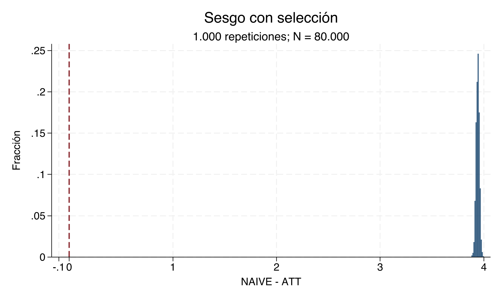

# Parámetros Causales en Stata {#parametros-causales-stata}

## Materiales para la clase {-}

- [Do-file de Stata](dofile/04_ParametrosStata/04_stata.do)
- [Base de datos](dofile/04_ParametrosStata/04_data.dta)
- [Script de R](dofile/04_ParametrosStata/04_R.R)
- [Notebook de Python (`04_phyton.ipynb`)](dofile/04_ParametrosStata/04_phyton.ipynb)
- [Abrir el notebook en Colab](https://colab.research.google.com/github/adiazescobar/libro_cortes/blob/main/dofile/04_ParametrosStata/04_phyton.ipynb)
- [Log de Stata](dofile/04_ParametrosStata/04_stata.log)
- [Resultados puntuales (CSV)](dofile/04_ParametrosStata/results/parameters_results.csv)
- [Resumen Monte Carlo (CSV)](dofile/04_ParametrosStata/results/monte_carlo_summary.csv)
- [Histograma con selección](dofile/04_ParametrosStata/sesgo_con_seleccion.png)
- [Histograma con aleatorización](dofile/04_ParametrosStata/sesgo_con_aleatorizacion.png)
- [Comparación de escenarios](dofile/04_ParametrosStata/comparacion_escenarios.png)


## Objetivos {-}

Al terminar este capítulo podrá:

1. construir el resultado observado y el efecto individual a partir de resultados potenciales;
2. estimar e interpretar ATE, ATT, ATU, CATE y la comparación naïve;
3. separar precisión, sesgo de selección e identificación mediante simulaciones; y
4. contrastar selección y aleatorización en una realización y en repetición.

**Conocimientos previos.** Se requiere manejar `use`, `generate`, `summarize`,
`ttest` y regresión lineal básica en Stata, además de las definiciones del
capítulo anterior sobre resultados potenciales y parámetros causales.

::: {.boxinfo}
El objetivo es distinguir **parámetros causales** —ATE, ATT, ATU y CATE— de la
diferencia observada entre tratados y controles. Los resultados que aparecen en
esta página se leen directamente de los archivos producidos por el do-file.
:::

## Describir los datos y construir el resultado observado

### Preparación de los datos

::: {.boxnote}
**Comando clave**

```stata
use "04_data.dta", clear
describe
generate X = (_n > 4)
generate y = D*yd1 + (1-D)*yd0
generate tau = yd1 - yd0
label variable X "Grupo pretratamiento"
label variable y "Resultado observado"
label variable tau "Efecto individual"
label define tratamiento 0 "Control" 1 "Tratados"
label values D tratamiento
label define grupo_pre 0 "Grupo A" 1 "Grupo B"
label values X grupo_pre
list, clean noobs
```
:::

::: {.boxsuccess}
**Salida central.** Se cargan 8 unidades. `y` selecciona el
resultado potencial compatible con `D`; `tau` conserva la diferencia causal
individual, observable aquí porque la base es didáctica.
:::

::: {.boxinfo}
**Interpretación.** `describe` revela estructura y etiquetas; `list` permite
auditar la construcción fila por fila. En datos reales nunca observamos a la
vez `yd0` y `yd1` para una misma persona.
:::

### Descripción por grupos

::: {.boxcode}
**Comando clave**

```stata
tabulate D
tabulate X D, row
summarize y yd0 yd1 tau
bysort D: summarize y yd0 yd1 tau
```
:::

::: {.boxoutput}
**Salida central.** Hay 4 unidades tratadas y 4
controles. Las medias de `y` son 11 y 4.25,
respectivamente.
:::

::: {.boxinfo}
**Interpretación.** La descripción muestra diferencias observadas; por sí sola
no establece qué habría ocurrido al mismo conjunto de personas sin tratamiento.
:::

## Relacionar diferencia de medias y regresión

### Diferencia de medias

::: {.boxcode}
**Comando clave**

```stata
ttest y, by(D)
summarize y if D == 1
scalar media_tratados = r(mean)
summarize y if D == 0
scalar media_controles = r(mean)
display "Tratados - controles = " media_tratados-media_controles
```
:::

::: {.boxoutput}
**Salida central.** Stata reporta `mean(0)-mean(1)`; la comparación causal que
usaremos, tratados menos controles, vale 6.75.
:::

::: {.boxwarning}
**Error frecuente.** Leer el renglón `diff` de `ttest` como tratados menos
controles. Con `by(D)`, Stata muestra `mean(0)-mean(1)`, cuyo signo es el opuesto
del coeficiente de `D` en la regresión con constante.
:::

### Regresión simple

::: {.boxcode}
**Comando clave**

```stata
regress y D, robust
display "Media controles = " _b[_cons]
display "Tratados - controles = " _b[D]
display "Error estándar robusto = " _se[D]
lincom D
```
:::

::: {.boxoutput}
**Salida central.** `_b[_cons]` reproduce 4.25 y `_b[D]`
reproduce 6.75. `_se[D]` y `lincom D` entregan el error
estándar robusto y el intervalo de confianza sin transcribirlos manualmente.
:::

::: {.boxinfo}
**Interpretación.** La equivalencia con la diferencia de medias es algebraica.
Ni `robust` ni un intervalo estrecho convierten el coeficiente en causal cuando
existe selección.
:::

## Calcular parámetros causales y heterogeneidad

### Programa `estimadores`

::: {.boxcode}
**Comando clave**

```stata
capture program drop estimadores
program define estimadores
    syntax varlist(min=3 max=3)
    tokenize `varlist'
    local tau `1'
    local y `2'
    local d `3'
    quietly summarize `tau'
    scalar ATE = r(mean)
    quietly summarize `tau' if `d' == 1
    scalar ATT = r(mean)
    quietly summarize `tau' if `d' == 0
    scalar ATU = r(mean)
    display "ATE = " ATE
    display "ATT = " ATT
    display "ATU = " ATU
end

estimadores tau y D
```
:::

::: {.boxinfo}
**Interpretación.** `program define` encapsula una tarea; `syntax` exige tres
variables; `tokenize` las numera; los `local` guardan sus nombres. Cada
`summarize` deja la media en `r(mean)`, que se copia a un escalar para no perderla
cuando se ejecuta el siguiente comando. El argumento `y` mantiene una interfaz
pedagógica común, aunque estos tres estimandos se calculan con `tau` y `D`.
:::

### ATE, ATT, ATU y CATE

::: {.boxcode}
**Comando clave**

```stata
summarize tau
scalar ATE_directo = r(mean)
summarize tau if D == 1
scalar ATT_directo = r(mean)
summarize tau if D == 0
scalar ATU_directo = r(mean)
summarize tau if X == 0
scalar CATE_X0 = r(mean)
summarize tau if X == 1
scalar CATE_X1 = r(mean)
display ATE_directo ATT_directo ATU_directo CATE_X0 CATE_X1
```
:::

::: {.boxoutput}
**Salida central**


Table: (\#tab:tabla-resultados-puntuales)Parámetros y contrastes en los datos originales

|   |Estimando           | Valor|  N|
|:--|:-------------------|-----:|--:|
|41 |ATE                 |  0.75|  8|
|42 |ATT                 |  0.75|  8|
|43 |ATU                 |  0.75|  8|
|44 |CATE(0)             |  1.25|  8|
|45 |CATE(1)             |  0.25|  8|
|55 |Naïve               |  6.75|  8|
|58 |Sesgo (Naïve − ATT) |  6.00|  8|
:::

::: {.boxinfo}
**Interpretación.** ATE, ATT y ATU son 0.75,
0.75 y 0.75. CATE(0) y CATE(1) son
1.25 y 0.25: el promedio agregado oculta heterogeneidad.
Además, $ATE=P(D=1)ATT+P(D=0)ATU$.
:::

### Descomposición del sesgo

::: {.boxcode}
**Comando clave**

```stata
summarize y if D == 1
scalar media_y1 = r(mean)
summarize y if D == 0
scalar media_y0 = r(mean)
scalar NAIVE = media_y1-media_y0
summarize tau if D == 1
scalar ATT_comparacion = r(mean)
scalar SESGO_ATT = NAIVE-ATT_comparacion
display "NAIVE = " NAIVE
display "NAIVE - ATT = " SESGO_ATT
```
:::

::: {.boxoutput}
**Salida central.** NAIVE es 6.75 y NAIVE−ATT es
6.
:::

::: {.boxkey}
**Resultado clave.** El sesgo aparece porque tratados y controles difieren en
resultados potenciales, no porque falten observaciones ni porque la resta esté
mal calculada.
:::

## Duplicar observaciones no resuelve la selección

### Duplicación de observaciones

::: {.boxcode}
**Comando clave**

```stata
use "04_data.dta", clear
generate byte X = (_n > 4)
generate double y = D*yd1 + (1-D)*yd0
generate double tau = yd1-yd0
expand 10000
estimadores tau y D
regress y D, robust
```
:::

::: {.boxoutput}
**Salida central**


Table: (\#tab:tabla-duplicacion-aleatorizacion)Duplicación y una asignación aleatoria

|   |Escenario      |Estimando           | Valor|     N|
|:--|:--------------|:-------------------|-----:|-----:|
|1  |Aleatorización |ATE                 | 0.750| 80000|
|2  |Aleatorización |ATT                 | 0.751| 80000|
|3  |Aleatorización |ATU                 | 0.749| 80000|
|15 |Aleatorización |Naïve               | 0.751| 80000|
|18 |Aleatorización |Sesgo (Naïve − ATT) | 0.000| 80000|
|21 |Duplicación    |ATE                 | 0.750| 80000|
|22 |Duplicación    |ATT                 | 0.750| 80000|
|23 |Duplicación    |ATU                 | 0.750| 80000|
|35 |Duplicación    |Naïve               | 6.750| 80000|
|38 |Duplicación    |Sesgo (Naïve − ATT) | 6.000| 80000|
:::

::: {.boxwarning}
**Error frecuente.** Confundir el tamaño nominal, que pasa de
8 a
80,000, con información
independiente. Las copias no aportan variación nueva: el sesgo permanece en
6.
:::

## Reasignar el tratamiento al azar

### Asignación aleatoria

::: {.boxcode}
**Comando clave**

```stata
use "04_data.dta", clear
generate byte X = (_n > 4)
expand 10000
drop D
set seed 87634
generate byte D = (runiform() < .5)
generate double y = D*yd1 + (1-D)*yd0
generate double tau = yd1-yd0
estimadores tau y D
regress y D, robust
```
:::

::: {.boxoutput}
**Salida central.** Esta realización produce NAIVE igual a
0.751 y NAIVE−ATT igual a 0.
:::

::: {.boxinfo}
**Interpretación.** La semilla hace reproducible la realización. La
aleatorización implica insesgadez al repetir el procedimiento; no exige que una
muestra finita reproduzca exactamente el ATE 0.75.
:::

## Repetir el experimento: Monte Carlo

La población simulada contiene 80,000
perfiles. Cada llamada vuelve a asignar tratamiento, construye `y` y devuelve
NAIVE−ATT.

### Monte Carlo con selección

::: {.boxcode}
**Comando clave**

```stata
capture program drop one_rep
program define one_rep, rclass
    syntax, POPulation(string) SCENario(string)
    use "`population'", clear
    drop D
    if "`scenario'" == "seleccion" {
        quietly summarize yd0
        generate D = (runiform() < invlogit((yd0-r(mean))/2))
    }
    else {
        generate D = (runiform() < .5)
    }
    generate double y = D*yd1 + (1-D)*yd0
    generate double tau = yd1-yd0
    quietly summarize tau if D == 1
    local att = r(mean)
    quietly summarize y if D == 1
    local y1 = r(mean)
    quietly summarize y if D == 0
    return scalar sesgo = `y1'-r(mean)-`att'
end

use "04_data.dta", clear
generate byte X = (_n > 4)
expand 10000
generate double y = D*yd1 + (1-D)*yd0
generate double tau = yd1-yd0
drop y tau
tempfile poblacion
save `poblacion', replace
simulate sesgo=r(sesgo), reps(1000) seed(12345) nodots: one_rep, population("`poblacion'") scenario("seleccion")
summarize sesgo, detail
```
:::

::: {.boxinfo}
**Interpretación.** `invlogit((yd0-r(mean))/2)` convierte el resultado potencial
sin tratamiento en una probabilidad entre cero y uno. Por eso `D` depende de
`yd0`. `simulate` guarda el escalar devuelto en cada una de
1,000 repeticiones; la semilla
fija la secuencia pseudoaleatoria.
:::

### Monte Carlo con aleatorización

::: {.boxcode}
**Comando clave**

```stata
simulate sesgo=r(sesgo), reps(1000) seed(87634) nodots: one_rep, population("`poblacion'") scenario("aleatorizacion")
summarize sesgo, detail
```
:::

::: {.boxkey}
**Resultado clave.** Bajo selección, el centro del sesgo es
3.941; bajo aleatorización es
0. La regla `runiform()<.5` hace a `D` independiente
de los resultados potenciales, en expectativa.
:::

### Comparación gráfica


Table: (\#tab:tabla-monte-carlo)Distribución del sesgo Naïve − ATT en 1000 repeticiones

|Escenario      | Repeticiones| Media| Desv. est.|     p5|   p50|   p95|
|:--------------|------------:|-----:|----------:|------:|-----:|-----:|
|Aleatorización |         1000| 0.000|      0.022| -0.038| 0.000| 0.035|
|Selección      |         1000| 3.941|      0.016|  3.915| 3.941| 3.966|



::: {.boxinfo}
**Lectura guiada.** El centro es 3.941, la desviación
estándar 0.016 y el intervalo entre cuantiles va de
3.915 a 3.966. ¿Qué proporción visual de
la masa queda a cada lado de cero? ¿Qué indica eso sobre sesgo sistemático?
:::


::: {.boxinfo}
**Lectura guiada.** El centro es 0, la desviación
estándar 0.022 y los cuantiles son
-0.038 y 0.035. ¿Por qué aparece masa a
ambos lados de cero aunque cada realización no tenga sesgo exactamente nulo?
:::


::: {.boxkey}
**Resultado clave.** Compare centro, dispersión, cuantiles y masa a cada lado
de cero. La selección desplaza la distribución; la aleatorización la centra sin
eliminar la variación muestral. ¿Cuál escenario es más disperso según las
desviaciones estándar canónicas y por cuánto?
:::

## Ejercicios

::: {.boxquestion}
**S-P1 (5 puntos). Regresión y diferencia de medias.** Considere el output de
`regress y D, robust` del capítulo. Interprete `_b[_cons]`, `_b[D]`, `_se[D]` y
el intervalo de confianza de `lincom D`. Explique la relación exacta entre
`_b[D]` y las dos medias de grupo, e indique por qué el coeficiente no tiene
automáticamente interpretación causal.


Table: (\#tab:tabla-output-s-p1)Output canónico de la regresión con errores estándar robustos

|Término   | Coeficiente| Error estándar robusto| IC 95%: límite inferior| IC 95%: límite superior|
|:---------|-----------:|----------------------:|-----------------------:|-----------------------:|
|Constante |        4.25|                  0.479|                   3.079|                   5.421|
|D         |        6.75|                  0.629|                   5.211|                   8.289|

**Comandos permitidos:** `regress y D, robust`, `lincom D` y operaciones
aritméticas con las medias de los dos grupos.

**Producto esperado:** interpretación escrita de los cuatro componentes
solicitados y una igualdad que conecte el coeficiente de `D` con las medias.
:::

::: {.boxquestion}
**S-P2 (6 puntos). Parámetros en seis unidades.** Use la siguiente población
didáctica. Calcule ATE, ATT, ATU, CATE(0), CATE(1), la comparación NAIVE y
NAIVE−ATT. Muestre las fórmulas y las unidades que entran en cada promedio.

| id | X | D | $Y_i(D=0)$ | $Y_i(D=1)$ |
|---:|---:|---:|-----:|-----:|
| 1 | 0 | 0 | 2 | 3 |
| 2 | 0 | 1 | 4 | 6 |
| 3 | 0 | 1 | 5 | 6 |
| 4 | 1 | 0 | 7 | 8 |
| 5 | 1 | 0 | 8 | 10 |
| 6 | 1 | 1 | 10 | 13 |

**Comandos permitidos:** `generate`, `summarize` con condiciones `if` y
operaciones aritméticas; también puede resolver los promedios a mano.

**Producto esperado:** tabla con los siete estimandos solicitados, sus fórmulas
y las unidades incluidas en cada promedio.
:::

::: {.boxquestion}
**S-P3 (6 puntos). Depuración de un programa.** El siguiente código contiene
cuatro errores que impiden calcular correctamente ATE, ATT y ATU. Identifique
cada error, explique su consecuencia y escriba una versión ejecutable corregida.

```stata
program define estimadores
    syntax varlist(min=2 max=3)
    tokenize varlist
    quietly summarize `1' if `3' == 1
    scalar ATE = r(mean)
    quietly summarize `1' if `3' == 1
    scalar ATT = r(mean)
    quietly summarize `1' if `3' == 1
    scalar ATU = r(mean)
end
```

**Comandos permitidos:** `program define`, `syntax`, `tokenize`, locales,
`summarize`, escalares y `display`.

**Producto esperado:** listado numerado de los cuatro errores, explicación de
su consecuencia y un programa Stata completo que ejecute sin errores.
:::

::: {.boxquestion}
**S-P4 (7 puntos). Nueva regla de selección.** Diseñe una regla donde la
probabilidad de tratamiento sea el complemento exacto de la regla canónica,
`invlogit(-(yd0-r(mean))/2)`, y por tanto disminuya con `yd0`. Anticipe el signo
y el centro aproximado de NAIVE−ATT, y razone cómo cambiaría su dispersión frente
a la regla canónica. Escriba código Stata ejecutable que modifique `one_rep`, fije
una semilla, ejecute `simulate` y resuma la distribución.

**Comandos permitidos:** comandos del programa `one_rep`, `invlogit()`,
`runiform()`, `set seed`, `simulate` y `summarize, detail`.

**Producto esperado:** código Stata ejecutable y un párrafo que anticipe signo,
centro y dispersión de la distribución frente a la regla canónica.
:::

## Síntesis

1. **Identificación:** más datos no eliminan el sesgo de selección.
2. **Heterogeneidad:** un ATE puede ocultar CATE distintos entre grupos.
3. **Precisión frente a sesgo:** aumentar $N$ puede reducir variabilidad sin
   acercar el estimador al parámetro causal.
4. **Aleatorización en expectativa:** el sesgo promedio se centra cerca de cero,
   aunque cada realización conserve variabilidad muestral.

## Puente al capítulo siguiente {-}

El capítulo [Experimentos aleatorios controlados](05-RCT.Rmd) usa esta misma
lógica para mostrar cómo un diseño experimental identifica efectos causales y
cómo se diagnostica el balance antes de estimarlos.
