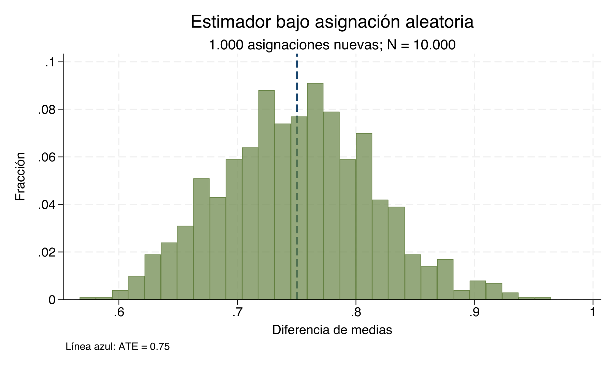

# Parámetros causales — Clase empírica {#parametros-causales-stata}

## Materiales para la clase {-}

::: {.class-materials}
**Descarga antes de comenzar**

- [Do-file de Stata](https://raw.githubusercontent.com/adiazescobar/libro_cortes/main/dofile/04_ParametrosStata/04_stata.do)
- [Base `04_data.dta`](https://raw.githubusercontent.com/adiazescobar/libro_cortes/main/dofile/04_ParametrosStata/04_data.dta)
- [Script de R](https://raw.githubusercontent.com/adiazescobar/libro_cortes/main/dofile/04_ParametrosStata/04_R.R)
- [Notebook de Python (`04_phyton.ipynb`)](https://raw.githubusercontent.com/adiazescobar/libro_cortes/main/dofile/04_ParametrosStata/04_phyton.ipynb)

[](https://colab.research.google.com/github/adiazescobar/libro_cortes/blob/main/dofile/04_ParametrosStata/04_phyton.ipynb)
:::

El *do-file*, el script de R y el notebook de Python siguen la misma secuencia.
Todos parten de los mismos ocho perfiles y mantienen fijos `yd0` y `yd1`.

- [Log de Stata](dofile/04_ParametrosStata/04_stata.log)
- [Resultados puntuales](dofile/04_ParametrosStata/results/parameters_results.csv)
- [Resumen Monte Carlo](dofile/04_ParametrosStata/results/monte_carlo_summary.csv)

::: {.boxinfo}
**Lecturas centrales**

- [Bernal y Peña — capítulo 2 (PDF)](https://www.dropbox.com/s/zsqa2gcbbgdi5i3/Capitulo%202%20Bernal%20y%20Pe%C3%B1a.pdf?dl=1)
- [Bernal y Peña — capítulo 3 (PDF)](https://www.dropbox.com/s/837u3ea36r7t5me/Capitulo%203%20Bernal%20y%20Pe%C3%B1a.pdf?dl=1)
- [Cunningham — capítulo 4: Potential Outcomes](https://mixtape.scunning.com/04-potential_outcomes)
:::


## Objetivos {-}

Al terminar esta clase podrá:

1. reproducir en Stata los estimandos calculados a mano con ocho personas;
2. distinguir aumento de N, precisión, sesgo e identificación;
3. mostrar qué cambia cuando solo la asignación `D` se vuelve aleatoria; y
4. explicar por qué la aleatorización elimina el sesgo en repetición, no
   necesariamente en una realización particular.

**Conocimientos previos.** Se requiere manejar `use`, `generate`, `summarize`,
`ttest` y `regress`, además de las definiciones de ATE, ATT, ATU y CATE.

::: {.boxkey}
**Hilo conductor.** No cambiaremos los resultados potenciales ni inventaremos
otro proceso de datos. La clase modifica una cosa a la vez: primero N y después
la asignación `D`.
:::

## Ejercicio manual: identificar los estimandos

Partimos de la tabla de ocho personas del capítulo teórico. Como es una base
didáctica, contiene ambos resultados potenciales. En datos reales solo se
observaría uno.

::: {.boxnote}
**Ejercicio manual**

Antes de correr el código, identifique qué filas entran en ATE, ATT, ATU,
CATE(0) y CATE(1). Después calcule el resultado observado y la diferencia de
medias entre tratados y controles.
:::

::: {.boxcode}
**Comando clave**

```stata
use "04_data.dta", clear
generate X = (_n > 4)
generate tau = yd1-yd0
generate y = D*yd1 + (1-D)*yd0
list X D yd0 yd1 y tau, clean noobs

summarize tau
summarize tau if D == 1
summarize tau if D == 0
summarize tau if X == 0
summarize tau if X == 1
```
:::

::: {.boxoutput}
**Salida central**


Table: (\#tab:tabla-manual)Estimandos del ejercicio manual

|   |Estimando   | Valor|  N|
|:--|:-----------|-----:|--:|
|21 |ATE         |  0.75|  8|
|22 |ATT         |  0.75|  8|
|23 |ATU         |  0.75|  8|
|24 |CATE(0)     |  1.25|  8|
|25 |CATE(1)     |  0.25|  8|
|35 |Naïve       |  6.75|  8|
|38 |Naïve − ATT |  6.00|  8|
:::

::: {.boxinfo}
**Interpretación.** ATE, ATT y ATU son 0.75, 0.75 y
0.75. CATE(0) y CATE(1) son 1.25 y 0.25. Stata
reproduce los mismos promedios que se calcularon fila por fila.
:::

### Diferencia observada, regresión y sesgo {-}

::: {.boxcode}
**Comando clave**

```stata
ttest y, by(D)
summarize y if D == 1
scalar media_y1 = r(mean)
summarize y if D == 0
scalar NAIVE = media_y1-r(mean)
summarize tau if D == 1
scalar ATT = r(mean)
scalar SESGO_ATT = NAIVE-ATT
regress y D, robust
```
:::

::: {.boxoutput}
**Salida central.** La comparación naïve es 6.75 y su diferencia
respecto del ATT es 6.


Table: (\#tab:tabla-regresion)Regresión equivalente a la diferencia de medias

|                   |Término   | Coeficiente| Error estándar robusto| IC 95% inferior| IC 95% superior|
|:------------------|:---------|-----------:|----------------------:|---------------:|---------------:|
|COEF_REG_CONSTANTE |Constante |        4.25|                  0.479|           3.079|           5.421|
|COEF_REG_D         |D         |        6.75|                  0.629|           5.211|           8.289|
:::

::: {.boxwarning}
**Error frecuente.** El coeficiente de `D` reproduce exactamente una diferencia
de medias. Los errores robustos cambian la inferencia, pero no convierten una
comparación seleccionada en un efecto causal.
:::

## Misma selección con N = 10.000

Ahora repetimos proporcionalmente los mismos ocho perfiles hasta obtener
exactamente 10.000 filas. No tocamos `D`: las mismas clases de personas siguen
tratadas y no tratadas.

::: {.boxcode}
**Comando clave**

```stata
use "04_data.dta", clear
generate X = (_n > 4)
generate tau = yd1-yd0
generate y = D*yd1 + (1-D)*yd0
expand 1250
assert _N == 10000

summarize y if D == 1
scalar media_y1_n10000 = r(mean)
summarize y if D == 0
scalar NAIVE_n10000 = media_y1_n10000-r(mean)
summarize tau if D == 1
scalar SESGO_n10000 = NAIVE_n10000-r(mean)
```
:::

::: {.boxoutput}
**Salida central**


Table: (\#tab:tabla-n)La misma asignación observacional con dos tamaños nominales

|   |Escenario                   |Estimando   | Valor|     N|
|:--|:---------------------------|:-----------|-----:|-----:|
|21 |Datos originales            |ATE         |  0.75|     8|
|22 |Datos originales            |ATT         |  0.75|     8|
|35 |Datos originales            |Naïve       |  6.75|     8|
|38 |Datos originales            |Naïve − ATT |  6.00|     8|
|41 |Misma selección, N = 10.000 |ATE         |  0.75| 10000|
|42 |Misma selección, N = 10.000 |ATT         |  0.75| 10000|
|55 |Misma selección, N = 10.000 |Naïve       |  6.75| 10000|
|58 |Misma selección, N = 10.000 |Naïve − ATT |  6.00| 10000|
:::

::: {.boxkey}
**Resultado clave.** Con N=10.000, NAIVE continúa en 6.75 y
NAIVE−ATT continúa en 6. El estimador no se acerca al parámetro:
repetimos la misma selección con más filas.
:::

::: {.boxwarning}
**Precisión no es identificación.** Aumentar N puede estrechar un intervalo
alrededor del valor equivocado. Además, copiar filas no crea información
independiente; aquí se usa deliberadamente para hacer visible que el sesgo es
una propiedad de la comparación, no una consecuencia de una muestra pequeña.
:::

## Una asignación aleatoria

Conservamos las mismas 10.000 filas, `yd0`, `yd1`, `X` y `tau`. Eliminamos el
`D` observacional y generamos un tratamiento independiente de los resultados
potenciales.

::: {.boxcode}
**Comando clave**

```stata
drop D y
set seed 87634
generate D = (runiform() < .5)
generate y = D*yd1 + (1-D)*yd0

summarize y if D == 1
scalar media_y1_aleatoria = r(mean)
summarize y if D == 0
display "Diferencia aleatoria = " media_y1_aleatoria-r(mean)
```
:::

::: {.boxoutput}
**Salida central.** En la realización reproducible del do-file, la diferencia
de medias es 0.801, frente a un ATE de 0.75.
:::

::: {.boxinfo}
**Interpretación.** La aleatorización elimina la asociación sistemática entre
`D` y los resultados potenciales. No obliga a que una realización finita
produzca exactamente el ATE: todavía existe variación de asignación.
:::

## Monte Carlo: un D nuevo en cada repetición

Para verificar la afirmación de insesgadez repetimos únicamente la asignación.
En cada repetición los 10.000 perfiles son idénticos, pero cada persona recibe
un `D` nuevo e independiente.

::: {.boxcode}
**Comando clave**

```stata
capture program drop one_random_assignment
program define one_random_assignment, rclass
    syntax, POPulation(string)
    use "`population'", clear
    generate D = (runiform() < .5)
    generate y = D*yd1 + (1-D)*yd0
    quietly summarize y if D == 1
    local y1 = r(mean)
    quietly summarize y if D == 0
    return scalar estimador = `y1'-r(mean)
end

simulate estimador=r(estimador), reps(1000) seed(87634) nodots: one_random_assignment, population("`population'")
summarize estimador, detail
```
:::

::: {.boxoutput}
**Salida central.** En 1.000
asignaciones, el promedio del estimador es 0.75 y su desviación
estándar es 0.065. El ATE fijo es 0.75.
:::



::: {.boxkey}
**Resultado clave.** Una asignación puede quedar por encima o por debajo del
ATE. Al repetir el mecanismo aleatorio, esos desbalances no tienen una dirección
sistemática y el promedio de los estimadores se centra en el ATE.
:::

## Ejercicios

::: {.boxquestion}
**S-P1 (5 puntos). Regresión y diferencia de medias.** Interprete `_b[_cons]`,
`_b[D]`, `_se[D]` y el intervalo de confianza de `regress y D, robust`. Explique
por qué la equivalencia algebraica entre `_b[D]` y la diferencia de medias no
garantiza interpretación causal.


Table: (\#tab:tabla-output-s-p1)Output canónico de la regresión

|                   |Término   | Coeficiente| Error estándar robusto| IC 95% inferior| IC 95% superior|
|:------------------|:---------|-----------:|----------------------:|---------------:|---------------:|
|COEF_REG_CONSTANTE |Constante |        4.25|                  0.479|           3.079|           5.421|
|COEF_REG_D         |D         |        6.75|                  0.629|           5.211|           8.289|

**Comandos permitidos:** `summarize`, `regress` y operaciones con las medias.

**Producto esperado:** interpretación escrita y la igualdad que conecta el
coeficiente de `D` con las dos medias.
:::

::: {.boxquestion}
**S-P2 (6 puntos). Parámetros en seis unidades.** Para la tabla entregada en
clase, calcule ATE, ATT, ATU, CATE(0), CATE(1), NAIVE y NAIVE−ATT. Muestre qué
unidades entran en cada promedio.

**Comandos permitidos:** `generate`, `summarize` con `if` y operaciones
aritméticas.

**Producto esperado:** tabla con los siete estimandos, sus fórmulas y las
unidades incluidas.
:::

::: {.boxquestion}
**S-P3 (6 puntos). Aumentar N sin cambiar la selección.** Parta de
`04_data.dta`, replique proporcionalmente los perfiles hasta N=10.000 y
demuestre que NAIVE y NAIVE−ATT no cambian. Explique por qué este resultado
contradice la afirmación “una muestra grande corrige el sesgo”.

**Comandos permitidos:** `use`, `generate`, `expand`, `assert`, `summarize` y
escalares.

**Producto esperado:** código ejecutable, los valores antes y después y una
interpretación sobre consistencia.
:::

::: {.boxquestion}
**S-P4 (7 puntos). Una asignación y la repetición del experimento.** Genere una
asignación aleatoria y compare su estimador con el ATE. Luego escriba código
Stata ejecutable que produzca un D nuevo en cada repetición y explique por qué
el promedio Monte Carlo puede coincidir con el ATE aunque una asignación no lo
haga exactamente.

**Comandos permitidos:** `runiform()`, `set seed`, un programa `rclass`,
`simulate` y `summarize`.

**Producto esperado:** código Stata ejecutable, resultado de una realización,
resumen de la distribución y explicación de insesgadez en repetición.
:::

## Síntesis

1. Los comandos reproducen exactamente los estimandos calculados a mano.
2. Aumentar N sin cambiar la selección no corrige el sesgo ni genera
   consistencia.
3. La asignación aleatoria cambia `D`, no los resultados potenciales.
4. La aleatorización produce insesgadez en repetición; una realización conserva
   variación de asignación.

## Puente al capítulo siguiente {-}

El capítulo [Experimentos aleatorios controlados](05-RCT.Rmd) desarrolla esta
misma lógica como diseño de investigación y estudia balance, cumplimiento e
inferencia experimental.
