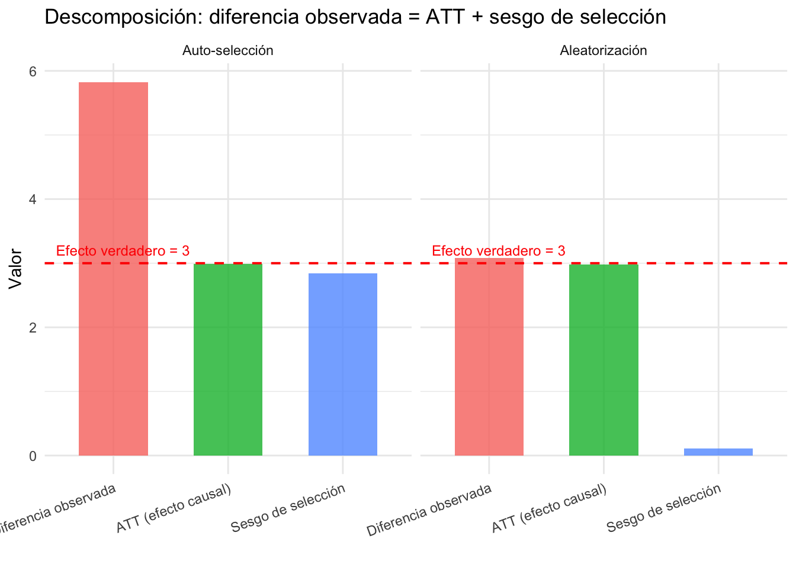
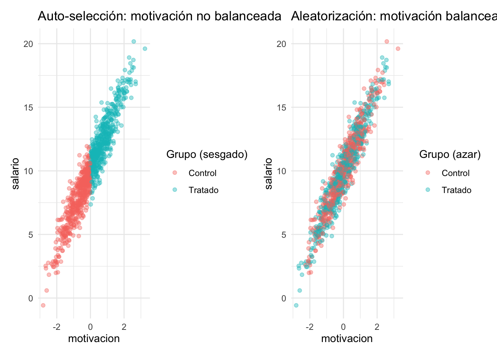
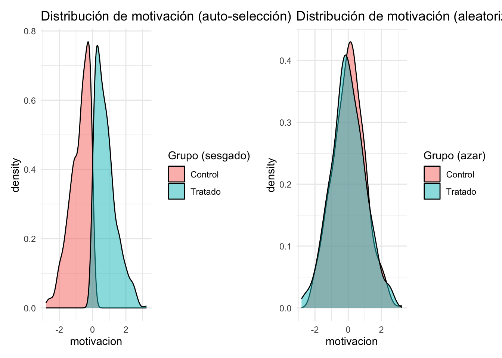
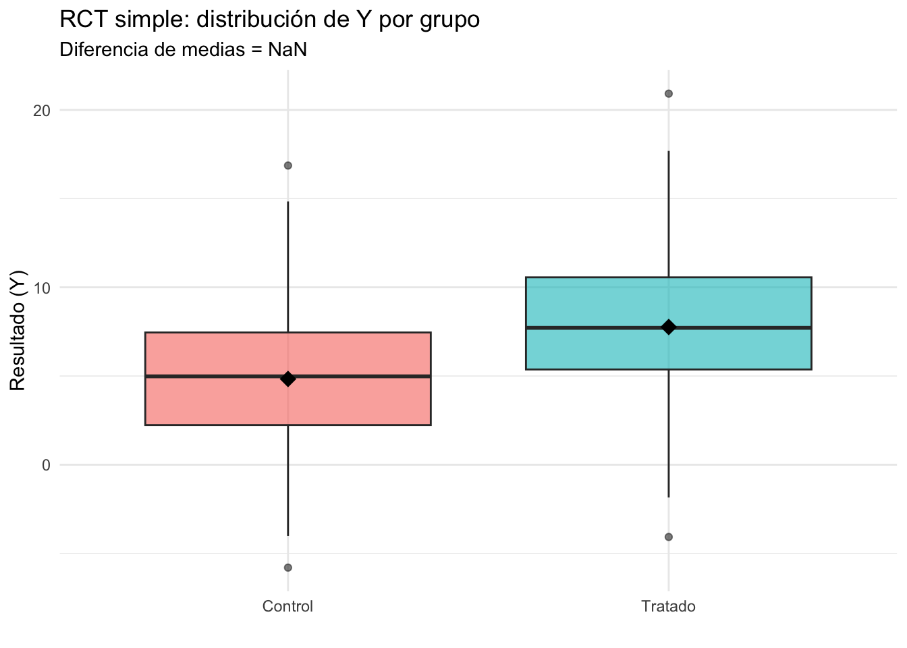
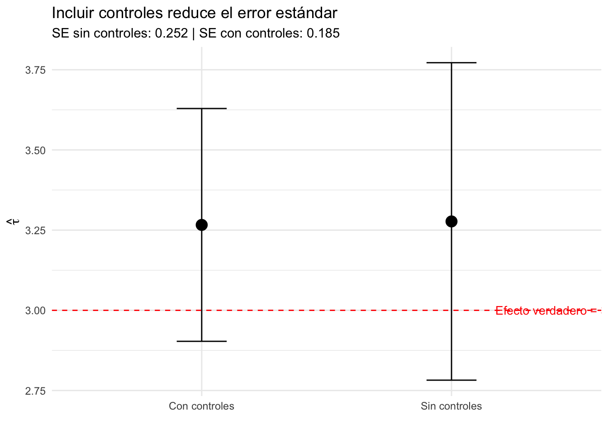
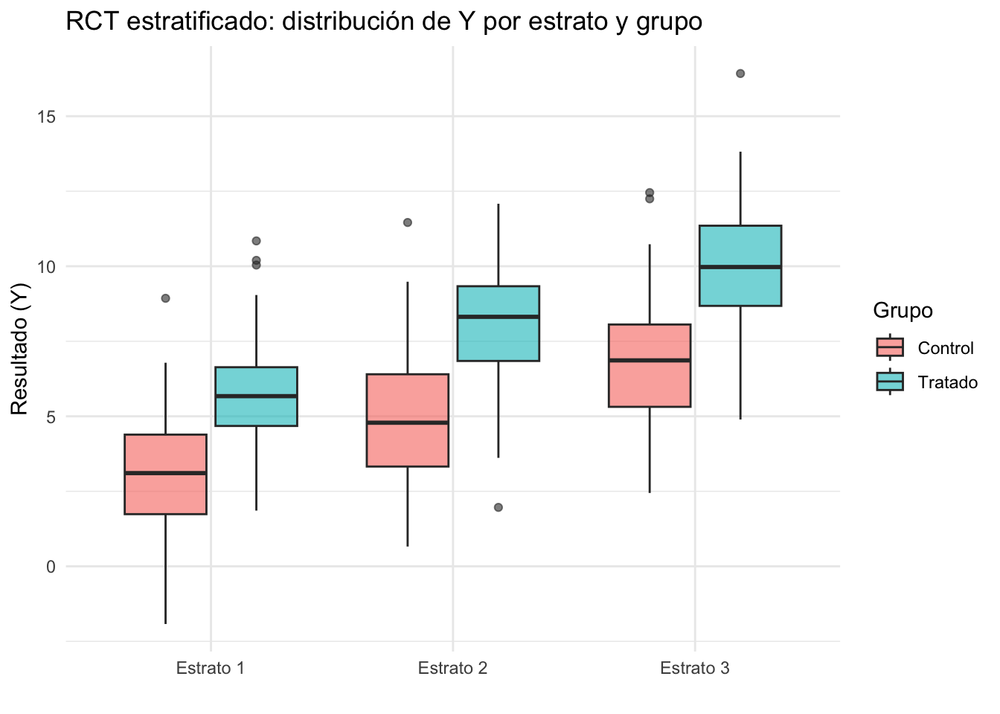
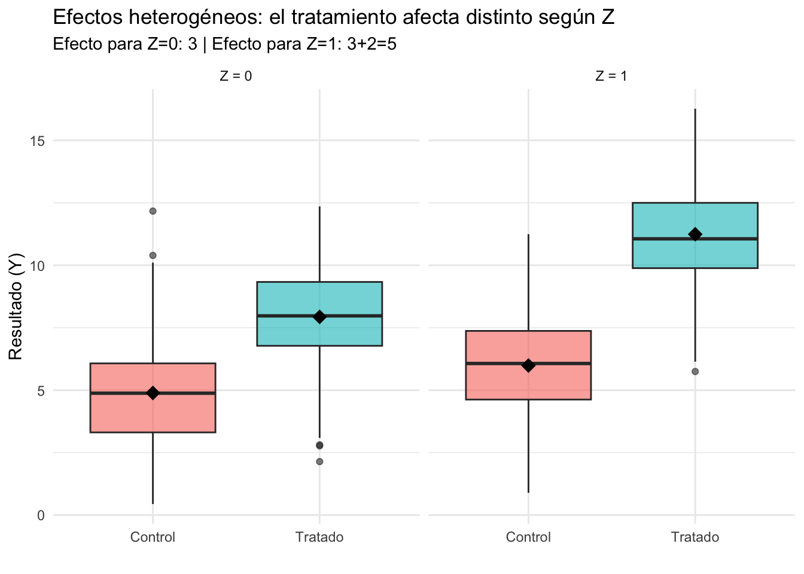

# Experimentos Aleatorizados (Teoría)

::: {.boxinfo}
**Objetivo del capítulo**

- Entender por qué la aleatorización elimina el sesgo de selección
- Formalizar la notación de resultados potenciales (ATE, CATE)
- Traducir resultados potenciales a regresiones lineales en cuatro escenarios de diseño
- Comprender cuándo y por qué incluir controles y estratos

### Lecturas{-}

- **Paper Alert:** [When Should You Adjust Standard Errors for Clustering? (NBER)](https://www.nber.org/papers/w24003)
- **Teoría:** [Lectura 4. Capítulo 4 Bernal y Peña (PDF)](https://www.dropbox.com/s/vxpgxt22pvphwx3/Capitulo%204%20Bernal%20y%20Pe%C3%B1a.pdf?dl=0)

:::

## Notación mínima para todo el módulo {-}

Antes de avanzar, fijemos la notación que usaremos en todo el módulo de experimentos:

- \( Y_i \): resultado (outcome).
- \( D_i \in \{0,1\} \): asignación aleatoria al tratamiento (1 = tratado, 0 = control).
- \( X_i \): controles **pre-tratamiento** (baseline).
- \( S_i \): estrato/bloque (vector de dummies de estratificación).

**Resultados potenciales:**

- \( Y_i(D=1) \): resultado si \( i \) recibe tratamiento.
- \( Y_i(D=0) \): resultado si \( i \) está en control.

El **problema fundamental** de la inferencia causal es que para cada individuo solo observamos uno de los dos:

\[
Y_i = D_i \cdot Y_i(D=1) + (1-D_i) \cdot Y_i(D=0)
\]

**Efectos:**

- **ATE (Average Treatment Effect):** efecto promedio en **toda** la población.
\[
ATE = \mathbb{E}[Y_i(D=1)-Y_i(D=0)]
\]

- **ATT (Average Treatment Effect on the Treated):** efecto promedio entre quienes **reciben** tratamiento.
\[
ATT = \mathbb{E}[Y_i(D=1)-Y_i(D=0) \mid D_i=1]
\]

- **ATU (Average Treatment Effect on the Untreated):** efecto promedio entre quienes **no reciben** tratamiento.
\[
ATU = \mathbb{E}[Y_i(D=1)-Y_i(D=0) \mid D_i=0]
\]

- **CATE (efecto promedio condicional):**
\[
CATE(x) = \mathbb{E}[Y_i(D=1)-Y_i(D=0) \mid X_i=x]
\]

Nota: en general \( ATE \neq ATT \neq ATU \). Por ejemplo, si un programa de capacitación laboral beneficia más a quienes lo eligen voluntariamente (porque están más motivados), entonces \( ATT > ATU \). Sin embargo, en un **RCT con asignación aleatoria**, la independencia \( D_i \perp (Y_i(D=1), Y_i(D=0)) \) garantiza que:

\[
ATE = ATT = ATU
\]

porque los grupos de tratamiento y control son, en promedio, idénticos en todo (observable y no observable).

---

### De la motivación a los resultados potenciales {-}

Veamos un ejemplo concreto. Supongamos que el tratamiento es un **programa de capacitación** y el outcome es el **salario**:

- \( Y_i(D=1) \): salario de \( i \) si recibe capacitación.
- \( Y_i(D=0) \): salario de \( i \) si no recibe capacitación.

Lo que observamos es la **diferencia de medias** entre tratados y controles:

\[
\underbrace{\mathbb{E}[Y_i \mid D_i=1] - \mathbb{E}[Y_i \mid D_i=0]}_{\text{diferencia observada}}
\]

Podemos descomponer esta diferencia sumando y restando \( \mathbb{E}[Y_i(D=0) \mid D_i=1] \):

\[
\mathbb{E}[Y_i(D=1) \mid D_i=1] - \mathbb{E}[Y_i(D=0) \mid D_i=0]
\]
\[
= \underbrace{\mathbb{E}[Y_i(D=1) \mid D_i=1] - \mathbb{E}[Y_i(D=0) \mid D_i=1]}_{ATT} + \underbrace{\mathbb{E}[Y_i(D=0) \mid D_i=1] - \mathbb{E}[Y_i(D=0) \mid D_i=0]}_{\text{sesgo de selección}}
\]

**Interpretación del sesgo de selección:**

El término \( \mathbb{E}[Y_i(D=0) \mid D_i=1] - \mathbb{E}[Y_i(D=0) \mid D_i=0] \) compara el salario **sin capacitación** entre quienes eligen capacitarse y quienes no. En nuestro ejemplo:

- Las personas más motivadas eligen capacitarse (\( D_i=1 \)).
- Pero la motivación **también** aumenta el salario, incluso sin capacitación.
- Por lo tanto \( \mathbb{E}[Y_i(D=0) \mid D_i=1] > \mathbb{E}[Y_i(D=0) \mid D_i=0] \): los tratados habrían ganado más **de todas formas**.
- Esto genera un sesgo **positivo**: atribuimos a la capacitación algo que en realidad es motivación.

**¿Qué hace la aleatorización?**

Al asignar \( D_i \) al azar, garantizamos que los grupos sean comparables **antes** del tratamiento:

\[
D_i \perp (Y_i(D=1), Y_i(D=0)) \implies \mathbb{E}[Y_i(D=0) \mid D_i=1] = \mathbb{E}[Y_i(D=0) \mid D_i=0]
\]

El sesgo de selección se hace **cero**, y la diferencia observada identifica directamente el efecto causal:

\[
\mathbb{E}[Y_i \mid D_i=1] - \mathbb{E}[Y_i \mid D_i=0] = ATT = ATE
\]

## ¿En regresión lineal cómo se ve esto? {-}

Lo que acabamos de ver con resultados potenciales (la descomposición ATT + sesgo de selección) tiene un equivalente directo en el lenguaje de regresión: el **sesgo por variable omitida**. Veamos cómo se conectan.

Tenemos el siguiente modelo de regresión lineal:

\[
Y = \alpha + \tau D + \varepsilon
\]

Donde:

- \( Y \) es el resultado (por ejemplo, salario),
- \( D \) es una variable binaria de tratamiento,
- \( \varepsilon \) incluye **motivación**, que no observamos.

Supongamos que la verdadera relación es:

\[
Y = \alpha + \tau D + \gamma M + u
\]

Donde:

- \( M \) es motivación (no observable),
- \( u \) es un nuevo error sin correlación con \( D \),
- Pero **no incluimos** \( M \) en la estimación → queda absorbido en \( \varepsilon = \gamma M + u \)

El modelo estimado es:

\[
Y = \alpha + \tau D + \varepsilon \quad \text{con} \quad \varepsilon = \gamma M + u
\]

Recordemos que el estimador de mínimos cuadrados ordinarios es:

\[
\hat{\beta} = (X'X)^{-1} X'Y
\]

Con \( X = [\mathbf{1}, D] \), tenemos:

\[
\hat{\beta} =
\begin{bmatrix}
\hat{\alpha} \\
\hat{\tau}
\end{bmatrix}
=
\left( \begin{bmatrix}
1 & D_1 \\
\vdots & \vdots \\
1 & D_n \\
\end{bmatrix}'
\begin{bmatrix}
1 & D_1 \\
\vdots & \vdots \\
1 & D_n \\
\end{bmatrix} \right)^{-1}
\begin{bmatrix}
1 & D_1 \\
\vdots & \vdots \\
1 & D_n \\
\end{bmatrix}' Y
\]

Queremos analizar el **sesgo** en \(\hat{\tau}\). Sustituyendo \( Y = \alpha + \tau D + \gamma M + u \)

Entonces:

\[
\hat{\tau} = \tau + \gamma \cdot \frac{\text{Cov}(D, M)}{\text{Var}(D)}
\]

Interpretación

- Si \( \text{Cov}(D, M) \neq 0 \), es decir, **si el tratamiento está correlacionado con la motivación**, el estimador de \(\tau\) estará **sesgado**.
- El sesgo es proporcional a:
  - El efecto de la motivación sobre \( Y \): \( \gamma \)
  - La correlación entre \( D \) y \( M \): \( \text{Cov}(D, M) \)

**Resumen del sesgo**

::: {.table .table-bordered .table-striped}
| Correlación entre \( D \) y \( M \) | Efecto de \( M \) sobre \( Y \) (\( \gamma \)) | ¿Hay sesgo en \( \hat{\tau} \)? | Dirección esperada del sesgo      |
|:----------------------------------:|:---------------------------------------------:|:-------------------------------:|:---------------------------------:|
| Cero                               | Cualquiera                                     | No                           | –                                 |
| Positiva                           | Positiva                                       | Sí                          | \( \hat{\tau} > \tau \) (sesgo hacia arriba) |
| Positiva                           | Negativa                                       | Sí                          | \( \hat{\tau} < \tau \) (sesgo hacia abajo) |
| Negativa                           | Positiva                                       | Sí                          | \( \hat{\tau} < \tau \) (sesgo hacia abajo) |
| Negativa                           | Negativa                                       | Sí                          | \( \hat{\tau} > \tau \) (sesgo hacia arriba) |
:::

**Lectura de la tabla**:

- Si el tratamiento está **correlacionado positivamente** con la motivación y la motivación **aumenta** el resultado, el estimador de \( \tau \) estará **sesgado hacia arriba**.
- Si la motivación está **omitida** y además está **correlacionada con el tratamiento**, siempre hay **sesgo**.
- Solo si la **motivación no está correlacionada con el tratamiento**, aunque no la observemos, **no hay sesgo**.

### ¿Qué hace la aleatorización?{-}

La **aleatorización** garantiza \( \text{Cov}(D, M) = 0 \), eliminando el sesgo de selección sin necesidad de observar \( M \).

 *Visualización: motivación, selección y aleatorización*

---

### Densidad de la motivación por grupo {-}

Por lo tanto ya no es necesario observar la motivación, ya que la aleatorización garantiza que los grupos sean comparables. Esto es exactamente lo mismo que vimos con resultados potenciales: el sesgo de selección \( \mathbb{E}[Y_i(D=0) \mid D_i=1] - \mathbb{E}[Y_i(D=0) \mid D_i=0] \) se hace cero, y en regresión \( \text{Cov}(D,M) = 0 \). Son dos caras de la misma moneda.

Ahora veamos cómo esto se traduce a regresión en cuatro escenarios de diseño experimental, de lo más simple a lo más completo.

---

## 1) RCT simple, sin estratos, sin controles {-}

**Objetivo:** identificación "pura" por aleatorización.

**Estimador (diferencia de medias):**

\[
\widehat{ATE} = \bar{Y}_1 - \bar{Y}_0
\]

donde \( \bar{Y}_1 \) es el promedio de \( Y \) en tratados y \( \bar{Y}_0 \) el promedio en controles.

**Regresión equivalente:**

\[
Y_i = \alpha + \tau D_i + u_i
\]

Aquí \( \hat{\tau} = \bar{Y}_1 - \bar{Y}_0 \). Es decir, el coeficiente de OLS sobre la dummy de tratamiento reproduce exactamente la diferencia de medias.

::: {.boxnote}
**Mensaje clave:** en un RCT, no "necesitas controles" para que el estimador sea causal; la aleatorización garantiza comparabilidad entre grupos. La regresión simple es suficiente para identificar el ATE.
:::

---

## 2) RCT simple, sin estratos, con controles {-}

**Objetivo:** misma identificación causal, mayor **precisión**.

\[
Y_i = \alpha + \tau D_i + \beta' X_i + u_i
\]

**Puntos clave:**

- \( \hat{\tau} \) **sigue siendo causal** (la asignación es aleatoria, incluir \( X_i \) no cambia eso).
- \( X_i \) se incluye para **reducir la varianza residual**: si \( X_i \) predice \( Y_i \), absorbe parte de la variación no explicada y los errores estándar de \( \hat{\tau} \) se reducen.
- Los controles ideales son **baseline** (pre-tratamiento). Hay que evitar "malos controles": variables que fueron **afectadas** por el tratamiento.

::: {.boxnote}
**Mensaje clave:** controles en un RCT son principalmente para **eficiencia** (intervalos de confianza más estrechos), no para "corregir sesgo". El sesgo ya fue eliminado por la aleatorización.
:::

---

## 3) RCT estratificado (bloques), sin controles adicionales {-}

**Objetivo:** respetar el diseño experimental y ganar precisión.

Si la asignación fue aleatoria **dentro de estratos** \( S \), la especificación estándar es:

\[
Y_i = \alpha + \tau D_i + \delta' S_i + u_i
\]

**Puntos clave:**

- Incluir dummies de estrato suele **mejorar la precisión** porque captura diferencias sistemáticas entre bloques.
- Alinea el análisis con el diseño: si la aleatorización fue **dentro** de estratos, el análisis debe **condicionar** en ellos.
- Omitir los estratos no sesga \( \hat{\tau} \), pero puede hacerlo **menos preciso** y los errores estándar pueden ser incorrectos.

::: {.boxnote}
**Mensaje clave:** si estratificaste la asignación, **controla por estratos** en el análisis. Es coherencia entre diseño y estimación.
:::

---

## 4) RCT estratificado + controles adicionales {-}

**Objetivo:** máxima precisión manteniendo interpretación causal.

\[
Y_i = \alpha + \tau D_i + \delta' S_i + \beta' X_i + u_i
\]

Aquí combinamos:

- **Dummies de estrato** \( S_i \): porque el diseño lo requiere (la aleatorización fue dentro de estratos).
- **Controles baseline** \( X_i \): porque mejoran la precisión (absorben varianza residual).

::: {.boxnote}
**Mensaje clave:** efectos fijos de estrato "por diseño" + controles baseline "por eficiencia". Es la especificación más completa y la que típicamente se reporta en papers experimentales.
:::

**Resumen de los cuatro escenarios:**

::: {.table .table-bordered .table-striped}
| Escenario | Regresión | ¿Por qué? |
|:---:|:---|:---|
| 1 | \( Y_i = \alpha + \tau D_i + u_i \) | Identificación pura por aleatorización |
| 2 | \( Y_i = \alpha + \tau D_i + \beta' X_i + u_i \) | + precisión con controles baseline |
| 3 | \( Y_i = \alpha + \tau D_i + \delta' S_i + u_i \) | Respetar diseño estratificado |
| 4 | \( Y_i = \alpha + \tau D_i + \delta' S_i + \beta' X_i + u_i \) | Diseño + eficiencia (especificación completa) |
:::

En los cuatro casos, \( \hat{\tau} \) estima el **ATE** de forma consistente. Lo que cambia es la **precisión**.

---

## Puente a heterogeneidad: efectos diferenciados (CATE) {-}

Hasta ahora hemos estimado un efecto **promedio** \( \tau \). Pero en muchos contextos queremos saber si el tratamiento tiene **efectos diferentes** según alguna característica observable \( Z_i \) (por ejemplo, género, edad, nivel educativo).

Para esto usamos una **interacción**:

\[
Y_i = \alpha + \tau D_i + \theta Z_i + \gamma (D_i \cdot Z_i) + u_i
\]

(Si aplica, se agregan \( \delta' S_i + \beta' X_i \) como antes.)

**Interpretación:**

- Efecto para \( Z = 0 \): \( \tau \)
- Efecto para \( Z = 1 \): \( \tau + \gamma \)
- \( \gamma \) mide la **diferencia** en el efecto del tratamiento entre los dos grupos.

**ATE (promedio):** \( \tau + \gamma \cdot \mathbb{E}[Z] \)

### El truco de centrar (Wooldridge) {-}

Si definimos \( Z_c = Z - \bar{Z} \) y estimamos la regresión con \( D_i \cdot Z_c \) en lugar de \( D_i \cdot Z_i \):

\[
Y_i = \alpha + \tau D_i + \theta Z_{c,i} + \gamma (D_i \cdot Z_{c,i}) + u_i
\]

entonces el coeficiente \( \tau \) **es directamente el ATE**, porque \( \mathbb{E}[Z_c] = 0 \).

::: {.boxnote}
**Mensaje clave:** si interactúas el tratamiento con una covariable, **centra la covariable** para que el coeficiente de \( D \) siga siendo directamente interpretable como el ATE promedio. Sin centrar, \( \tau \) solo es el efecto para el grupo con \( Z = 0 \).
:::

---

::: {.boxvideo .green title="Videos recomendados:"}

- [Video 1](https://www.youtube.com/embed/eGRd8jBdNYg)
- [Video 2](https://www.youtube.com/embed/crpuBZv6XtA)
- [Video 3](https://www.youtube.com/embed/xlX3VtuIfQ0)

Y todos los que encuentres en Google buscando: **RCT Esther Duflo**
:::

::: {.boxnote }

**PROMPT DE CHATGPT PARA REFLEXIÓN PROFUNDA**

**Instrucciones**: Copia este mensaje en ChatGPT o la IA de tu preferencia. Tu objetivo no es obtener respuestas, sino **reflexionar guiado por preguntas**.

---

Hola. Actúa como mi tutor metodológico. No quiero que me des respuestas. Quiero que me ayudes a pensar como si estuviéramos en una tutoría.

Estoy estudiando diseños experimentales. Entiendo que si el tratamiento se asigna aleatoriamente, entonces \( \text{Cov}(D, X) = 0 \), incluso para variables no observables.

Pero sigo viendo que en muchos papers experimentales incluyen **controles en la regresión**. Ayúdame a pensar **paso a paso** si eso es necesario o no.

Por favor, hazme preguntas como:

- ¿Qué gana o pierde la estimación si incluyo controles?
- ¿Qué pasa si hay desequilibrios por azar?
- ¿Qué efecto tiene sobre la precisión del estimador?
- ¿Los controles ayudan a mejorar algo aunque \( \hat{\tau} \) ya sea insesgado?
- ¿Hay casos en que incluir controles puede ser problemático?

No me des respuestas. Solo nuevas preguntas que me ayuden a entender mejor este punto.

:::

---
