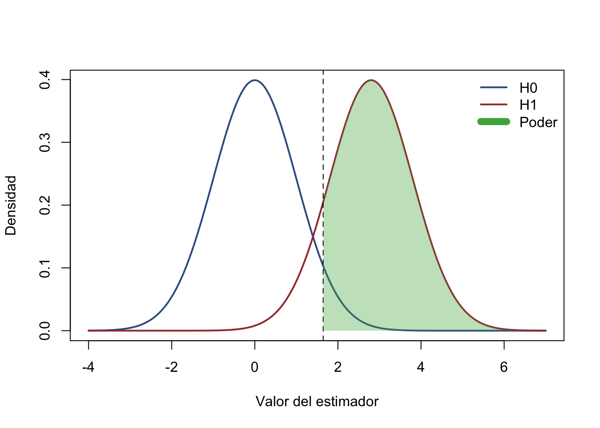

# Poder estadístico — Clase teórica {#poder-estadistico-teoria}

## Pregunta causal

Venimos de diseñar experimentos aleatorios para identificar un efecto causal. Ahora preguntamos: **¿cuántas unidades necesitamos para distinguir un efecto relevante del ruido muestral?** La aleatorización identifica el estimando; un diseño con poder suficiente permite aprender sobre él con una precisión útil.

Al finalizar esta clase podrán definir los errores tipo I y II, interpretar el poder, derivar el efecto mínimo detectable (MDE) y el tamaño de muestra, y ajustar el cálculo por controles, cumplimiento parcial, atrición y asignación por conglomerados.

La ruta de aula tiene 19 momentos: pregunta causal; motivación; notación; supuestos; errores tipo I/II; medias muestrales; dos distribuciones; definición de poder; distancia detectable; tamaño de muestra; taller de desempleo; parámetros de diseño; resultado continuo sin controles; continuo con controles; binario sin controles; binario con controles; eventos por exposición; conglomerados; y amenazas y decisiones.

:::: {.box-intuicion}
**Idea central.** “No significativo” no significa “sin efecto”. Puede significar que el experimento no tenía precisión para detectar un efecto que importaba.
::::

## Intuición y motivación

Una muestra demasiado pequeña expone al estudio a falsos negativos; una muestra innecesariamente grande usa recursos y participantes sin una ganancia proporcional. El análisis de poder traduce una pregunta sustantiva —qué cambio vale la pena detectar— en una decisión de diseño.

Si repetimos el muestreo aleatorio, la media muestral cambia. Al crecer el tamaño de muestra, su distribución se concentra alrededor de la media poblacional. Por ello es más fácil separar dos poblaciones cuyas medias difieren.

:::: {.box-cuidado}
**Diseño, no ritual.** El MDE debe venir de relevancia científica o de política, evidencia previa y costos; no debe elegirse después de observar qué efecto produce significancia.
::::

## Notación, parámetros y estimandos

Sea $D_i\in\{0,1\}$ la asignación, $Y_i(D=1)$ y $Y_i(D=0)$ los resultados potenciales y

\[
\tau=E[Y_i(D=1)-Y_i(D=0)]
\]

el efecto promedio objetivo. En un RCT con asignación individual estimamos $\widehat\tau=\bar Y_1-\bar Y_0$. Usaremos $\alpha$ para el error tipo I, $\beta$ para el error tipo II, $1-\beta$ para el poder, $\delta$ para el efecto que deseamos detectar, $p=N_1/N$ para la fracción tratada, $\sigma^2$ para la varianza del resultado y $z_q$ para el cuantil $q$ de una normal estándar.

El **MDE** es el menor efecto verdadero que el diseño detecta con probabilidad $1-\beta$, dados $N$, $\alpha$, la regla de colas y los demás parámetros. No es el menor efecto que puede existir ni el efecto que necesariamente estimaremos.

:::: {.box-definicion}
**Unidad siempre explícita.** $N$ denota el total y $n_1,n_0$ los tamaños por brazo. En asignación balanceada, $n_1=n_0=n$ y, por tanto, $N=2n$.
::::

## Supuestos de identificación

El cálculo básico supone asignación aleatoria, observaciones independientes bajo asignación individual, una regla de prueba fijada antes del análisis, varianzas y frecuencias piloto transportables, y medición comparable entre brazos. Para interpretar $\widehat\tau$ como efecto causal también requerimos consistencia, ausencia de interferencia entre unidades y atrición que no destruya la comparabilidad.

Los controles deben ser predeterminados. Su ganancia de precisión depende de que el $R^2$ anticipado describa la capacidad predictiva de esos controles en la población y especificación del estudio.

:::: {.box-supuesto}
**Separar identificación y precisión.** Aumentar $N$ reduce incertidumbre, pero no corrige incumplimiento mal definido, interferencia, medición diferencial ni sesgo por atrición selectiva.
::::

## Desarrollo teórico y demostraciones

### Errores tipo I y II

Contrastamos $H_0:\tau=0$. La diapositiva de aula resume “qué decidimos” frente a “qué pasa realmente”:

| Decisión | $H_0$ verdadera: no hay impacto | $H_1$ verdadera: hay impacto |
|:--|:--|:--|
| No rechazar $H_0$ | Decisión correcta, probabilidad $1-\alpha$ | Error tipo II, probabilidad $\beta$ |
| Rechazar $H_0$ | Error tipo I, probabilidad $\alpha$ | Decisión correcta: poder $1-\beta$ |

El **error tipo I** es declarar un efecto cuando no existe. El **error tipo II** es no detectar uno que sí existe. El **poder estadístico** es la probabilidad de rechazar $H_0$ cuando el efecto verdadero especificado existe.

### De la varianza muestral al error estándar

Para brazos independientes,

\[
\operatorname{Var}(\widehat\tau)
=\operatorname{Var}(\bar Y_1)+\operatorname{Var}(\bar Y_0)
=\frac{\sigma_1^2}{n_1}+\frac{\sigma_0^2}{n_0},
\qquad
SE(\widehat\tau)=\sqrt{\frac{\sigma_1^2}{n_1}+\frac{\sigma_0^2}{n_0}}.
\]

Con varianza común $\sigma^2$ y $p=N_1/N$, esto se convierte en

\[
SE(\widehat\tau)=\frac{\sigma}{\sqrt{Np(1-p)}}.
\]

Aquí $N$ es **total**. Si el diseño está balanceado y $n$ es **por brazo**, $SE=\sigma\sqrt{2/n}$.

### Dos distribuciones y poder

La línea crítica de una prueba unilateral al 5% se fija bajo $H_0$. El área de la distribución alternativa a la derecha de esa línea es el poder.


``` r
alpha <- 0.05
se <- 1
delta <- 2.8
critical <- qnorm(1 - alpha) * se
x <- seq(-4, 7, length.out = 1200)
f0 <- dnorm(x, mean = 0, sd = se)
f1 <- dnorm(x, mean = delta, sd = se)
plot(x, f0, type = "l", lwd = 2, col = "#365f91",
     xlab = "Valor del estimador", ylab = "Densidad", ylim = c(0, max(f0)))
lines(x, f1, lwd = 2, col = "#a23b3b")
abline(v = critical, lty = 2)
ix <- x >= critical
polygon(c(critical, x[ix], max(x)), c(0, f1[ix], 0),
        col = adjustcolor("#4daf4a", alpha.f = 0.35), border = NA)
legend("topright", c("H0", "H1", "Poder"),
       col = c("#365f91", "#a23b3b", "#4daf4a"), lwd = c(2, 2, 8), bty = "n")
```

<div class="figure">

<p class="caption">(\#fig:power-two-distributions)Distribuciones del estimador bajo la hipótesis nula y una alternativa; el área sombreada es el poder.</p>
</div>

Reducir $SE$ estrecha ambas distribuciones; aumentar $|\delta|$ las separa. Ambos cambios elevan el poder.

### Valores críticos, MDE y tamaño de muestra

Defina

\[
K=\begin{cases}
z_{1-\alpha/2}+z_{1-\beta}, & \text{prueba bilateral},\\
z_{1-\alpha}+z_{1-\beta}, & \text{prueba unilateral}.
\end{cases}
\]

En la aproximación normal, $MDE=K\,SE(\widehat\tau)$. Para resultado continuo, varianza común y asignación $p$,

\[
MDE=K\frac{\sigma}{\sqrt{Np(1-p)}}
\quad\Longleftrightarrow\quad
N_{\text{total}}=\frac{K^2\sigma^2}{p(1-p)MDE^2}.
\]

Con $p=1/2$, el tamaño **por brazo** es $n=2K^2\sigma^2/MDE^2$ y el total es $N=2n$. Estas fórmulas usan exactamente la convención de colas incorporada en $K$.

:::: {.box-formula}
**Lectura comparativa.** El MDE cae a la tasa $1/\sqrt{N}$: reducirlo a la mitad exige aproximadamente cuadruplicar la muestra, si todo lo demás permanece constante.
::::

### Taller de desempleo juvenil

Caso histórico de `POWER.pptx`: desempleo juvenil inicial de 42%, 4.000 jóvenes elegibles, una capacitación y capacidad anunciada para 420 personas. La diapositiva pregunta si la muestra basta y usa $\alpha=0.05$ bilateral, poder de 80%, $z_{1-\alpha/2}=1.96$, $z_{1-\beta}=0.84$ y asignación balanceada.

La diapositiva interpreta “disminuir el desempleo un 20%” con $\delta=0.22$ y varianza de referencia $0.42(1-0.42)$. Bajo esa **convención histórica de aula**,

\[
n_{\text{por brazo}}
=\frac{(1.96+0.84)^2\{2(0.42)(1-0.42)\}}{0.22^2}
\approx79,
\qquad N_{\text{total}}\approx158.
\]

Con 5% de atrición, $n_0=\lceil79/(1-0.05)\rceil=84$ por brazo (la diapositiva redondeaba a 83), es decir, 168 en total. La capacidad de 420 excede este cálculo histórico.

:::: {.box-cuidado}
**Corrección de convención.** Una reducción **relativa** de 20% desde 42% equivale a 8,4 puntos porcentuales, no a 22. Ese objetivo requiere un nuevo cálculo binario con $p_0=0.42$ y $p_1=0.336$. No se debe mezclar “porcentaje” con “puntos porcentuales”.
::::

### Parámetros que cambian el diseño

Con controles predeterminados que explican una fracción $R^2$ de la variación, $\sigma_{res}^2=\sigma^2(1-R^2)$. Por tanto,

\[
MDE_{X}=MDE_{\text{sin }X}\sqrt{1-R^2},
\qquad N_X=N_{\text{sin }X}(1-R^2).
\]

Si la diferencia de take-up entre asignados a tratamiento y control es $c$, el efecto ITT esperado es $c$ veces el efecto de recibir tratamiento. Para detectar un efecto de tratamiento $\delta$, se sustituye $\delta_{ITT}=c\delta$: el tamaño requerido se infla por $1/c^2$.

Si la retención esperada es $r=1-a$, la muestra reclutada debe satisfacer

\[
N_{reclutar}=\left\lceil\frac{N_{analitico}}{r}\right\rceil.
\]

Esta inflación preserva cantidad, no repara sesgo por atrición diferencial.

### Resultado continuo sin controles 7.1

Este es el caso de resultado continuo sin controles en Bogotá: un programa de aprendizaje busca aumentar ingresos anuales; presupuesto para $N=1{,}000$, 50% por brazo, prueba bilateral, $\alpha=0.02$ y poder de 80%. Con una DE histórica $\sigma$, el MDE es

\[
MDE=(z_{0.99}+z_{0.80})\frac{\sigma}{\sqrt{1000(0.5)(0.5)}}.
\]

Es $N$ **total** y la prueba es de **dos colas**. El caso exige una estimación piloto de $\sigma$ para expresarlo en unidades monetarias; sin ella solo puede reportarse en unidades de DE.

### Resultado continuo con controles 7.2

El segundo caso Bogotá estudia un resultado continuo con controles: conserva $N=1{,}000$, asignación 50/50, prueba bilateral y poder de 80%, y añade predictores con $R^2=0.5$. Manteniendo los demás parámetros, el MDE es $\sqrt{0.5}$ veces el del diseño sin controles. La ganancia depende de que el $R^2$ sea externo y reproducible, no calculado buscando el mejor resultado final.

### Resultado binario sin controles 7.3

Este caso Bogotá usa un resultado binario sin controles: subsidio de transporte para mamografía, $N=1{,}000$ total, 50% control, tasa base $p_0=0.03$, prueba unilateral con $\alpha=0.05$ y poder de 80%. `POWER.pptx` usa $z_{0.95}=1.65$, $z_{0.80}=0.84$ y reporta un MDE histórico de 0,027. Para planear una diferencia $p_1-p_0=\delta$, la varianza exacta aproximada es

\[
SE=\sqrt{\frac{p_1(1-p_1)}{n_1}+\frac{p_0(1-p_0)}{n_0}},
\]

por lo que el MDE binario se resuelve numéricamente cuando $p_1=p_0+\delta$ aparece también dentro del error estándar.

### Resultado binario con controles 7.4

El caso Zambia usa un resultado binario con controles: incentivos para circuncisión masculina, $N=1{,}000$ total (la lámina usa $n=991$ efectivos), 50/50, tasa base 3%, prueba unilateral, $\alpha=0.05$, poder 80% y $R^2=0.6$ de un estudio similar en Kenya. La lámina reporta MDE histórico de 0,017. Conceptualmente se multiplica la varianza relevante por $1-R^2$; antes de usar ese ajuste debe justificarse la transportabilidad del predictor étnico al distrito de Makululu.

### Comparación de tasas

El caso Senegal compara tasas: vacuna contra malaria, 1.667 muertes en 23.141 persona-años, $\mu_0=0.07203$ por persona-año; reducción relativa esperada de 40%, luego $\mu_1=0.0432$; asignación 50/50, prueba bilateral, $\alpha=0.01$ y poder 90%. La diapositiva usa $z_{0.995}=2.58$ y $z_{0.90}=1.28$ y reporta 2.067 persona-años **por brazo**. La unidad de análisis del cálculo es exposición, no necesariamente personas.

### Diseño por clústeres

El caso Sudáfrica asigna clústeres: 240 aldeas, 20 agricultores por aldea, 120 clústeres por brazo, media de tierra degradada 1,26 ha, $\sigma=0.47$ ha, ICC $\rho=0.037$, prueba bilateral, $\alpha=0.01$ y poder 90%. El efecto de diseño para clústeres de tamaño $m$ es

\[
DE=1+(m-1)\rho=1+19(0.037)=1.703.
\]

Así, $SE_{cluster}=SE_{individual}\sqrt{DE}$ y $MDE_{cluster}=MDE_{individual}\sqrt{DE}$. `POWER.pptx` reporta el MDE histórico de 0,0683 hectáreas. Son 240 **clústeres totales** y 4.800 individuos; la precisión depende mucho más del número de clústeres que de añadir individuos dentro de los mismos clústeres.

:::: {.box-cluster}
**Regla de diseño.** Con ICC positiva, ignorar la agrupación sobrestima el tamaño efectivo de la muestra. Si los tamaños de clúster varían mucho, $1+(m-1)\rho$ es solo una aproximación y debe ajustarse por esa variación.
::::

## Amenazas, limitaciones y errores comunes

Los cálculos son tan confiables como sus insumos. Las amenazas principales son DE o tasas piloto no transportables, hipótesis de una cola elegida después de ver el signo, múltiples resultados sin ajuste, asignación desigual ignorada, take-up sobrestimado, atrición diferencial, ICC subestimada y pocos clústeres para aproximaciones asintóticas.

El poder prospectivo no reemplaza intervalos de confianza. El “poder observado”, calculado con el efecto estimado del mismo estudio, es una transformación poco informativa del valor p. Después del estudio deben reportarse estimación, incertidumbre y desviaciones del diseño.

:::: {.box-error}
**Chequeo mínimo.** Antes de aprobar un cálculo, identifique estimando, unidad de asignación, unidad de observación, total versus por brazo, colas, $\alpha$, poder, MDE, varianza, asignación, retención, take-up e ICC cuando corresponda.
::::

## Resumen

El poder conecta una diferencia sustantiva con la distribución muestral del estimador. En diseños individuales, $MDE=K\,SE$ y el tamaño crece con la varianza y con $1/MDE^2$. Los controles reducen varianza mediante $1-R^2$; el cumplimiento parcial diluye el ITT; la atrición reduce el $N$ analítico; y los clústeres inflan la varianza mediante el efecto de diseño.

## Preguntas para clase

:::: {.box-ejercicio}
**Código:** POWER-T1

**Tipo:** Decisión estadística

**Fuente:** Elaboración para clase

**Enunciado:** Un RCT contrasta $H_0:\tau=0$ con una prueba bilateral de nivel 5% y fue diseñado con poder 80% frente a $\tau=0.20$. Para cada combinación entre realidad ($\tau=0$ o $\tau=0.20$) y decisión (rechazar o no rechazar $H_0$), nombre el resultado estadístico y asocie su probabilidad usando $\alpha$, $1-\alpha$, $\beta$ o $1-\beta$.

**Puntaje sugerido:** 4 puntos

**Producto esperado:** Tabla de cuatro celdas con nombre y probabilidad.
::::

:::: {.box-ejercicio}
**Código:** POWER-T2

**Tipo:** Cálculo continuo

**Fuente:** Elaboración para clase

**Enunciado:** Se planea un RCT individual, balanceado, con resultado continuo de DE 12, MDE de 4 unidades, prueba bilateral con $\alpha=0.05$ y poder 80%. Use $z_{0.975}=1.96$ y $z_{0.80}=0.84$. Derive el tamaño por brazo y el total. Luego suponga controles predeterminados con $R^2=0.36$ y recalcule ambos tamaños, redondeando hacia arriba.

**Puntaje sugerido:** 6 puntos

**Producto esperado:** Fórmulas sustituidas, tamaños por brazo y totales, y comparación porcentual.
::::

:::: {.box-ejercicio}
**Código:** POWER-T3

**Tipo:** Ajustes de implementación y clúster

**Fuente:** Elaboración para clase

**Enunciado:** Un cálculo individual requiere 600 observaciones analíticas totales para detectar el efecto de recibir tratamiento. La diferencia esperada de take-up entre brazos es 0,75 y la retención es 0,90. Además, la intervención se asignará por aldeas de 15 personas con ICC 0,04. Aplique, en orden, la inflación por cumplimiento parcial, el efecto de diseño y la inflación por atrición; reporte la muestra total a reclutar y el número mínimo de aldeas, redondeando cada requisito final hacia arriba. Explique qué supuesto adicional se necesita para interpretar causalmente la estimación.

**Puntaje sugerido:** 7 puntos

**Producto esperado:** Cadena de cálculo con unidades y una frase sobre identificación.
::::

## Puente a la clase práctica

En la clase práctica traduciremos cada decisión a comandos de Stata: tamaño de muestra y MDE para medias, proporciones y tasas; incorporación de controles; cumplimiento parcial; atrición; y aleatorización por clústeres. La tarea no es memorizar una sintaxis, sino auditar que cada opción corresponda al estimando y a las unidades de esta derivación.

## Referencias

Djimeu, E. W. y D.-G. Houndolo (2016). *Power calculation for causal inference in social science: Sample size and minimum detectable effect determination*. 3ie Working Paper 26.

Bloom, H. S. (1995). “Minimum Detectable Effects: A Simple Way to Report the Statistical Power of Experimental Designs”. *Evaluation Review*, 19(5), 547–556.

Hayes, R. J. y S. Bennett (1999). “Simple Sample Size Calculation for Cluster-Randomized Trials”. *International Journal of Epidemiology*, 28(2), 319–326.
