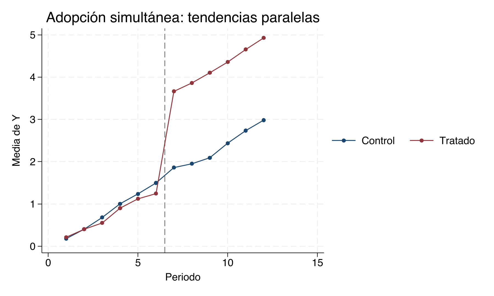
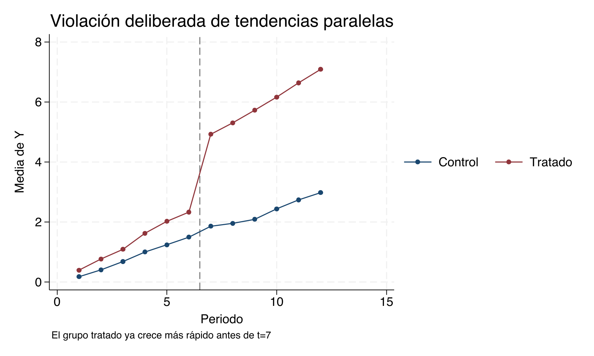
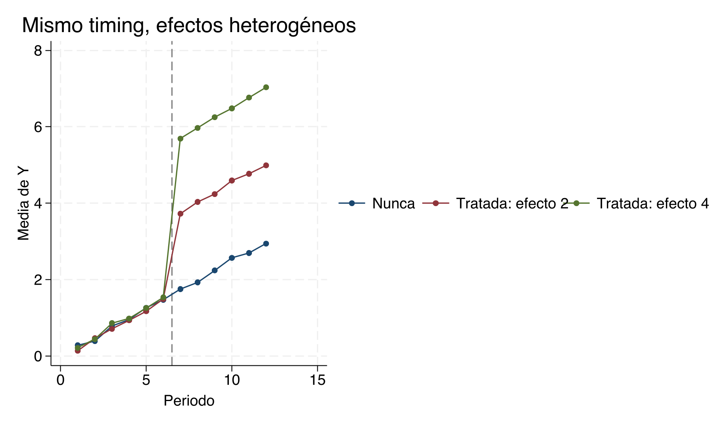
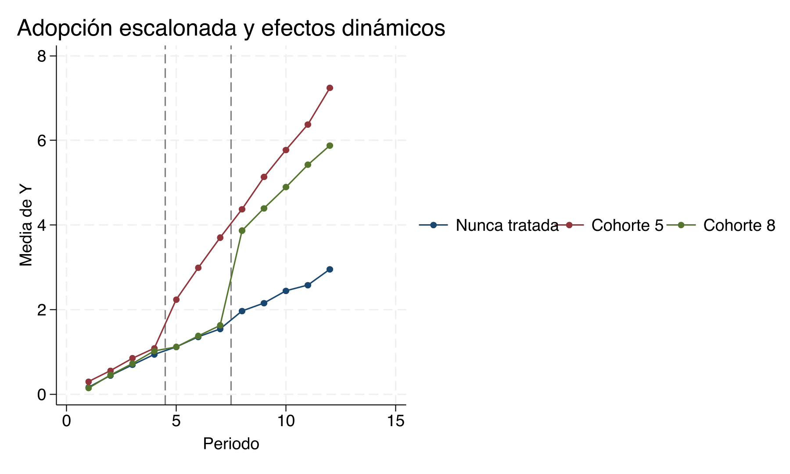
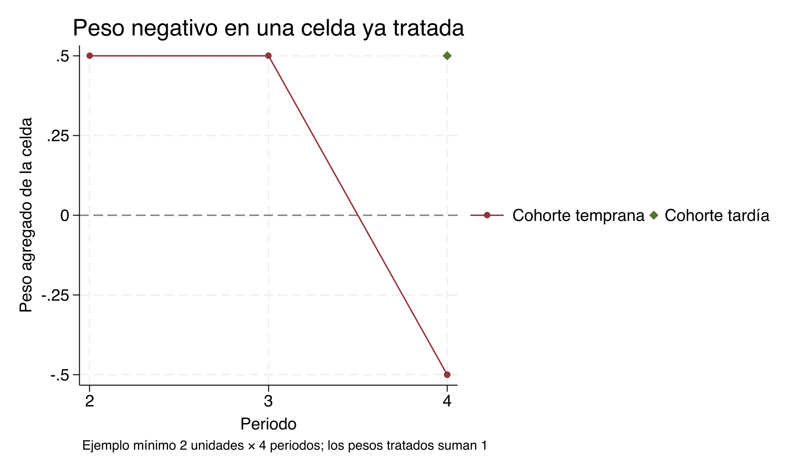
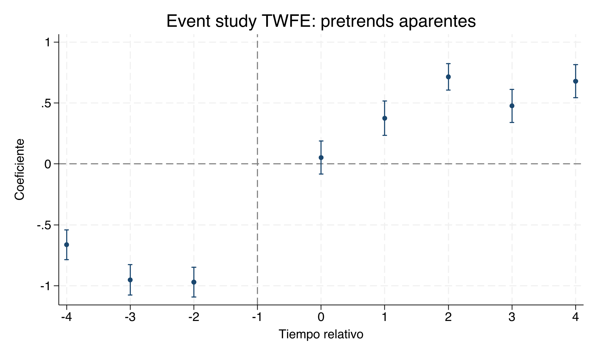

# Datos de panel y TWFE — Clase empírica {#panel-twfe-stata}

## Materiales para la clase {-}

::: {.class-materials}
**Descargue antes de comenzar**

- [Do-file de Stata](https://raw.githubusercontent.com/adiazescobar/libro_cortes/main/dofile/11_TWFE/11_stata.do)
- [Script de R](https://raw.githubusercontent.com/adiazescobar/libro_cortes/main/dofile/11_TWFE/11_twfe.R)
- [Script de Python](https://raw.githubusercontent.com/adiazescobar/libro_cortes/main/dofile/11_TWFE/11_twfe.py)
- [Resultados de estimadores de panel](https://raw.githubusercontent.com/adiazescobar/libro_cortes/main/dofile/11_TWFE/results/panel_estimators.csv)
- [Resultados de la equivalencia 2×2](https://raw.githubusercontent.com/adiazescobar/libro_cortes/main/dofile/11_TWFE/results/twfe_2x2.csv)
- [Resultados de adopción escalonada](https://raw.githubusercontent.com/adiazescobar/libro_cortes/main/dofile/11_TWFE/results/twfe_staggered.csv)
- [Event study TWFE](https://raw.githubusercontent.com/adiazescobar/libro_cortes/main/dofile/11_TWFE/results/twfe_eventstudy.csv)
- [Mapa método–parámetro](https://raw.githubusercontent.com/adiazescobar/libro_cortes/main/dofile/11_TWFE/results/method_parameter_map.csv)
:::

::: {.boxinfo}
**Lecturas centrales**

- [Bernal y Peña — capítulo 5 (PDF)](lecturas/bernal-pena/capitulo-05.pdf)
- [Cunningham — capítulo 8: Panel Data](https://mixtape.scunning.com/08-panel_data)
- [Cunningham — capítulo 9: Difference-in-Differences](https://mixtape.scunning.com/09-difference_in_differences)
:::

::: {.boxinfo}
**Metas de aprendizaje**

- Declarar, describir y visualizar un panel.
- Comparar pooled OLS, FE, FD y RE.
- Verificar la equivalencia 2×2.
- Diagnosticar comparaciones y pesos de TWFE escalonado.
- Elegir métodos modernos según el parámetro.
:::

La secuencia conserva tres hitos de la clase original: la **equivalencia en el caso 2×2**, una **Simulación grande** con adopción escalonada y la comparación de **estimadores modernos**.


## Declarar y auditar la estructura del panel {-}

```stata
xtset id t
xtdes
xtsum Y X
xtline Y if id<=10, overlay
```

- `xtset` verifica que cada par unidad–periodo sea único.
- `xtdes` muestra balance, huecos y longitud del panel.
- `xtsum` separa variación *overall*, *between* y *within*.
- `xtline` permite detectar trayectorias, quiebres y valores anómalos.

::: {.boxadvertencia}
**Error frecuente**

No declare un panel con un identificador ficticio. La misma unidad debe observarse repetidamente; los cortes transversales repetidos requieren otra estructura.
:::

### Descomponer variación within y between {-}

Antes de estimar, prediga qué parte de la variación identifica cada modelo:

```stata
xtsum Y X
bysort id: egen X_bar = mean(X)
gen X_within = X-X_bar
summarize X X_bar X_within
```

::: {.boxpregunta}
**Predicción antes de correr**

Si casi toda la variación de \(X\) es *between*, ¿qué dificultad tendrá FE? ¿Cambiaría su conclusión si \(X\) fuera una política que varía solo una vez por municipio?
:::

::: {.boxcerebro}
**Qué mirar en la salida**

Compare las desviaciones estándar *between* y *within*. Un FE puede estar bien identificado conceptualmente y, aun así, ser poco preciso si hay muy pocos cambios dentro de unidad.
:::

## Comparar pooled OLS, FE, FD y RE {-}

El DGP canónico genera \(X_{it}\) correlacionado con \(\alpha_i\), con \(\beta=3\).

```stata
regress Y X i.t, vce(cluster id)
xtreg Y X i.t, fe vce(cluster id)
regress D.Y D.X ibn.t, noconstant vce(cluster id)
xtreg Y X i.t, re vce(cluster id)
```


Table: (\#tab:twfe-panel-table)Estimadores de panel en el DGP canónico

|DGP   |Método     |Parámetro             | Coeficiente|    EE| Verdad|
|:-----|:----------|:---------------------|-----------:|-----:|------:|
|panel |Pooled OLS |beta within/between   |       3.521| 0.035|      3|
|panel |FE         |beta within           |       3.023| 0.030|      3|
|panel |FD         |beta first difference |       3.010| 0.035|      3|
|panel |RE         |beta quasi-within     |       3.312| 0.029|      3|

Pooled y RE mezclan variación *within* con la heterogeneidad correlacionada. FE y FD eliminan \(\alpha_i\) y se concentran cerca del valor verdadero.

### Pooled OLS: qué mezcla {-}

```stata
regress Y X i.t, vce(cluster id)
```

::: {.boxpregunta}
**Predicción antes de correr**

Como \(X_{it}=0.7\alpha_i+0.3t+u_{it}\), determine el signo esperado del sesgo pooled antes de mirar la tabla.
:::

::: {.boxcerebro}
**Interpretación**

Pooled compara simultáneamente personas con distinto \(\alpha_i\) y cambios de una misma persona. El coeficiente 3.521 excede el valor verdadero 3 porque \(X\) carga positivamente la heterogeneidad omitida.
:::

### Efectos fijos con xtreg {-}

```stata
xtreg Y X i.t, fe vce(cluster id)
estimates store fe_cluster
```

::: {.boxcerebro}
**Qué mirar en la salida**

El coeficiente FE, 3.023, usa variación *within*. Revise también cuántas unidades y periodos contribuyen, y no interprete `rho` como una prueba causal.
:::

### Transformación within a mano {-}

```stata
bysort id: egen mean_Y = mean(Y)
bysort id: egen mean_X = mean(X)
gen Y_within = Y-mean_Y
gen X_within = X-mean_X
regress Y_within X_within i.t, noconstant vce(cluster id)
```

El ejercicio permite comprobar la **transformación within** sin tratar `xtreg, fe` como una caja negra.

::: {.boxadvertencia}
**Error frecuente**

Si incluye efectos temporales en `xtreg`, debe reproducir la misma transformación temporal en la regresión manual. Dos especificaciones distintas no tienen por qué coincidir.
:::

### Primeras diferencias {-}

```stata
regress D.Y D.X ibn.t, noconstant vce(cluster id)
```

FD pierde el primer periodo de cada unidad y pondera cambios consecutivos. Con \(T>2\), no es algebraicamente idéntico a FE.

::: {.boxpregunta}
**Predicción antes de correr**

¿Esperaría mayor precisión de FE o FD si \(\varepsilon_{it}\) fuera ruido blanco? ¿Y si estuviera fuertemente correlacionado en el tiempo?
:::

### Efectos aleatorios y Hausman {-}

```stata
xtreg Y X i.t, fe
estimates store fe
xtreg Y X i.t, re
hausman fe ., sigmamore
```

El contraste depende de supuestos sobre ambos modelos y no reemplaza el razonamiento sustantivo sobre correlación entre \(X_{it}\) y \(\alpha_i\).

::: {.boxadvertencia}
**Decisión de diseño**

Hausman no “elige” automáticamente el mejor modelo. Primero establezca si el supuesto RE es defendible y si ambos estimadores apuntan al mismo parámetro.
:::

## Construir el DiD 2×2 desde cuatro medias {-}

```stata
summarize Y if treated==1 & t==0
scalar yt0=r(mean)
summarize Y if treated==1 & t==1
scalar yt1=r(mean)
summarize Y if treated==0 & t==0
scalar yc0=r(mean)
summarize Y if treated==0 & t==1
scalar yc1=r(mean)
display (yt1-yt0)-(yc1-yc0)
```

::: {.boxpregunta}
**Predicción antes de correr**

Escriba primero las cuatro medias en una tabla 2×2 y marque qué dos cambios forman el contrafactual.
:::

### Verificar DiD, FD y TWFE {-}

```stata
regress Y treated t D, vce(cluster id)
regress D.Y D.D, vce(cluster id)
reghdfe Y D, absorb(id t) vce(cluster id)
```


Table: (\#tab:twfe-equivalence-table)DiD = FD = TWFE en el diseño 2×2

|DGP |Método            |Parámetro | Coeficiente|    EE| Verdad|
|:---|:-----------------|:---------|-----------:|-----:|------:|
|2x2 |DiD manual        |ATT       |       2.788| 0.000|      3|
|2x2 |Regression DiD    |ATT       |       2.788| 0.141|      3|
|2x2 |First differences |ATT       |       2.788| 0.141|      3|
|2x2 |TWFE              |ATT       |       2.788| 0.141|      3|

Los cuatro coeficientes son idénticos salvo redondeo. Sus errores estándar pueden variar por la forma de estimación; la interpretación causal exige los supuestos discutidos en la teoría.

::: {.boxcerebro}
**Interpretación**

La equivalencia numérica comprueba el álgebra del diseño, no tendencias paralelas.
:::

## Panel largo con adopción simultánea {-}

Antes de escalonar la adopción, extienda el 2×2 a varios periodos con una fecha común:

```stata
clear
set obs 3600
egen id = seq(), block(12)
bysort id: gen t=_n
gen treated=id>150
gen D=treated & t>=7
gen Y=id/100+.25*t+2*D+rnormal()
xtset id t
reghdfe Y D, absorb(id t) vce(cluster id)
```

::: {.boxcerebro}
**Qué mirar en la salida**

Con fecha común y efecto constante, no aparecen comparaciones entre cohortes tratadas en fechas distintas. Este es el puente entre DiD multiperiodo y el problema escalonado.
:::



## Tendencias paralelas y una violación deliberada {-}

```stata
gen trend_violation=.15*treated*t
gen Y_bad=Y+trend_violation
reghdfe Y_bad D, absorb(id t) vce(cluster id)
```

Compare trayectorias pretratamiento y estime el mismo modelo con y sin la tendencia adicional.

::: {.boxadvertencia}
**Error frecuente**

No “arregle” el segundo DGP agregando mecánicamente `c.t#i.treated`. La tendencia específica impone una extrapolación, puede absorber parte del tratamiento y cambia el estimando.
:::

::: {.boxpregunta}
**Decisión de diseño**

Si las tendencias previas divergen, proponga un control alternativo, una ventana distinta o un diseño diferente antes de añadir términos funcionales.
:::



## Mismo timing con efectos heterogéneos {-}

```stata
replace D=(id>100 & t>=7)
gen tau=cond(id<=200,2,4)
gen Y_hetero=id/100+.25*t+tau*D+rnormal()
reghdfe Y_hetero D, absorb(id t) vce(cluster id)
```

Con el mismo timing, TWFE promedia heterogeneidad entre unidades sin usar una cohorte tratada como control de otra fecha. Calcule el promedio correcto ponderando observaciones tratadas.

::: {.boxcerebro}
**Interpretación**

La heterogeneidad por sí sola no produce el problema Bacon de comparaciones temprana–tardía. El problema central requiere también variación en adopción.
:::



## Adopción escalonada con efectos dinámicos {-}

El DGP tiene 900 unidades, 12 periodos, una cohorte que adopta en \(t=5\), otra en \(t=8\) y una nunca tratada. Los efectos crecen con la exposición y difieren entre cohortes.

```stata
gen cohort = cond(id<=300,5,cond(id<=600,8,0))
gen D = cohort>0 & t>=cohort
gen event_time = t-cohort if cohort>0
gen double tau = 0
replace tau = 1 + .45*event_time if cohort==5 & D
replace tau = 2 + .25*event_time if cohort==8 & D
gen double Y0 = alpha_i + .25*t + rnormal()
gen double Y = Y0 + tau

* Auditar la heterogeneidad antes de estimar
tabstat tau if D, by(cohort) statistics(n mean min max)
table cohort event_time if D, statistic(mean tau)
summarize tau if D
reghdfe Y D, absorb(id t) vce(cluster id)
```

La heterogeneidad no queda implícita: para la cohorte temprana el efecto comienza en 1 y crece 0.45 por periodo de exposición; para la tardía comienza en 2 y crece 0.25. Por tanto, \(\tau_{g,e}\) varía **entre cohortes** y **dentro de cada cohorte a lo largo del tiempo**.

::: {.boxcerebro}
**Chequeo pedagógico del DGP**

Antes de interpretar TWFE, verifique dos ingredientes distintos:

1. `tab cohort` confirma adopción escalonada: \(g=5\), \(g=8\) y nunca tratados.
2. `table cohort event_time ...` confirma efectos heterogéneos y dinámicos: las celdas tratadas no comparten el mismo `tau`.

Si cualquiera de los dos ingredientes desaparece, este ejemplo ya no representa el problema central que queremos estudiar.
:::


Table: (\#tab:twfe-staggered-table)ATT verdadero y coeficiente TWFE escalonado

|DGP       |Método   |Parámetro                   |Muestra                 | Coeficiente|    EE|
|:---------|:--------|:---------------------------|:-----------------------|-----------:|-----:|
|staggered |True ATT |average treated-cell effect |all treated cells       |       2.546| 0.000|
|staggered |TWFE     |implicit weighted average   |all cohorts and periods |       2.091| 0.042|

TWFE no recupera el promedio simple de las celdas tratadas porque residualiza el tratamiento y mezcla comparaciones con distinta exposición.



::: {.boxpregunta}
**Predicción antes de correr**

La cohorte temprana acumula más periodos tratados. Antes de estimar, indique si espera que TWFE quede por encima o por debajo del ATT overall y qué comparación puede generar la diferencia.
:::

## Leer bacondecomp fila por fila {-}

```stata
bacondecomp Y D, ddetail
```

Lea la salida en tres familias:

- `Never_v_timing`: tratada frente a nunca tratada;
- `Early_v_Late`: temprana frente a tardía antes de su adopción;
- `Late_v_Early`: tardía frente a temprana ya tratada.

Una salida estilizada puede organizarse así:

| Tipo | Beta 2×2 | Peso Bacon | aporte ponderado |
|---|---:|---:|---:|
| `Early_v_Late` | \(\widehat\beta_{EL}\) | \(\omega_{EL}\) | \(\omega_{EL}\widehat\beta_{EL}\) |
| `Late_v_Early` | \(\widehat\beta_{LE}\) | \(\omega_{LE}\) | \(\omega_{LE}\widehat\beta_{LE}\) |
| `Never_v_timing` | \(\widehat\beta_{NU}\) | \(\omega_{NU}\) | \(\omega_{NU}\widehat\beta_{NU}\) |

Compruebe:

\[
\omega_{EL}+\omega_{LE}+\omega_{NU}=1
\]

y que la suma de la última columna reproduce el coeficiente TWFE.

::: {.boxadvertencia}
**Error frecuente**

`bacondecomp` muestra comparaciones y pesos en la descomposición Bacon. No debe describirse como si reportara directamente todos los pesos sobre \(ATT(g,t)\).
:::

::: {.boxcerebro}
**Qué mirar en la salida**

Una participación alta de `Late_v_Early` es preocupante cuando el efecto de la cohorte temprana cambia con exposición, porque esa cohorte ya tratada funciona como control.
:::

## Calcular los pesos causales a mano {-}

Residualice \(D_{it}\) sin depender inicialmente de un paquete:

```stata
bysort id: egen D_bar_i=mean(D)
bysort t: egen D_bar_t=mean(D)
summarize D
scalar D_bar=r(mean)
gen double D_tilde=D-D_bar_i-D_bar_t+D_bar
egen denom=total(D_tilde^2)
gen double peso_causal=D_tilde/denom if D==1
summarize peso_causal if D==1, detail
count if peso_causal<0 & D==1
```

Para agregar por cohorte–periodo:

```stata
collapse (sum) peso_causal (mean) tau, by(cohort t D)
keep if D==1
gen aporte_peso=peso_causal*tau
egen beta_twfe_teorico=total(aporte_peso)
```

::: {.boxpregunta}
**Predicción antes de correr**

¿En qué celdas espera \(D_{it}\) residualizado negativo: al comienzo o al final de la exposición de la cohorte temprana?
:::

::: {.boxcerebro}
**Interpretación**

Compare los pesos causales con los pesos \(N_{g,t}/\sum N_{g,t}\) del **ATT overall**. Ambos suman uno, pero solo los segundos forman necesariamente un promedio convexo.
:::



## Diagnóstico con twowayfeweights {-}

```stata
twowayfeweights Y id t D, type(feTR) summary_measures
```

Esta herramienta responde una pregunta complementaria: cómo pondera TWFE efectos grupo-periodo y cuán robusto es su signo a heterogeneidad.

::: {.boxcerebro}
**Decisión de diseño**

Use `bacondecomp` para entender de dónde vienen las comparaciones 2×2 y `twowayfeweights` para estudiar pesos implícitos sobre efectos causales.
:::

## Event study TWFE contaminado {-}

```stata
reghdfe Y lead4 lead3 lead2 lag0 lag1 lag2 lag3 lag4, ///
    absorb(id t) vce(cluster id)
```


Table: (\#tab:twfe-event-table)Event study TWFE tradicional en un DGP sin anticipación

|DGP       |Método           |Parámetro                 | Horizonte| Coeficiente|    EE|
|:---------|:----------------|:-------------------------|---------:|-----------:|-----:|
|staggered |TWFE event study |relative-time coefficient |        -4|      -0.663| 0.062|
|staggered |TWFE event study |relative-time coefficient |        -3|      -0.951| 0.064|
|staggered |TWFE event study |relative-time coefficient |        -2|      -0.970| 0.062|
|staggered |TWFE event study |relative-time coefficient |         0|       0.052| 0.070|
|staggered |TWFE event study |relative-time coefficient |         1|       0.375| 0.072|
|staggered |TWFE event study |relative-time coefficient |         2|       0.714| 0.055|
|staggered |TWFE event study |relative-time coefficient |         3|       0.477| 0.069|
|staggered |TWFE event study |relative-time coefficient |         4|       0.678| 0.069|

Los leads negativos aparecen aunque el DGP no tiene anticipación. Son contaminación de efectos heterogéneos de otros periodos, no evidencia de que las unidades hayan respondido antes.



::: {.boxadvertencia}
**Error frecuente**

No use un test conjunto de leads TWFE como prueba definitiva de tendencias paralelas en este DGP: los coeficientes ya están contaminados por efectos postratamiento heterogéneos.
:::

## Comparar estimadores sin mezclar parámetros {-}


Table: (\#tab:twfe-method-map)Qué estima cada alternativa heterogeneity-robust

|Método             |Parámetro                                  |Muestra de comparación       |Horizonte              |
|:------------------|:------------------------------------------|:----------------------------|:----------------------|
|csdid              |ATT(g,t) and explicit aggregations         |never or not-yet treated     |calendar/group/event   |
|eventstudyinteract |interaction-weighted relative-time average |chosen control cohort        |relative time          |
|did_imputation     |event effects by imputation                |untreated observations       |requested horizons     |
|did_multiplegt_dyn |dynamic current-vs-status quo effects      |switchers and valid controls |dynamic/cumulative     |
|did2s              |parameter defined by second stage          |untreated first-stage sample |second-stage variables |

### Callaway y Sant’Anna {-}

```stata
csdid Y, ivar(id) time(t) gvar(cohort) notyet
estat simple
estat group
estat event
```

`csdid` construye \(ATT(g,t)\) y luego permite agregaciones transparentes.

### Sun y Abraham {-}

```stata
eventstudyinteract Y lead4 lead3 lead2 lag0-lag4, ///
    absorb(id t) cohort(cohort) control_cohort(never_treat) ///
    vce(cluster id)
```

`eventstudyinteract` produce promedios *interaction-weighted* por tiempo relativo.

### Imputación de Borusyak, Jaravel y Spiess {-}

```stata
did_imputation Y id t cohort, horizons(0/4) pretrend(4)
```

El método aprende el resultado no tratado con observaciones no tratadas y construye efectos de evento por imputación.

### Diseños generales y tratamientos no absorbentes {-}

```stata
did_multiplegt_dyn Y id t D, effects(4) placebo(4) cluster(id)
```

La instalación correcta es `ssc install did_multiplegt_dyn, replace`. Sus efectos dinámicos pueden representar cambios actuales frente al *status quo* y diseños más generales.

### Estimación en dos etapas {-}

```stata
did2s Y, first_stage(i.id i.t) second_stage(lag0-lag4) ///
    treatment(D) cluster(id)
```

En `did2s`, el parámetro depende de las variables de la segunda etapa. Para `event_plot`, guarde cada matriz con el mismo nombre que luego consume el gráfico:

```stata
matrix did2s_b = e(b)
matrix did2s_v = e(V)
event_plot did2s_b#did2s_v
```

No combine en una figura métodos con poblaciones, agregaciones u horizontes incompatibles.

::: {.boxpregunta}
**Predicción antes de correr**

Antes de comparar dos curvas, complete para cada método: población, control, parámetro, horizonte, normalización y anticipación permitida.
:::

::: {.boxcerebro}
**Qué mirar en la salida**

Dos coeficientes con el mismo rótulo “evento \(k\)” pueden promediar cohortes distintas. La comparación válida exige alinear soporte y pesos, no solo el eje horizontal.
:::

## ¿Qué supone cada estimador? {-}

Ahora que el problema de TWFE y las cinco alternativas ya están sobre la mesa, use esta matriz como **síntesis**. La pregunta no es cuál comando es más moderno, sino qué observaciones construyen el resultado no tratado de cada cohorte y si esa comparación ofrece un contrafactual defendible.

| Método | Supuesto | Control | Diagnóstico | Limitación |
|---|---|---|---|---|
| TWFE | Tendencia contrafactual común de \(Y(D=0)\) para las comparaciones implícitas | Nunca tratados, no-aún tratados y, mecánicamente, cohortes ya tratadas | Gráficas pretratamiento, leads y descomposición de comparaciones | No corrige la contaminación cuando una cohorte ya tratada sirve como control y los efectos son heterogéneos |
| `csdid` | Tendencias paralelas para cada \(ATT(g,t)\), incondicionales o condicionales en covariables pretratamiento | Nunca tratados o no-aún tratados, según la opción declarada | `estat event`, `estat pretrend`, intervalos pretratamiento y placebos por cohorte | No prueba tendencias paralelas; poco soporte común puede volver frágil la reponderación |
| `eventstudyinteract` | Tendencias contrafactuales paralelas entre cada cohorte y la cohorte de control elegida | Cohorte nunca tratada o última cohorte, todavía no tratada en el horizonte usado | Event study *interaction-weighted*, intervalos de confianza de los leads y prueba conjunta | No garantiza tendencias paralelas y exige revisar soporte y composición por horizonte |
| `did_imputation` | El modelo del resultado no tratado, estimado únicamente antes del tratamiento, extrapola correctamente a las celdas tratadas | Observaciones nunca tratadas y no-aún tratadas usadas para estimar el modelo no tratado | Opción `pretrend()`, residuales pretratamiento, placebos e intervalos por horizonte | No corrige una extrapolación incorrecta del modelo no tratado ni falta de soporte |
| `did2s` | La primera etapa modela correctamente \(Y(D=0)\) con observaciones no tratadas y la segunda etapa define el evento de interés | Nunca tratados y no-aún tratados en la primera etapa | Leads de la segunda etapa, intervalos, prueba conjunta y placebos | No elimina el sesgo si la primera etapa extrapola mal o si cambia la composición |
| `did_multiplegt_dyn` | Los *switchers* y *stayers* pertinentes habrían tenido tendencias contrafactuales paralelas, con no anticipación en el horizonte | *Stayers*, *quasi-stayers* o unidades que aún conservan el *status quo* | Opción `placebo()`, efectos placebo, intervalos y gráficas por horizonte | No verifica el supuesto; pocos *switchers* o cambios reversibles pueden reducir potencia y soporte |

::: {.boxcerebro}
**Regla de lectura**

Primero fije estimando, población y control; después escoja el comando. Los métodos modernos evitan comparaciones contaminadas específicas, pero ninguno vuelve innecesarias las tendencias paralelas.
:::

## Tendencias paralelas: del supuesto al diagnóstico {-}

La matriz aclara qué supuesto corresponde a cada solución. El paso siguiente es evaluar cuánta evidencia ofrece el diseño a favor de ese supuesto, sin confundir un diagnóstico con una prueba.

**1. Grafique los resultados observados, sin ajustar.** La figura no identifica el efecto, pero revela escala, composición, fechas de adopción y divergencias que el modelo puede ocultar.

```stata
preserve
collapse (mean) Y, by(cohort t)
twoway (connected Y t if cohort==5) ///
       (connected Y t if cohort==8) ///
       (connected Y t if cohort==0), ///
       xline(5 8, lpattern(dash)) legend(order(1 "g=5" 2 "g=8" 3 "Nunca"))
restore
```

**2. Defina explícitamente cohorte y control.** Verifique que `cohort` sea la primera fecha de tratamiento, que cero identifique a los nunca tratados y que las unidades no-aún tratadas solo entren mientras permanezcan sin tratamiento.

```stata
bysort id (t): assert cohort==cohort[1]
gen byte never_treat=cohort==0
tab cohort
tab cohort t if D==0
```

**3. Estime un event study compatible con esa comparación.** Para Sun–Abraham, cada interacción cohorte–evento se compara con la cohorte de control declarada; no sustituya esta estimación por el event study TWFE contaminado mostrado arriba.

```stata
eventstudyinteract Y lead4 lead3 lead2 lag0-lag4, ///
    absorb(id t) cohort(cohort) control_cohort(never_treat) ///
    vce(cluster id)
matrix list e(b_iw)
matrix list e(V_iw)
event_plot e(b_iw)#e(V_iw), stub_lead(lead#) stub_lag(lag#) together
```

**4. Lea los preperiodos con sus intervalos.** Reporte cada estimación y su incertidumbre, además de una prueba conjunta cuando el comando la permita. Un coeficiente impreciso cerca de cero y uno precisamente estimado cerca de cero aportan evidencia muy distinta.

**5. Ejecute placebos coherentes con el estimador.** Por ejemplo:

```stata
csdid Y, ivar(id) time(t) gvar(cohort) notyet
estat event
estat pretrend

did_multiplegt_dyn Y id t D, effects(4) placebo(4) cluster(id)
```

**6. Discuta potencia.** La ausencia de rechazo conjunto no demuestra el supuesto. Informe si el diseño habría detectado una desviación económicamente relevante mediante intervalos pretratamiento, un efecto mínimo detectable o simulaciones con el número real de cohortes y clústeres.

**7. Haga sensibilidad.** Pregunte cuánto tendría que desviarse la tendencia contrafactual postratamiento para cambiar la conclusión. Esta etapa complementa —no reemplaza— el argumento institucional, la elección del control y los placebos.

::: {.boxadvertencia}
**Lo que no puede concluirse**

Que los leads no sean individual o conjuntamente significativos no verifica el contrafactual postratamiento. También puede reflejar pocos preperiodos, pocos clústeres, intervalos anchos o una prueba con baja potencia.
:::

### Extensión avanzada opcional: HonestDiD {-}

[`honestdid`](https://github.com/mcaceresb/stata-honestdid) implementa el análisis de sensibilidad de Rambachan y Roth. En lugar de asumir desviación exactamente cero, calcula conjuntos de confianza robustos bajo restricciones explícitas sobre la magnitud relativa o la suavidad de la desviación postratamiento.

HonestDiD no prueba, valida, verifica, repara ni elimina las tendencias paralelas: es un **análisis de sensibilidad**. Su entrada debe ser el vector y la matriz de covarianzas de un event study compatible con el diseño. En este ejemplo se usan los coeficientes *interaction-weighted* de `eventstudyinteract`, nunca los del TWFE contaminado.

```stata
* Instalación estable y verificación del plugin compilado (una sola vez)
ssc install honestdid
honestdid _plugin_check
```

```stata
* Estimación compatible: Sun-Abraham con cohorte nunca tratada como control
eventstudyinteract Y lead4 lead3 lead2 lag0-lag4, ///
    absorb(id t) cohort(cohort) control_cohort(never_treat) ///
    vce(cluster id)

* eventstudyinteract guarda el estimador IW en e(b_iw) y e(V_iw)
matrix b_iw = e(b_iw)
matrix V_iw = e(V_iw)

* Repostear exactamente esas matrices permite auditarlas como e(b) y e(V)
ereturn clear
ereturn post b_iw V_iw
matrix b_honest = e(b)
matrix V_honest = e(V)
matrix list b_honest
matrix list V_honest

* Aquí 1/3 son leads y 4/8 son efectos post; confirme siempre el orden
honestdid, pre(1/3) post(4/8) b(b_honest) vcov(V_honest) ///
    mvec(0(0.5)2) delta(rm) coefplot
```

::: {.boxcerebro}
**Cómo leer la sensibilidad**

`mvec()` recorre valores de \(\bar M\), que permiten desviaciones postratamiento cada vez mayores respecto de las observadas antes del tratamiento. Reporte los conjuntos de confianza y el *breakdown value*: el menor \(\bar M\) para el cual cambia la conclusión sustantiva. No escoja \(\bar M\) para “salvar” significancia; justifíquelo con conocimiento económico e institucional.
:::

::: {.boxadvertencia}
**Ejemplo opcional**

El bloque requiere el plugin compilado de `honestdid`. Si `_plugin_check` falla en el computador del aula, conserve la estimación compatible, exporte `b_honest` y `V_honest`, y ejecute la sensibilidad después de instalar el binario apropiado. La clase principal no depende de que el plugin esté disponible.
:::

## Checklist aplicado {-}

Antes de correr un comando, documente:

| Decisión | Pregunta |
|---|---|
| Tratamiento | ¿Binario, continuo, multivaluado, absorbente o reversible? |
| Controles | ¿Nunca tratados, no-aún tratados, *stayers* o *quasi-stayers*? |
| Parámetro | ¿ATT global, \(ATT(g,t)\), evento, acumulado o *status quo*? |
| Dinámica | ¿Anticipación o efectos rezagados? |
| Inferencia | ¿Nivel de asignación, clustering y número de clústeres? |
| Covariables | ¿Pretratamiento o afectadas por el programa? |
| Comparación | ¿Misma población y horizonte entre métodos? |

## Preguntas tipo examen {-}

::: {.boxejercicio}
**Código:** TWFE-S1
**Tipo:** Panel y estimación
**Fuente:** Elaboración propia
**Enunciado:** Declare el panel, descomponga la variación de \(X\) y estime pooled OLS, FE, FD y RE. Explique las diferencias usando la correlación entre \(X_{it}\) y \(\alpha_i\).
**Puntaje sugerido:** 5 puntos
**Comandos permitidos:** `xtset`, `xtsum`, `regress`, `xtreg`
**Producto esperado:** Código, tabla y explicación de máximo 180 palabras.
:::

::: {.boxejercicio}
**Código:** TWFE-S2
**Tipo:** Equivalencia 2×2
**Fuente:** Elaboración propia
**Enunciado:** Estime DiD manual, regresión DiD, primeras diferencias y TWFE en un panel de dos periodos. Verifique la igualdad y separe esa comprobación de la discusión de identificación.
**Puntaje sugerido:** 5 puntos
**Comandos permitidos:** `summarize`, `regress`, `reghdfe`
**Producto esperado:** Cuatro coeficientes y checklist causal.
:::

::: {.boxejercicio}
**Código:** TWFE-S3
**Tipo:** Diagnóstico escalonado
**Fuente:** Goodman-Bacon; de Chaisemartin y D’Haultfœuille
**Enunciado:** En el DGP escalonado, ejecute los dos diagnósticos de pesos. Explique qué pregunta responde cada uno y señale las comparaciones potencialmente contaminadas.
**Puntaje sugerido:** 5 puntos
**Comandos permitidos:** `reghdfe`, `bacondecomp`, `twowayfeweights`
**Producto esperado:** Dos salidas y diagnóstico comparativo.
:::

::: {.boxejercicio}
**Código:** TWFE-S4
**Tipo:** Selección de estimador
**Fuente:** Elaboración propia
**Enunciado:** Para un tratamiento reversible con efectos rezagados, defina el parámetro y seleccione un estimador. Justifique controles, horizonte, clustering y por qué no usaría automáticamente un event study TWFE.
**Puntaje sugerido:** 5 puntos
**Comandos permitidos:** `did_multiplegt_dyn`, `csdid`, `eventstudyinteract`, `did_imputation`, `did2s`
**Producto esperado:** Especificación ejecutable y memo de máximo 250 palabras.
:::

## Replicación en R y Python {-}

`11_twfe.R` y `11_twfe.py` reproducen los DGP y la lógica de FE/TWFE. Para una comparación entre lenguajes, mantenga idénticos el estimando, las cohortes, el horizonte y la población de control; no compare únicamente nombres de comandos.
