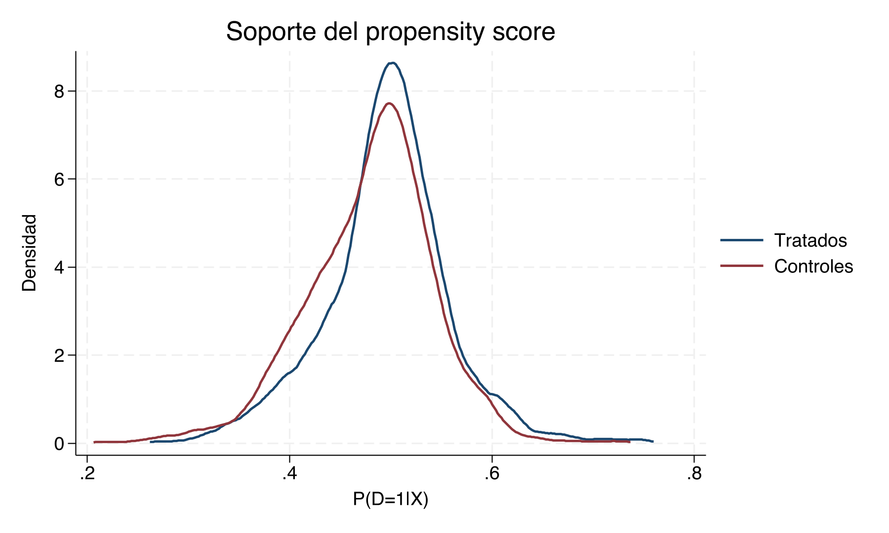
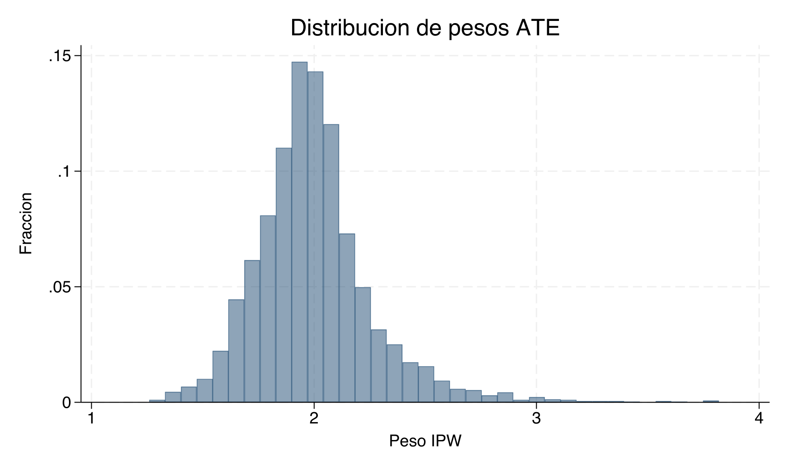

# Ponderación por probabilidad inversa — Clase empírica {#psm-ipw-sinteticos}

## Materiales para la clase {-}

Descarga estos archivos antes de comenzar:

- [Do-file completo de IPW](dofile/16_PSM_IPW_Sinteticos/02_ipw_stata.do)
- [Base de datos de la práctica](dofile/16_PSM_IPW_Sinteticos/base6.dta)
- [Log completo de Stata](dofile/16_PSM_IPW_Sinteticos/ipw_demo.log)

::: {.boxinfo}
**Lecturas centrales**

- [Bernal y Peña — capítulo 6 (PDF)](lecturas/bernal-pena/capitulo-06.pdf)
- [Cunningham — capítulo 5: Matching and Subclassification](https://mixtape.scunning.com/05-matching_and_subclassification)
:::

::: {.boxinfo}
**Metas de aprendizaje**

- Construir manualmente pesos ATE y ATT a partir del propensity score.
- Distinguir Horvitz–Thompson y Hájek en resultados reales.
- Auditar soporte, balance, concentración de pesos y tamaño efectivo de muestra.
- Comparar `teffects ipw`, `teffects aipw` y `teffects ipwra`.
- Reconocer cuándo la positividad débil obliga a cambiar el diseño y la población objetivo.
:::


## Pregunta causal y estimandos {-}

Usaremos la misma base de PSM para que el cambio sea metodológico, no una historia nueva. El tratamiento es `D`, el resultado es `y2` y todas las covariables son pretratamiento:

```stata
use base6.dta, clear
global Xmust personas orden_n ocupado_jefe educa_jefe ingresos_hogar_jefe hombre
drop if missing(D, y2, $Xmust)
```

Estudiaremos dos preguntas:

$$
ATE=E[Y(D=1)-Y(D=0)]
$$

y

$$
ATT=E[Y(D=1)-Y(D=0)\mid D=1].
$$

La diferencia cruda es $0.3325$, pero no la llamamos efecto causal: los grupos presentan selección observable. IPW busca construir una pseudopoblación donde la distribución de esas covariables sea comparable.

## Estimar el propensity score {-}

```stata
logit D $Xmust
predict double ps, pr
assert ps > 0 & ps < 1
```

La primera auditoría no es el coeficiente del logit. Es la superposición de $\hat e(X)$ entre tratados y controles.



En esta base hay superposición amplia. Esto anticipa pesos moderados, pero no demuestra CIA: solo indica que existen comparaciones observables razonables.

## Construir los pesos {-}

Para ATE ponderamos ambos brazos hacia la población completa; para ATT dejamos peso uno a los tratados y reponderamos los controles hacia ellos.

```stata
gen double w_ate = D/ps + (1-D)/(1-ps)
gen double w_att = D + (1-D)*ps/(1-ps)

summ D, meanonly
scalar pD = r(mean)
gen double w_ate_stab = D*pD/ps + (1-D)*(1-pD)/(1-ps)
```


Table: (\#tab:ipw-diagnostics-table)Diagnóstico de pesos generado por Stata

|   |Peso       |    p1|   p50|   p99| Máximo|     Suma|      ESS|
|:--|:----------|-----:|-----:|-----:|------:|--------:|--------:|
|1  |w_ate      | 1.460| 1.977| 2.876|  3.819| 7999.691| 3930.393|
|7  |w_att      | 0.492| 1.000| 1.495|  2.803| 3903.633| 3872.014|
|13 |w_ate_stab | 0.731| 0.988| 1.406|  1.947| 3999.841| 3932.900|

```text
Peso ATE: máximo = 3.819; ESS = 3,930 de 4,000
Peso ATT: máximo = 2.803; ESS = 3,872 de 4,000
ATE estabilizado: máximo = 1.947; ESS = 3,933 de 4,000
```

La cercanía entre tamaño nominal y ESS confirma que ninguna observación domina. Los pesos estabilizados cambian la escala, no la concentración relativa dentro de cada brazo ni el soporte disponible.



::: {.boxexam}
**IPW-S1.** Suponga que el peso ATE máximo fuera 64 y el ESS fuera 420 con 4,000 observaciones. Explique qué problema empírico revelan conjuntamente esas cifras, qué figura examinaría y por qué reportar únicamente el tamaño nominal sería engañoso.
:::

## Horvitz–Thompson y Hájek a mano {-}

La mecánica debe quedar visible antes de usar `teffects`. Para ATE, Horvitz–Thompson conserva el denominador $N$:

```stata
gen double ht1_ate_i = D*y2/ps
gen double ht0_ate_i = (1-D)*y2/(1-ps)
summ ht1_ate_i, meanonly
scalar ht1_ate = r(mean)
summ ht0_ate_i, meanonly
scalar ht0_ate = r(mean)
scalar ht_ate = scalar(ht1_ate) - scalar(ht0_ate)
```

Hájek normaliza cada media por la suma realizada de pesos:

```stata
summ y2 [aw=1/ps] if D==1, meanonly
scalar hajek1_ate = r(mean)
summ y2 [aw=1/(1-ps)] if D==0, meanonly
scalar hajek0_ate = r(mean)
scalar hajek_ate = scalar(hajek1_ate) - scalar(hajek0_ate)
```


Table: (\#tab:ipw-manual-table)Cálculos manuales exportados por Stata

|Estimador        |Estimando | Efecto|
|:----------------|:---------|------:|
|Diferencia cruda |ATE       | 0.3325|
|HT manual        |ATE       | 0.3277|
|Hajek manual     |ATE       | 0.3278|
|HT manual        |ATT       | 0.3320|
|Hajek manual     |ATT       | 0.3322|

```text
ATE HT manual       = 0.3277
ATE Hájek manual    = 0.3278
ATT HT manual       = 0.3320
ATT Hájek manual    = 0.3322
```

Aquí HT y Hájek son casi idénticos porque las sumas de pesos están cerca de sus masas objetivo. Esa coincidencia es un resultado de esta muestra, no una identidad algebraica.

::: {.boxexam}
**IPW-S2.** Un compañero obtiene el mismo valor para HT y Hájek y concluye que son el mismo estimador. Use las fórmulas y las sumas de pesos para evaluar esa afirmación. Describa una muestra en la cual esperaríamos una diferencia mayor.
:::

## El mismo resultado con `reg` {-}

Con intercepto y un indicador binario de tratamiento, el coeficiente de `D` de una regresión ponderada es la diferencia entre las medias ponderadas. Por eso reproduce puntualmente el Hájek manual de cada población objetivo:

```stata
reg y2 D [pw=w_ate], vce(robust)
reg y2 D [pw=w_att], vce(robust)
```


Table: (\#tab:ipw-reg-equivalence)Equivalencia puntual entre Hájek, regresión ponderada y teffects ipw

|   |Estimador     |Estimando |    Efecto| Error estándar|
|:--|:-------------|:---------|---------:|--------------:|
|3  |Hajek manual  |ATE       | 0.3277858|             NA|
|6  |reg ponderada |ATE       | 0.3277858|         0.0340|
|8  |teffects ipw  |ATE       | 0.3277858|         0.0336|
|5  |Hajek manual  |ATT       | 0.3322074|             NA|
|7  |reg ponderada |ATT       | 0.3322074|         0.0342|
|11 |teffects ipw  |ATT       | 0.3322074|         0.0338|

La coincidencia se exige para el estimador puntual, no para el error estándar. La opción `vce(robust)` de `reg` trata los pesos como dados, mientras `teffects ipw` incorpora que el propensity score fue estimado; para inferencia usamos el segundo cuando corresponde.

## Postestimación: ¿quedó balanceado? {-}

Antes de interpretar el efecto, auditamos si la ponderación equilibró cada covariable pretratamiento en la población objetivo. El diagnóstico nativo se ejecuta por separado para ATE y ATT:

```stata
teffects ipw (y2) (D $Xmust, logit), ate
tebalance summarize
tebalance density personas

teffects ipw (y2) (D $Xmust, logit), atet
tebalance summarize
tebalance density personas
```


Table: (\#tab:ipw-balance-ate-table)Balance ATE antes y después de ponderar

|Covariable          | SMD cruda| SMD ponderada| RV cruda| RV ponderada|
|:-------------------|---------:|-------------:|--------:|------------:|
|personas            |    -0.130|         0.000|    0.849|        1.060|
|orden_n             |     0.100|         0.001|    1.477|        1.090|
|ocupado_jefe        |     0.145|         0.000|    0.794|        1.000|
|educa_jefe          |    -0.017|        -0.003|    0.945|        0.962|
|ingresos_hogar_jefe |     0.080|        -0.001|    1.129|        0.741|
|hombre              |     0.035|         0.002|    0.998|        1.000|


Table: (\#tab:ipw-balance-att-table)Balance ATT antes y después de ponderar

|Covariable          | SMD cruda| SMD ponderada| RV cruda| RV ponderada|
|:-------------------|---------:|-------------:|--------:|------------:|
|personas            |    -0.130|        -0.009|    0.849|        1.064|
|orden_n             |     0.100|         0.005|    1.477|        1.106|
|ocupado_jefe        |     0.145|        -0.002|    0.794|        1.003|
|educa_jefe          |    -0.017|         0.003|    0.945|        0.957|
|ingresos_hogar_jefe |     0.080|        -0.009|    1.129|        0.724|
|hombre              |     0.035|        -0.005|    0.998|        1.000|

```text
Mayor |SMD| ponderada ATE: 0.003
Mayor |SMD| ponderada ATT: 0.009
Covariables auditadas: 6; observaciones: 4,000
```


Usamos $|\mathrm{SMD}|=0.10$ como referencia descriptiva, no como prueba estadística ni regla automática. IPW logra aquí un balance excelente de **medias**: el mayor $|\mathrm{SMD}|$ ponderado es menor a 0.01. Sin embargo, no todos los segundos momentos quedan igualmente alineados. Para `ingresos_hogar_jefe`, la razón de varianza pasa de 1.129 sin ponderar a 0.741 con pesos ATE y 0.724 con pesos ATT. Por eso revisamos cada covariable, sus razones de varianza y sus densidades: balancear las medias o el propensity score no garantiza balance distribucional. **El balance observable no demuestra CIA** ni descarta confusión no observada.

Si persiste desequilibrio, el ciclo es: (1) revisar temporalidad y teoría causal de las covariables; (2) añadir no linealidades o interacciones justificadas al modelo de tratamiento; (3) reestimar el propensity score y los pesos; y (4) repetir soporte, distribución de pesos y balance ATE/ATT. Se escoge la especificación por ese razonamiento y diagnósticos de diseño, **sin mirar el efecto** ni buscar el resultado preferido.

## Estimación integrada y doble robustez {-}

`teffects` incorpora la estimación del propensity score en la inferencia. Ejecutamos cada método para ATE y ATET:

```stata
teffects ipw   (y2)        (D $Xmust, logit), ate
teffects aipw  (y2 $Xmust) (D $Xmust, logit), ate
teffects ipwra (y2 $Xmust) (D $Xmust, logit), ate

teffects ipw   (y2)        (D $Xmust, logit), atet
teffects aipw  (y2 $Xmust) (D $Xmust, logit), atet
teffects ipwra (y2 $Xmust) (D $Xmust, logit), atet
```


Table: (\#tab:ipw-teffects-table)Estimadores integrados generados por Stata

|   |Método         |Estimando | Efecto| Error estándar|
|:--|:--------------|:---------|------:|--------------:|
|8  |teffects ipw   |ATE       | 0.3278|         0.0336|
|9  |teffects aipw  |ATE       | 0.3282|         0.0336|
|10 |teffects ipwra |ATE       | 0.3281|         0.0336|
|11 |teffects ipw   |ATT       | 0.3322|         0.0338|
|12 |teffects aipw  |ATT       | 0.3319|         0.0339|
|13 |teffects ipwra |ATT       | 0.3318|         0.0338|

Los tres métodos producen resultados cercanos: `teffects ipw` estima $0.3278$ para ATE y $0.3322$ para ATT, con errores estándar de $0.0336$ y $0.0338$. La estabilidad es coherente con el buen soporte y el balance de medias, aunque la auditoría de razones de varianza advierte que persisten diferencias de dispersión. AIPW e IPWRA protegen contra la mala especificación de uno de los dos componentes bajo sus condiciones de doble robustez; no protegen contra confusión no observada ni falta de positividad.

::: {.boxexam}
**IPW-S3.** En otra aplicación, una covariable pretratamiento conserva $|\mathrm{SMD}|>0.10$ después de IPW. Proponga una secuencia que separe estimando, muestra, soporte y modelo de tratamiento; describa cómo reespecificaría el propensity score y qué diagnósticos repetiría antes de volver a estimar. Explique por qué no debe elegir la especificación mirando el efecto e indique qué hallazgo impediría interpretar causalmente el resultado.
:::

## Una simulación donde la positividad sí importa {-}

Para evitar repetir el problema del semestre pasado —un ejemplo sin la heterogeneidad necesaria para revelar el método— simulamos selección fuerte:

```stata
set obs 4000
gen double x = rnormal()
gen double ps_true = invlogit(-0.2 + 3*x)
gen byte D = runiform() < ps_true
gen double tau = 2
gen double y0 = 1 + x + rnormal()
gen double y = y0 + tau*D
```

El efecto verdadero es 2 para todas las unidades, pero el tratamiento se vuelve casi determinístico en los extremos de $X$. El problema no es heterogeneidad del efecto: es la escasez de contrafactuales en algunas regiones.


Table: (\#tab:ipw-simulation-table)Simulación de positividad débil generada por Stata

|Estimador                | Estimación| EE descriptivo| Efecto verdadero| Peso máximo|  ESS| N usado|
|:------------------------|----------:|--------------:|----------------:|-----------:|----:|-------:|
|HT, muestra completa     |      1.517|          0.343|                2|       329.2|  288|    4000|
|Hajek, muestra completa  |      1.788|          0.218|                2|       329.2|  288|    4000|
|Hajek, soporte 0.05-0.95 |      1.936|          0.067|                2|        19.9| 1364|    2720|

La tabla usa errores estándar robustos descriptivos para las regresiones ponderadas de Hájek; el de HT proviene de la dispersión de su contribución observacional tratando el propensity score estimado como fijo. Sirven para mostrar la pérdida de precisión, no para reemplazar la inferencia completa de una aplicación.

La muestra completa tiene un peso máximo de 329.2, ESS de solo 288 y errores estándar grandes. Al restringir soporte, el peso máximo baja a 19.9 y el ESS sube a 1,364, aun cuando quedan 2,720 observaciones. La estimación se acerca al valor verdadero en esta corrida, pero la última fila ya describe el efecto para la población con $0.05\leq\hat e(X)\leq0.95$, no automáticamente el ATE original. No escogemos el umbral porque “da mejor”: reportamos el cambio de población y justificamos el diseño.

::: {.boxwarning}
Una estimación más cercana al valor verdadero en una simulación no convierte el trimming en una regla universal. En datos reales no observamos el efecto verdadero y el umbral no debe elegirse mirando el resultado.
:::

::: {.boxexam}
**IPW-S4.** Compare las tres filas de la simulación. Explique por qué el máximo de los pesos afecta de manera diferente a HT y Hájek, qué se gana al restringir soporte y cuál es el nuevo estimando que debería declararse.
:::

## Flujo de trabajo para una aplicación {-}

1. Definir ATE o ATT y la población objetivo.
2. Justificar covariables pretratamiento con razonamiento causal.
3. Estimar $e(X)$ y examinar soporte antes de calcular el efecto.
4. Construir pesos y reportar cuantiles, máximo, sumas y ESS.
5. Verificar balance ponderado covariable por covariable.
6. Estimar el efecto con inferencia que reconozca el propensity score estimado.
7. Comparar IPW con AIPW/IPWRA sin usar la similitud como prueba de CIA.
8. Si se modifica soporte o pesos, declarar la nueva población y repetir diagnósticos.

## Referencias y ayuda de Stata {-}

- `help teffects ipw`, `help teffects aipw` y `help teffects ipwra`.
- `help tebalance summarize` y `help tebalance density`.
- Hirano, Imbens y Ridder (2003), *Econometrica*.
- Robins, Rotnitzky y Zhao (1994), *Journal of the American Statistical Association*.
