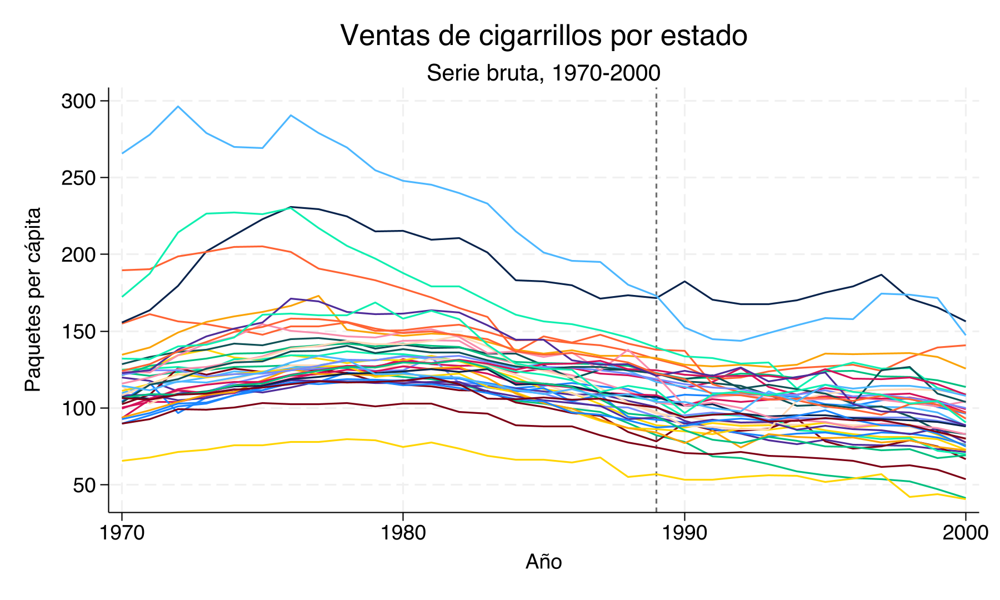
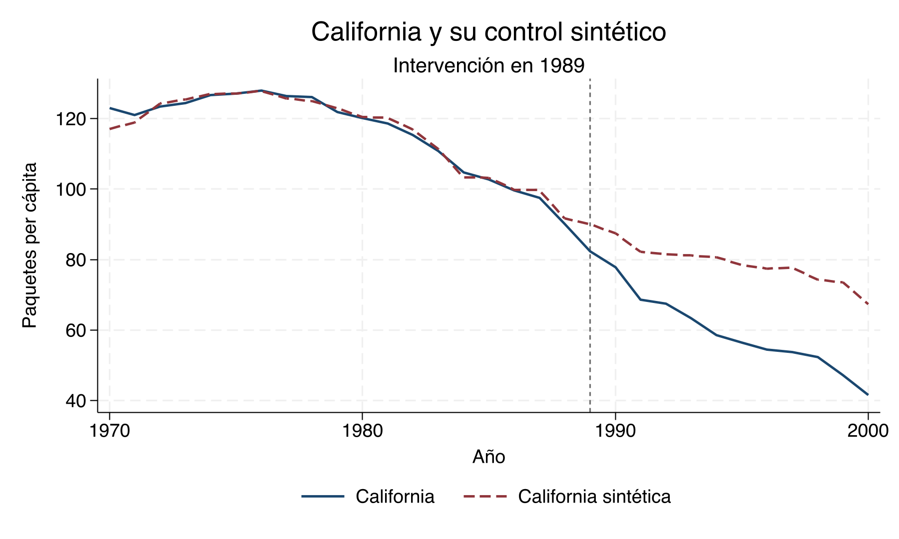
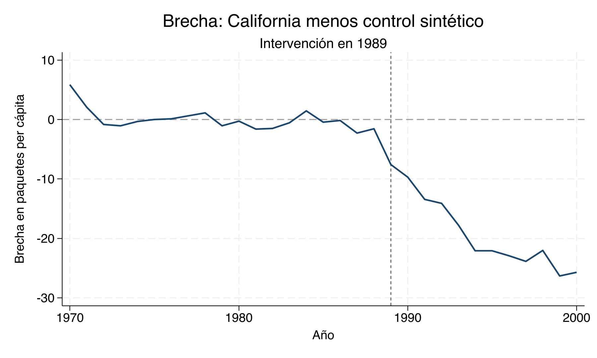
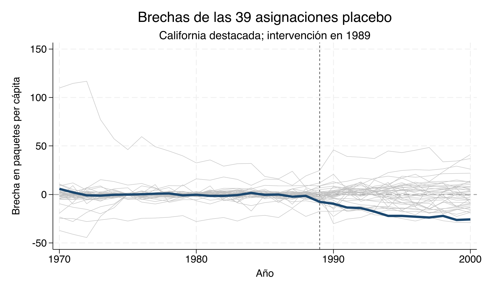
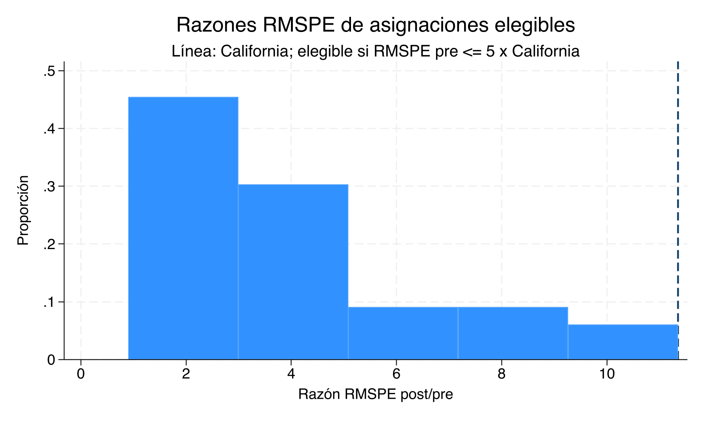
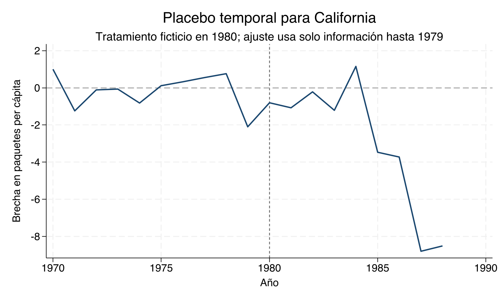
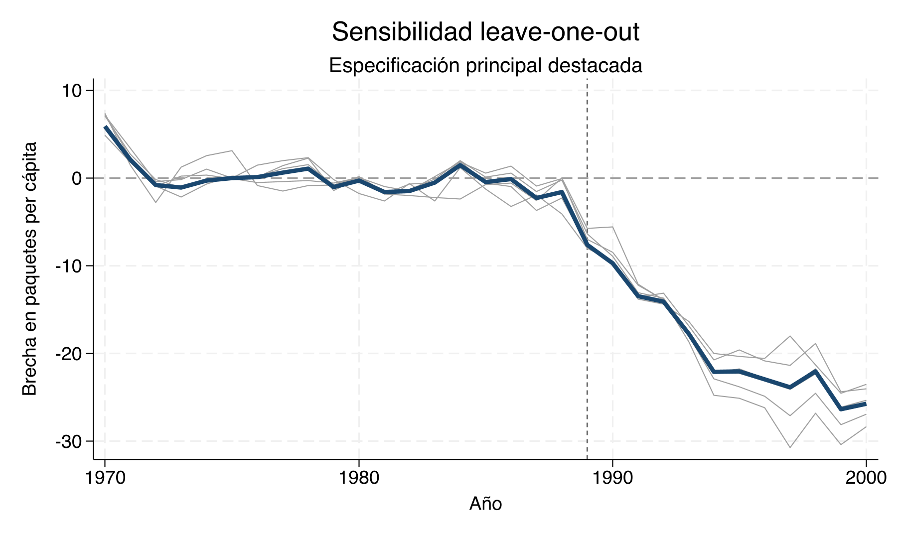

# Controles sintéticos — Clase empírica {#controles-sinteticos-stata}

## Materiales para la clase {-}

- [Do-file completo](dofile/17_SyntheticControls/01_synthetic_controls.do)
- [Datos de Prop 99](dofile/17_SyntheticControls/synth_smoking.dta)

::: {.boxinfo}
**Lecturas centrales**

- [Bernal y Peña — capítulo 6 (PDF)](lecturas/bernal-pena/capitulo-06.pdf)
- [Cunningham — capítulo 10: Synthetic Control](https://mixtape.scunning.com/10-synthetic_control)
- [Abadie, Diamond y Hainmueller (2010) — artículo original (PDF)](https://economics.mit.edu/sites/default/files/publications/Synthetic%20Control%20Methods.pdf)
:::

::: {.boxinfo}
**Metas de aprendizaje**

- Estimar y reconstruir California sintética.
- Auditar ajuste, placebos y sensibilidad a donantes.
- Interpretar la brecha como un estimando dinámico bajo los supuestos del diseño.
:::


---

## Pregunta empírica y datos {-}

La Proposición 99 fue aprobada en noviembre de 1988 y entró en vigor en enero de
1989. Elevó el impuesto a los cigarrillos en California y financió un programa
amplio de control del tabaco. Esta cronología justifica fijar 1989 como primer
periodo tratado. La pregunta es concreta:
**¿qué trayectoria habría seguido el consumo de cigarrillos en California desde
1989 si la política no se hubiera implementado?** Solo una unidad recibe el
tratamiento y no hay un estado que sea, por sí mismo, un control natural obvio.

La base `synth_smoking.dta` reproduce la muestra analítica de
[Abadie, Diamond y Hainmueller (2010)](https://economics.mit.edu/sites/default/files/publications/Synthetic%20Control%20Methods.pdf).
Esa muestra ya excluye el Distrito de Columbia y los estados que, durante
1989--2000, adoptaron programas amplios de control del tabaco o aumentos grandes
del impuesto estatal. Quedan California y 38 donantes. El archivo no permite
reconstruir por sí solo cada exclusión histórica; el criterio proviene de la
fuente primaria y la auditoría reproducible verifica el universo observable.

El panel cubre 1970--2000: ADH comienza en 1970 porque desde ese año el resultado
está disponible para todos los controles y termina en 2000 antes de que políticas
posteriores comprometieran más unidades potenciales. `cigsale` mide ventas de
paquetes de cigarrillos per cápita. California es la unidad 3. Los predictores son
consumo de cerveza (`beer`), ingreso por habitante en logaritmos (`lnincome`),
precio minorista de los cigarrillos (`retprice`), proporción de población de 15 a
24 años (`age15to24`) y rezagos seleccionados del resultado.


Table: (\#tab:sc-sample-audit-table)Auditoría canónica de muestra y disponibilidad de predictores

|Análisis     |Variable        |  Ventana  | Esperadas| Observadas| Faltantes| Auditoría aprobada |
|:------------|:---------------|:---------:|---------:|----------:|---------:|:------------------:|
|panel        |states          | 1970-2000 |        39|         39|         0|         Sí         |
|panel        |years           | 1970-2000 |        31|         31|         0|         Sí         |
|panel        |unit_years      | 1970-2000 |      1209|       1209|         0|         Sí         |
|donor_pool   |eligible_donors | 1970-2000 |        38|         38|         0|         Sí         |
|main         |cigsale         | 1970-2000 |      1209|       1209|         0|         Sí         |
|main         |beer            | 1984-1988 |       195|        195|         0|         Sí         |
|main         |lnincome        | 1980-1988 |       351|        351|         0|         Sí         |
|main         |retprice        | 1980-1988 |       351|        351|         0|         Sí         |
|main         |age15to24       | 1980-1988 |       351|        351|         0|         Sí         |
|main         |cigsale         |   1975    |        39|         39|         0|         Sí         |
|main         |cigsale         |   1980    |        39|         39|         0|         Sí         |
|main         |cigsale         |   1988    |        39|         39|         0|         Sí         |
|time_placebo |lnincome        | 1972-1979 |       312|        312|         0|         Sí         |
|time_placebo |retprice        | 1972-1979 |       312|        312|         0|         Sí         |
|time_placebo |age15to24       | 1972-1979 |       312|        312|         0|         Sí         |
|time_placebo |cigsale         |   1970    |        39|         39|         0|         Sí         |
|time_placebo |cigsale         |   1975    |        39|         39|         0|         Sí         |
|time_placebo |cigsale         |   1979    |        39|         39|         0|         Sí         |

La tabla documenta 39 estados por 31 años, es
decir, 1209 observaciones en un panel balanceado. `cigsale` está
completo en los 1.209 estado-año, y cada predictor está disponible sin faltantes
en la ventana exacta usada por la especificación principal o el placebo temporal.
La fila de elegibilidad confirma los 38 donantes que ya contiene
la muestra ADH; no sustituye la justificación institucional de sus exclusiones.

::: {.boxwarning}
**Diseño antes de cómputo.** La fecha de intervención, el conjunto donante, los
predictores y las ventanas se fijan antes de estudiar la brecha posterior. Los
estados donantes deben permanecer sin exposición directa ni indirecta relevante a
Prop 99. Un promedio simple de estados no tratados no impone comparabilidad y no
es un control sintético.
:::

### Inspección de las series brutas {-}

<div class="figure" style="text-align: center">

<p class="caption">(\#fig:sc-raw-series)Ventas estatales de cigarrillos antes y después de 1989. Fuente: salida canónica de Stata.</p>
</div>

La dispersión de niveles y tendencias deja claro por qué el promedio simple de
los otros estados sería una elección arbitraria. El método buscará una combinación
convexa que reproduzca la historia de California; la figura bruta sirve para
detectar heterogeneidad, cambios comunes y posibles unidades atípicas, no para
elegir donantes después de ver el efecto.

## Especificación y estimación en Stata {-}

El do-file declara el panel, fija 1989 como primer periodo tratado y ejecuta la
estimación canónica:

**Extracto del do-file completo.** No es un script independiente: el preámbulo
resuelve la ruta de trabajo, construye `state_id` y declara `tempfile main_native`.
Para reproducir el análisis desde cero debe ejecutarse el
[do-file completo](dofile/17_SyntheticControls/01_synthetic_controls.do).

```stata
* El preámbulo ya creó state_id y declaró tempfile main_native.
use "synth_smoking.dta", clear
xtset state_id year

synth cigsale beer(1984(1)1988) lnincome retprice age15to24 ///
    cigsale(1988) cigsale(1980) cigsale(1975), ///
    trunit(3) trperiod(1989) xperiod(1980(1)1988) ///
    mspeperiod(1970(1)1988) nested ///
    keep(`main_native') replace
```

Las tres opciones temporales y algorítmicas cumplen funciones distintas:

- `xperiod(1980(1)1988)` define los años sobre los cuales `synth` promedia los
  predictores ordinarios `lnincome`, `retprice` y `age15to24`. La ventana escrita
  dentro de `beer(1984(1)1988)` y los tres valores puntuales de `cigsale` prevalecen
  para esas filas.
- `mspeperiod(1970(1)1988)` define los años del resultado pretratamiento cuyo MSPE
  se minimiza para seleccionar la importancia predictora $V$.
- `nested` elige el algoritmo de optimización que busca $V$; no define una ventana
  de datos ni crea una muestra de validación.

Por tanto, la trayectoria previa completa es un diagnóstico necesario de ajuste
*in-sample*. No es una prueba reservada ni una validación *out-of-sample*.
`trunit(3)` identifica California, `trperiod(1989)` fija el inicio y `keep()`
conserva la trayectoria nativa producida por `synth`.

No se usan observaciones posteriores a 1988 para escoger los pesos. Una vez
estimados, los mismos pesos se aplican a las ventas de los donantes en todo el
horizonte 1970--2000.

::: {.boxinfo}
**Entorno observado de reproducción.** Los artefactos canónicos se regeneraron con
StataNow/SE 19.5 para Unix (Intel 64-bit), revisión 15 Apr 2026, y `synth 0.0.7`
(26 Jan 2014). La instrucción `version 19.0` del do-file congela la sintaxis
interpretada; no reemplaza la versión instalada que se documenta aquí.
:::

## ¿Quién construye a California sintética? {-}

El archivo `results/synth_weights.csv` contiene los pesos devueltos por Stata para
las 38 unidades donantes. La tabla muestra aquellas con peso estrictamente
positivo; los 32 estados restantes reciben peso numéricamente
cero.


Table: (\#tab:sc-weights-table)Pesos positivos de California sintética (salida de Stata)

|Estado      | Identificador Stata|  Peso|
|:-----------|-------------------:|-----:|
|Colorado    |                   4| 0,160|
|Connecticut |                   5| 0,068|
|Montana     |                  19| 0,200|
|Nevada      |                  21| 0,236|
|New Mexico  |                  23| 0,001|
|Utah        |                  34| 0,335|

Los 6 donantes con peso positivo son Colorado, Connecticut, Montana, Nevada, New Mexico, Utah. El
mayor peso corresponde a Utah (0,335).
Los pesos son no negativos y suman 1,000, de
modo que el contrafactual interpola dentro del conjunto donante. La concentración
es informativa sobre soporte y dependencia; no reparte el efecto de la política
entre estados.

## Balance de predictores {-}

Los pesos deben evaluarse por lo que logran reproducir, no por su apariencia. La
tabla combina `results/synth_predictor_balance.csv` con
`results/synth_v_weights.csv`: conserva la escala original de cada predictor y
muestra la diagonal de $V$ devuelta por `synth`.


Table: (\#tab:sc-balance-table)Balance e importancia de predictores de California sintética

|Predictor         | California| Sintética| Diferencia (tratada - sintética)| Importancia V|
|:-----------------|----------:|---------:|--------------------------------:|-------------:|
|beer(1984(1)1988) |     24,280|    24,225|                            0,055|     7.465e-06|
|lnincome          |     10,077|     9,859|                            0,218|     1.036e-07|
|retprice          |     89,422|    89,427|                           -0,005|     9.983e-01|
|age15to24         |      0,174|     0,174|                           -0,000|     7.781e-06|
|cigsale(1988)     |     90,100|    91,673|                           -1,573|     1.119e-05|
|cigsale(1980)     |    120,200|   120,482|                           -0,282|     5.129e-06|
|cigsale(1975)     |    127,100|   127,117|                           -0,017|     1.694e-03|

El balance es cercano, pero no exacto. Por ejemplo, la discrepancia en ventas de
1988 es -1,573 paquetes per cápita y la de ingreso es
0,218 puntos logarítmicos, cerca de
24,3% en niveles. Sin embargo, `lnincome` recibe
una importancia $V$ de apenas
1.04e-07, mientras
retprice concentra
0,998. $V$ no es un coeficiente causal: indica cuánto
penaliza el algoritmo cada discrepancia al construir $W$. Tampoco conviene ordenar
la calidad por diferencias absolutas entre filas porque las escalas son distintas.
Revisar la trayectoria completa previa es un diagnóstico necesario de ajuste
*in-sample*, incluidos cambios que no entraron como predictores puntuales; no es
una prueba reservada de validez.

## Reconstrucción manual del resultado de `synth` {-}

Para auditar el estimador, el do-file combina las ventas observadas de cada
donante con los pesos exportados:

$$
\widehat Y^{N}_{California,t}
=\sum_{j\in\mathcal D}\widehat w_jY_{jt},
\qquad
\widehat\alpha_t=Y_{California,t}-\widehat Y^{N}_{California,t}.
$$

Después compara esa suma con `_Y_synthetic`, la serie nativa de `synth`. El error
máximo en los 31 años es 9.9e-14,
menor que la tolerancia de $10^{-8}$. Esta coincidencia verifica que
la trayectoria publicada se deriva de los pesos mostrados y no de otra rutina.


Table: (\#tab:sc-reconstruction-table)Comprobación de la reconstrucción en años seleccionados

|  Año| California| Sintética de synth| Suma manual ponderada|
|----:|----------:|------------------:|---------------------:|
| 1970|   123,0000|           117,1225|              117,1225|
| 1988|    90,1000|            91,6735|               91,6735|
| 1989|    82,4000|            90,0026|               90,0026|
| 2000|    41,6000|            67,3187|               67,3187|

## Trayectoria observada y contrafactual {-}

<div class="figure" style="text-align: center">

<p class="caption">(\#fig:sc-path-figure)California observada y California sintética. La línea vertical marca el inicio de Prop 99.</p>
</div>

Antes de 1989 las dos series siguen niveles y giros parecidos, con discrepancias
pequeñas pero visibles. Después, las ventas observadas en California se ubican por
debajo del contrafactual y la separación aumenta. La distancia vertical en cada
año es un estimado dinámico, no una comparación antes--después con el propio nivel
de California.

## La brecha anual y su magnitud {-}

<div class="figure" style="text-align: center">

<p class="caption">(\#fig:sc-gap-figure)Brecha anual: California menos California sintética.</p>
</div>

La brecha se define siempre como tratada menos sintética. Su promedio entre 1989 y
2000 es -18,97 paquetes per cápita; durante ese horizonte
va de -26,33 a -7,60. El signo
negativo indica menores ventas observadas que las estimadas para California sin
Prop 99. La lectura causal exige que, en ausencia de la política, la relación que
reconstruyó el periodo previo hubiera permanecido estable.


Table: (\#tab:sc-post-gap-table)Trayectoria posterior y brecha anual, 1989--2000

|  Año| California| Sintética| Brecha|
|----:|----------:|---------:|------:|
| 1989|      82,40|     90,00|  -7,60|
| 1990|      77,80|     87,51|  -9,71|
| 1991|      68,70|     82,16| -13,46|
| 1992|      67,50|     81,58| -14,08|
| 1993|      63,40|     81,16| -17,76|
| 1994|      58,60|     80,69| -22,09|
| 1995|      56,40|     78,46| -22,06|
| 1996|      54,50|     77,44| -22,94|
| 1997|      53,80|     77,67| -23,87|
| 1998|      52,30|     74,35| -22,05|
| 1999|      47,20|     73,53| -26,33|
| 2000|      41,60|     67,32| -25,72|

## RMSPE: ajuste antes y después {-}

Para una ventana $\mathcal T$ el error cuadrático medio de predicción es

$$
RMSPE(\mathcal T)=
\sqrt{\frac{1}{|\mathcal T|}\sum_{t\in\mathcal T}\widehat\alpha_t^2}.
$$


Table: (\#tab:sc-rmspe-table)RMSPE de la especificación principal

|Unidad     | RMSPE pre nativo| RMSPE pre recomp.| RMSPE post| Razón post/pre|
|:----------|----------------:|-----------------:|----------:|--------------:|
|California |         1,756235|          1,754306|     19,913|         11,351|

`synth` reporta un RMSPE pre nativo de 1.756235, calculado durante la optimización
con su precisión interna. La trayectoria guardada y `e(W_weights)` exponen pesos
redondeados a tres decimales; al reconstruir exactamente esa trayectoria publicada
se obtiene 1.754306. La diferencia es de precisión/redondeo, no de ventana. Todos
los placebos, el filtro y la razón de esta clase usan de manera consistente el
RMSPE recomputado desde las brechas exportadas.

El RMSPE previo cuantifica el error que ya existía donde el tratamiento aún no
operaba. La razón post/pre muestra cuánto se deteriora el ajuste después de 1989,
pero no tiene signo, no mide el efecto promedio y no es por sí sola una prueba de
identificación. Debe leerse junto con la gráfica de brechas, la escala del
resultado y las amenazas institucionales al contrafactual.

::: {.boxwarning}
**El buen ajuste previo es necesario, no suficiente.** Aumenta la credibilidad de
la reconstrucción porque el método reproduce resultados observados sin usar el
periodo tratado. No descarta anticipación, interferencia, cambios de medición,
otras políticas simultáneas ni shocks particulares de California o de sus
donantes con peso positivo.
:::

## Placebos espaciales {-}

El do-file reasigna ficticiamente el tratamiento de 1989 a cada una de las
39
unidades, excluye a la unidad placebo de su propio conjunto donante y vuelve a
estimar la misma especificación. California está incluida como la asignación real.

<div class="figure" style="text-align: center">

<p class="caption">(\#fig:sc-placebo-gaps-figure)Brechas de las 39 asignaciones espaciales. California aparece destacada.</p>
</div>

Mostrar todas las asignaciones evita ocultar unidades con mal ajuste o brechas
grandes. La nube también revela por qué comparar magnitudes posteriores sin mirar
el error previo puede ser engañoso: algunas trayectorias placebo ya estaban lejos
de cero antes de 1989.

### Resultados de todas las asignaciones {-}


Table: (\#tab:sc-placebo-table)RMSPE y elegibilidad de todas las asignaciones espaciales

|Unidad         | RMSPE pre| RMSPE post| Razón post/pre| Elegible 5× RMSPE (clase) |Optimización        |
|:--------------|---------:|----------:|--------------:|:-------------------------:|:-------------------|
|California     |     1,754|     19,913|         11,351|            Sí             |nested              |
|Georgia        |     1,187|     11,650|          9,811|            Sí             |nested              |
|Missouri       |     1,044|      8,117|          7,776|            Sí             |nested              |
|Virginia       |     1,923|     14,088|          7,328|            Sí             |nested              |
|Texas          |     2,162|     15,700|          7,263|            Sí             |nested              |
|Indiana        |     3,762|     21,543|          5,727|            Sí             |nested              |
|Louisiana      |     1,493|      8,002|          5,360|            Sí             |nested              |
|West Virginia  |     2,846|     15,192|          5,339|            Sí             |nested              |
|Tennessee      |     2,281|     11,104|          4,868|            Sí             |nested              |
|Oklahoma       |     2,684|     11,834|          4,409|            Sí             |nested              |
|South Carolina |     1,480|      6,414|          4,334|            Sí             |nested              |
|Wisconsin      |     1,723|      7,031|          4,081|            Sí             |nested              |
|New Mexico     |     2,156|      7,974|          3,699|            Sí             |nested              |
|Maine          |     3,096|     11,292|          3,647|            Sí             |nested              |
|Delaware       |     6,354|     20,958|          3,298|            Sí             |nested              |
|Montana        |     2,300|      7,409|          3,222|            Sí             |nested              |
|North Dakota   |     2,839|      8,650|          3,047|            Sí             |nested              |
|Connecticut    |     4,039|     12,187|          3,017|            Sí             |nested              |
|Vermont        |     3,757|     11,175|          2,975|            Sí             |nested              |
|Mississippi    |     2,034|      5,533|          2,720|            Sí             |nested              |
|Idaho          |     2,349|      6,159|          2,622|            Sí             |nested              |
|Illinois       |     2,577|      5,778|          2,242|            Sí             |nested              |
|Nebraska       |     2,309|      4,863|          2,106|            Sí             |nested              |
|Arkansas       |     2,052|      4,218|          2,056|            Sí             |nested              |
|Rhode Island   |    11,218|     22,884|          2,040|            No             |nested              |
|Kentucky       |    20,443|     39,867|          1,950|            No             |nested              |
|South Dakota   |     2,956|      5,734|          1,940|            Sí             |nested              |
|Ohio           |     1,409|      2,533|          1,797|            Sí             |nested              |
|Iowa           |     3,612|      6,486|          1,796|            Sí             |nested              |
|Pennsylvania   |     1,669|      2,708|          1,622|            Sí             |nested              |
|Nevada         |     6,371|      9,136|          1,434|            Sí             |nested              |
|Colorado       |     4,103|      5,871|          1,431|            Sí             |nested              |
|Alabama        |     2,286|      2,595|          1,135|            Sí             |nested              |
|Minnesota      |     3,938|      4,045|          1,027|            Sí             |nested              |
|Kansas         |     3,868|      3,491|          0,902|            Sí             |nested              |
|North Carolina |     9,023|      7,574|          0,839|            No             |nested              |
|Utah           |    24,367|     14,942|          0,613|            No             |default tras rc=430 |
|Wyoming        |     9,680|      5,264|          0,544|            No             |nested              |
|New Hampshire  |    59,038|     17,685|          0,300|            No             |nested              |

### Comparación restringida por ajuste previo {-}

La regla predeclarada conserva una asignación si

$$
RMSPE_i^{pre}\leq 5\,RMSPE_{California}^{pre}.
$$

Esta es una **convención docente de $5\times RMSPE$**, fijada en el diseño del
curso. No replica el filtro de ADH (2010), que conserva unidades bajo
$MSPE_i^{pre}\leq 5\times MSPE_{California}^{pre}$. Como $MSPE=RMSPE^2$, la regla
docente equivale a $25\times MSPE$ y es más laxa. Con estos artefactos conserva
33 asignaciones; el criterio $5\times MSPE$ de ADH conservaría
28. La comparación principal de la clase mantiene su regla
predeclarada y rotula la diferencia.

El umbral calculado desde los CSV es 8,772. Lo cumplen
33 asignaciones y 6 quedan fuera de la comparación
restringida. Entre las elegibles, 1 tiene una razón al menos tan
grande como la de California. Por tanto, la proporción observada es
1/33 = 0,0303.

<div class="figure" style="text-align: center">

<p class="caption">(\#fig:sc-rmspe-ratio-figure)Distribución de las razones RMSPE entre asignaciones que cumplen la regla 5×.</p>
</div>

Esta fracción es **descriptiva**: ubica la asignación real dentro de un conjunto
finito de ejercicios comparables. Su resolución depende de cuántas asignaciones
superan el filtro. No es automáticamente un p-valor asintótico ni convierte la
intercambiabilidad de los estados en un hecho.

### Regla portable de optimización para Utah {-}

Las 39 asignaciones intentan primero `nested`. Cualquier falla de
otra unidad o cualquier código distinto de `rc=430` detiene el do-file. Solo si
Utah falla exactamente con `rc=430` se repite la misma especificación y el mismo
*donor pool* con la optimización por defecto. El contrato admite, por tanto, dos
resultados reproducibles: 39 corridas `nested`, o 38 `nested` más ese único
fallback de Utah. En la corrida canónica observada, Utah devolvió rc=430 con nested y se reestimó con la optimización por defecto. Utah es inelegible bajo 5× RMSPE (24,367 > 8,772), por lo que su ruta de optimización no entra en el numerador ni en el denominador de 1/33.

## Placebo temporal de 1980 sin fuga de información {-}

El placebo temporal pregunta si el procedimiento también produce una ruptura
cuando se finge que el tratamiento comenzó antes de la intervención real. La reestimación es
nueva; no reutiliza los pesos estimados con datos hasta 1988:

**Extracto del do-file completo.** Este bloque depende del panel temporal `panel`,
de la lista de donantes `time_donors` y de `tempfile time_native`, creados en líneas
anteriores del archivo enlazado. Se muestra aquí la llamada que impide la fuga, no
un programa Stata autocontenido.

```stata
* panel, time_donors y tempfile time_native ya fueron creados.
synth cigsale lnincome retprice age15to24 ///
    cigsale(1979) cigsale(1975) cigsale(1970), ///
    trunit(3) trperiod(1980) xperiod(1972(1)1979) ///
    mspeperiod(1970(1)1979) counit(`time_donors') nested ///
    keep(`time_native') replace
```

Todos los predictores y resultados empleados para ajustar los pesos terminan en
1979. `mspeperiod(1970(1)1979)` impide además que la selección de $V$ use el
resultado posterior a la fecha ficticia. `beer` se elimina porque solo está
disponible desde 1984; incluirlo filtraría información posterior al tratamiento
ficticio. Los años 1980--1988 quedan así reservados para evaluar la ruptura
placebo.

<div class="figure" style="text-align: center">

<p class="caption">(\#fig:sc-time-placebo-figure)Placebo temporal con tratamiento ficticio en 1980 y ajuste limitado a información hasta 1979.</p>
</div>

En la ventana 1980--1988, la brecha observada tiene una media de
-2,96 paquetes per cápita y alcanza un mínimo de
-8,80. La combinación sintética ya se separa de California
en dirección negativa antes de la intervención real. Este patrón es una **alerta
para la estabilidad contrafactual**: reduce la confianza en que la relación previa
se habría mantenido intacta y obliga a interpretar con cautela la brecha posterior
a 1989. No invalida mecánicamente el diseño —la escala, persistencia y cronología
de ambas rupturas también importan—, pero impide tratar el placebo temporal como
evidencia plenamente tranquilizadora.

## Sensibilidad leave-one-out {-}

El análisis retira por turno cada donante con peso positivo y vuelve a ejecutar
`synth`; no renormaliza mecánicamente los pesos originales. Como hay
6 donantes positivos, se obtienen 6 reestimaciones,
cada una con 31 años de brechas.

<div class="figure" style="text-align: center">

<p class="caption">(\#fig:sc-loo-figure)Brecha principal y 6 reestimaciones leave-one-out.</p>
</div>


Table: (\#tab:sc-loo-table)Diagnóstico leave-one-out derivado de las brechas reestimadas

|Donante excluido | RMSPE pre| RMSPE post| Brecha post media|
|:----------------|---------:|----------:|-----------------:|
|Colorado         |     1,917|     21,103|            -19,81|
|Connecticut      |     1,976|     19,662|            -18,62|
|Montana          |     1,923|     18,308|            -17,56|
|Nevada           |     2,426|     22,484|            -20,69|
|New Mexico       |     1,752|     20,047|            -19,09|
|Utah             |     2,582|     18,233|            -17,53|

Las brechas posteriores medias de las reestimaciones van de
-20,69 a -17,53, frente a
-18,97 en la especificación principal. La persistencia del
signo informa que el patrón no depende de una sola unidad positiva. No prueba que
los donantes sean válidos, que estén libres de spillovers o que no exista un shock
concurrente; tampoco evalúa sensibilidad a decisiones distintas sobre predictores
o fecha.

## Lectura conjunta de la evidencia {-}

La evaluación debe conectar cuatro piezas:

1. **Soporte y balance:** los pesos forman una combinación convexa y reproducen
   razonablemente los predictores y la historia anterior.
2. **Estimando:** cada brecha anual compara California observada con su
   contrafactual sintético; el promedio posterior resume esa trayectoria sin
   reemplazarla.
3. **Rareza placebo:** la razón RMSPE de California se compara con asignaciones
   que tenían capacidad de ajuste previo semejante bajo una regla predeclarada.
4. **Sensibilidad:** el placebo temporal busca quiebres falsos y el leave-one-out
   detecta dependencia de donantes positivos.

En conjunto, los diagnósticos pueden hacer más o menos creíble el diseño. No
sustituyen el argumento institucional sobre no anticipación, ausencia de
interferencia, medición estable y falta de políticas concurrentes.

## Preguntas de trabajo {-}

::: {.boxexam}
**SC-S1. Pesos y soporte.** Use la tabla de pesos para identificar todos los
donantes con contribución positiva. Verifique las restricciones convexas y evalúe
qué dicen la concentración de pesos y el balance de predictores sobre el soporte.
Explique también qué interpretación de los pesos sería incorrecta.
:::

::: {.boxexam}
**SC-S2. Calidad de ajuste.** Compare el RMSPE previo y posterior, calcule la razón
post/pre y relacione esos tres objetos con la tabla de balance y la trayectoria.
¿Qué mide cada uno y por qué el deterioro posterior no basta para establecer
identificación causal?
:::

::: {.boxexam}
**SC-S3. Brecha y estimando.** Defina la brecha con el orden correcto, resuma su
magnitud entre 1989 y 2000 e interprete su signo y evolución. ¿Bajo qué supuestos
esa secuencia puede leerse como el efecto dinámico de Prop 99 para California?
:::

::: {.boxexam}
**SC-S4. Placebos y sensibilidad.** Reconstruya la regla 5× y la proporción de
asignaciones elegibles con razón al menos tan grande como California. Luego
evalúe qué añaden —y qué no demuestran— la excepción de Utah, el placebo temporal
de 1980 y las 6 reestimaciones leave-one-out.
:::
