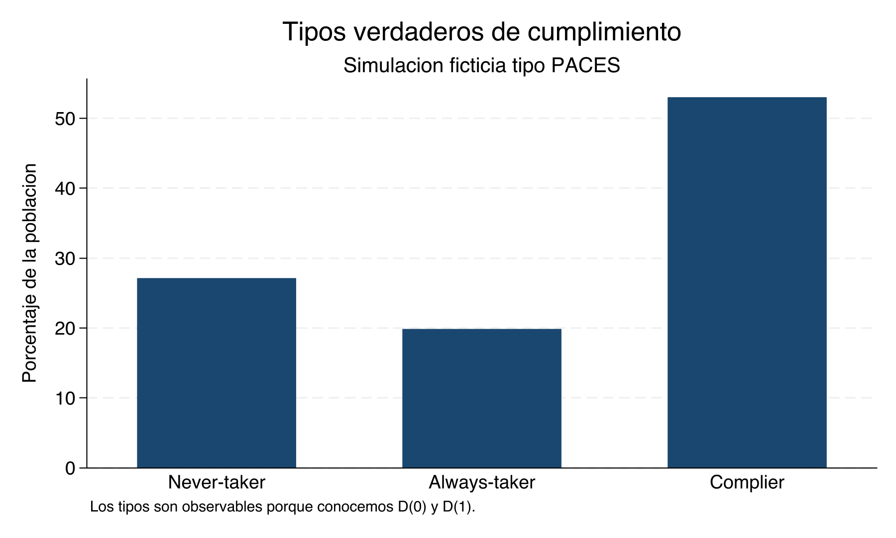
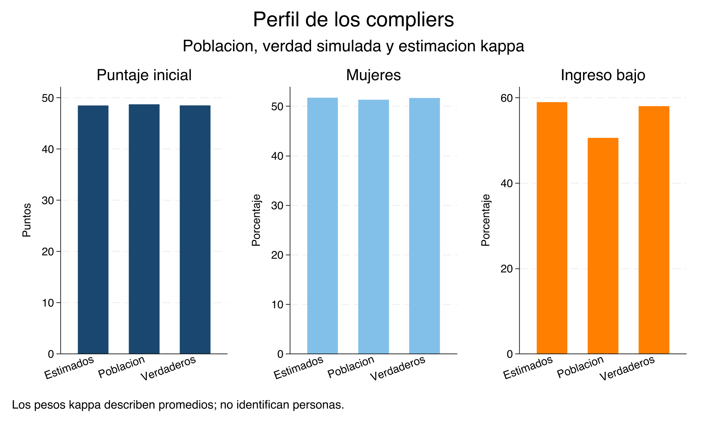
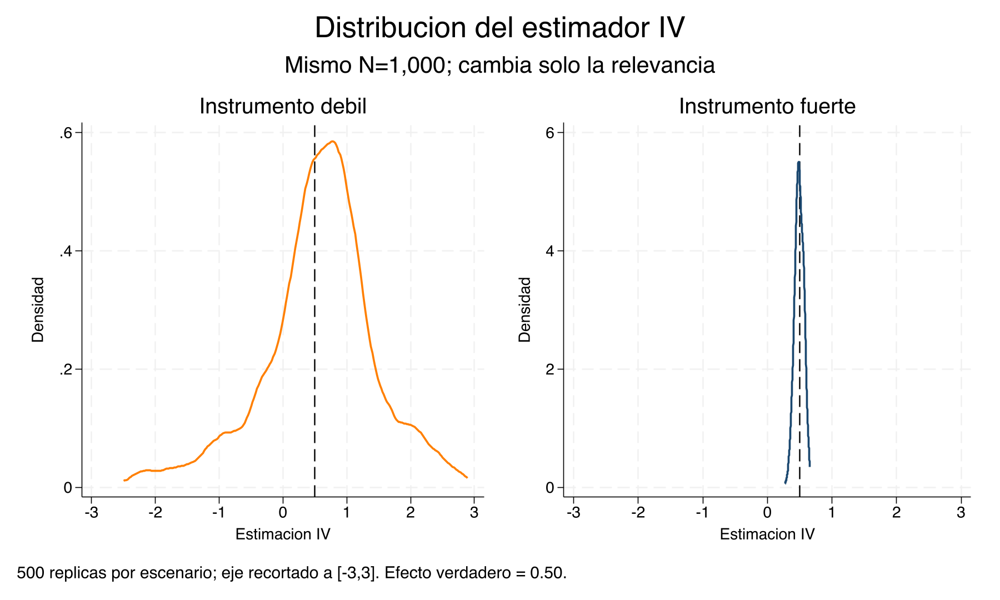
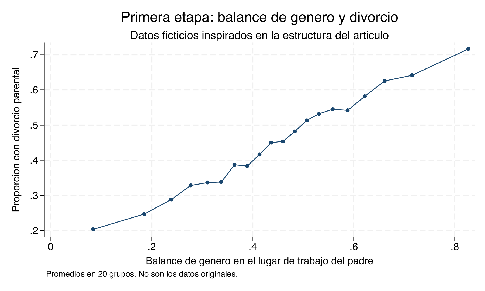

# Variables instrumentales y LATE — Clase empírica {#iv-stata}

::: {.boxdownload}
**Materiales de la clase**

- [Descargar do-file Stata](https://raw.githubusercontent.com/adiazescobar/libro_cortes/main/dofile/18_IV_LATE/IV_LATE_simulacion.do)
- [Descargar base PACES simulada (.dta)](https://raw.githubusercontent.com/adiazescobar/libro_cortes/main/dofile/18_IV_LATE/data/paces_simulada_estudiantes.dta)
- [Descargar base PACES simulada (.csv)](https://raw.githubusercontent.com/adiazescobar/libro_cortes/main/dofile/18_IV_LATE/data/paces_simulada_estudiantes.csv)
- [Descargar base de divorcio simulada (.dta)](https://raw.githubusercontent.com/adiazescobar/libro_cortes/main/dofile/18_IV_LATE/data/divorcio_iv_simulado_estudiantes.dta)
- [Descargar base de divorcio simulada (.csv)](https://raw.githubusercontent.com/adiazescobar/libro_cortes/main/dofile/18_IV_LATE/data/divorcio_iv_simulado_estudiantes.csv)
:::

::: {.boxinfo}
**Lecturas centrales**

- [Bernal y Peña — capítulo 7 (PDF)](lecturas/bernal-pena/capitulo-07.pdf)
- [Cunningham — capítulo 7: Instrumental Variables](https://mixtape.scunning.com/07-instrumental_variables)
- [Frimmel, Halla & Winter-Ebmer (2024) — artículo sobre divorcio (PDF)](https://irihs.ihs.ac.at/id/eprint/7056/1/frimmel-halla-winter-ebmer-2024-how-does-parental-divorce-affect-childrens-long-term-outcomes.pdf)
:::

::: {.boxinfo}
**Metas de aprendizaje**

- Relacionar ITT, primera etapa, forma reducida, Wald y 2SLS
- Comprobar con verdad simulada que IV recupera LATE y no necesariamente ATE o ATT
- Estimar la proporción y el perfil promedio de los compliers sin clasificarlos individualmente
- Leer la salida de `ivreg2` y distinguir Cragg–Donald, Stock–Yogo y Kleibergen–Paap
- Comparar intervalos convencionales con inferencia Anderson–Rubin robusta a instrumentos débiles
- Evaluar la exclusión en una aplicación con instrumento continuo
:::

---

## Antes de comenzar: qué datos estamos usando {-}

Las dos bases de esta clase contienen **datos ficticios** creados por el do-file. La primera está inspirada en la estructura de una lotería como PACES; la segunda, en la pregunta del artículo sobre divorcio y composición de género del lugar de trabajo. **No son los microdatos originales** de ninguno de esos estudios y no reproducen sus estimaciones publicadas.

Stata es la fuente canónica de las bases, tablas y gráficas que aparecen aquí. Las versiones anteriores en Python y R pueden servir como extensiones, pero no afirmamos que produzcan resultados idénticos mientras no estén sujetas a las mismas pruebas numéricas.

Para ejecutar todos los diagnósticos se necesita:

```stata
ssc install ivreg2, replace
ssc install ranktest, replace
```

`lateffects` y `estat compliers` pertenecen a StataNow. El do-file conserva un cálculo manual transparente con pesos de Abadie para que el argumento pedagógico no dependa de la disponibilidad del comando.

---

## Parte A — La verdad que solo conocemos en una simulación {-}

### Una lotería ficticia tipo PACES {-}

Construimos una población en la que $Z=1$ significa ganar una lotería ficticia y $D=1$ usar la beca. Para cada persona generamos los dos tratamientos potenciales:

$$D_i(0),\qquad D_i(1),$$

y los dos resultados potenciales:

$$Y_i(D=0),\qquad Y_i(D=1).$$

En el resto de la clase abreviaremos esta misma convención como `Y(D=0)` y `Y(D=1)` cuando no sea necesario escribir el subíndice individual.

El tratamiento y el resultado observados son

$$D_i=D_i(0)(1-Z_i)+D_i(1)Z_i,$$

$$Y_i=Y_i(D=0)(1-D_i)+Y_i(D=1)D_i.$$

El do-file impone monotonicidad, $D_i(1)\geq D_i(0)$, pero permite efectos heterogéneos. Por construcción, ATE, ATT y LATE son distintos. Esta diferencia es indispensable: si todos tuvieran el mismo efecto, la simulación no enseñaría por qué importa el adjetivo *local*.

```stata
gen byte D0 = compliance_type == 2
gen byte D1 = inlist(compliance_type, 2, 3)
assert D1 >= D0
gen byte D = D0*(1-Z) + D1*Z

gen double Y1 = Y0 + tau_i
gen double Y  = D*Y1 + (1-D)*Y0
```




Table: (\#tab:iv-truth-table)Verdad conocida en la simulación tipo PACES

|Medida                      | Valor|
|:---------------------------|-----:|
|ATE verdadero               | 0.683|
|ATT verdadero               | 0.841|
|LATE verdadero              | 1.316|
|Proporción de compliers     | 0.530|
|Proporción de always-takers | 0.198|
|Proporción de never-takers  | 0.271|
|Proporción de defiers       | 0.000|

::: {.boxinfo}
**Primera distinción**

La tabla anterior utiliza variables latentes que un investigador real nunca observa conjuntamente. Su función es establecer la respuesta correcta antes de ocultar los contrafactuales.
:::

---

## Parte B — La misma base desde la perspectiva del investigador {-}

Ahora conservamos únicamente `Z`, `D`, `Y` y covariables predeterminadas. Ya no observamos `D0`, `D1`, `Y0`, `Y1`, `tau_i` ni `compliance_type`.

### Las cuatro piezas de la estimación {-}

#### ITT {-}

El efecto de ganar la lotería sobre el resultado es

$$ITT_Y=E[Y\mid Z=1]-E[Y\mid Z=0].$$

```stata
reg Y Z, vce(robust)
```

#### Primera etapa {-}

El efecto de ganar sobre el uso de la beca es

$$ITT_D=E[D\mid Z=1]-E[D\mid Z=0].$$

```stata
reg D Z, vce(robust)
```

#### Wald {-}

$$\widehat{LATE}_{Wald}=\frac{\widehat{ITT}_Y}{\widehat{ITT}_D}.$$

#### 2SLS {-}

```stata
ivreg2 Y (D = Z), robust first
ivregress 2sls Y (D = Z), vce(robust)
```

Con una variable endógena, un instrumento y sin covariables, Wald y 2SLS producen el mismo coeficiente. La equivalencia no autoriza calcular los errores estándar con una segunda regresión OLS manual.


Table: (\#tab:iv-paces-estimators)Resultados producidos por Stata: simulación tipo PACES

|Estimacion                       | Valor|
|:--------------------------------|-----:|
|ATE verdadero                    | 0.683|
|ATT verdadero                    | 0.841|
|LATE verdadero                   | 1.316|
|OLS                              | 0.879|
|ITT sobre Y                      | 0.664|
|Primera etapa                    | 0.521|
|Forma reducida                   | 0.664|
|Wald                             | 1.273|
|2SLS                             | 1.273|
|Proporción estimada de compliers | 0.521|

La forma reducida es el numerador y la primera etapa es el denominador. Wald coincide con 2SLS y queda cerca del LATE verdadero, no del ATE ni del ATT. OLS tampoco tiene por qué recuperar alguno de esos tres estimandos.

::: {.boxexam}
**IV-S1.** Sin mirar las variables latentes, use la tabla para reconstruir Wald a partir de la forma reducida y la primera etapa. Identifique el estimando recuperado, compárelo con ATE y ATT y explique por qué una coincidencia entre OLS y alguno de ellos podría ser accidental.
:::

### ¿Quiénes son los compliers? {-}

Bajo monotonicidad:

$$\widehat P(AT)=P(D=1\mid Z=0),$$

$$\widehat P(NT)=P(D=0\mid Z=1),$$

$$\widehat P(C)=P(D=1\mid Z=1)-P(D=1\mid Z=0).$$

La última expresión es exactamente la primera etapa. Sin embargo, las celdas observables siguen siendo mezclas:

| Celda | Tipos posibles bajo monotonicidad |
|---|---|
| $Z=0,D=1$ | Always-takers |
| $Z=1,D=0$ | Never-takers |
| $Z=1,D=1$ | Always-takers y compliers |
| $Z=0,D=0$ | Never-takers y compliers |

Por tanto, **no podemos identificar** qué personas son compliers. Sí podemos estimar sus características promedio mediante los pesos de Abadie. Si $p(X)=P(Z=1\mid X)$,

$$\kappa_i=1-\frac{D_i(1-Z_i)}{1-p(X_i)}-\frac{(1-D_i)Z_i}{p(X_i)}.$$

Entonces, bajo los supuestos,

$$E[g(X)\mid C]=\frac{E[\kappa g(X)]}{E[\kappa]}.$$

En StataNow:

```stata
lateffects kappa (Y) (D) (Z female baseline_score low_income)
estat compliers female baseline_score low_income, genkappa(kappa_statanow)
```

El valor `kappa_statanow` no es una etiqueta y no debe interpretarse automáticamente como una probabilidad individual.




Table: (\#tab:iv-complier-profile)Perfil de compliers producido por Stata

|Grupo               |Variable       |  Media|
|:-------------------|:--------------|------:|
|Population          |Female         |  0.513|
|True compliers      |Female         |  0.517|
|Estimated compliers |Female         |  0.517|
|Population          |Baseline score | 48.732|
|True compliers      |Baseline score | 48.517|
|Estimated compliers |Baseline score | 48.492|
|Population          |Low income     |  0.506|
|True compliers      |Low income     |  0.580|
|Estimated compliers |Low income     |  0.590|

En la simulación podemos comparar la estimación con los compliers verdaderos. En una aplicación real solo tendríamos las columnas de población y estimación.

::: {.boxexam}
**IV-S2.** La proporción estimada de compliers no coincide exactamente con la proporción verdadera de la simulación. Explique por qué esto no contradice la identidad poblacional. Después compare el perfil estimado con el verdadero y evalúe la afirmación: “una observación con peso kappa alto es definitivamente complier”.
:::

---

## Parte C — Instrumentos fuertes, débiles e inferencia {-}

### El experimento correcto: mantener $N$ fijo {-}

Para separar relevancia de tamaño muestral usamos el mismo $N=1{,}000$ y el mismo modelo estructural en dos escenarios. Solo cambia $\pi$, el coeficiente de $Z$ en la primera etapa:

$$D=\pi Z+W+e_D,\qquad Y=0.5D+W+u.$$

```stata
ivreg2 y (D = z), robust first
ivregress 2sls y (D = z), vce(robust)
estat weakrobust, ci ar
```


Table: (\#tab:iv-weak-table)Resultados de Stata con el mismo N y distinta relevancia

|Escenario |    N|   pi| F primera etapa| Kleibergen–Paap F|   OLS|    IV|IC convencional |IC Anderson–Rubin |
|:---------|----:|----:|---------------:|-----------------:|-----:|-----:|:---------------|:-----------------|
|Débil     | 1000| 0.05|            0.41|              0.40| 0.988| 0.845|[-1.836, 3.525] |[-Inf, Inf]       |
|Fuerte    | 1000| 0.70|          213.49|            217.94| 0.876| 0.427|[0.294, 0.561]  |[0.282, 0.552]    |



En el escenario débil, el intervalo Anderson–Rubin puede ser toda la recta real: los datos no descartan ningún valor del parámetro. Esto no es un error de Stata; es información honesta sobre identificación débil. El intervalo convencional, aunque también amplio aquí, descansa en una aproximación que puede tener tamaño incorrecto.

### Cómo leer los diagnósticos de `ivreg2` {-}

1. **Primera etapa y $R^2$ parcial:** muestran cuánto añaden los instrumentos excluidos después de los controles.
2. **Kleibergen–Paap rk LM:** evalúa subidentificación bajo errores no homocedásticos.
3. **Kleibergen–Paap rk Wald $F$:** resume fuerza de primera etapa de forma robusta.
4. **Cragg–Donald:** pertenece al marco homocedástico donde se derivan los valores críticos de Stock–Yogo.
5. **Hansen J:** solo existe con sobreidentificación; un no rechazo no prueba validez.
6. **`endog(D)`:** contrasta exogeneidad de $D$ suponiendo instrumentos válidos.

::: {.boxwarning}
**$F>10$ y 104.7 no son reglas intercambiables**

Diez es una heurística histórica. El valor 104.7 de Lee, McCrary, Moreira y Porter corresponde al test t convencional sin ajuste, al 5%, en un caso específico con un instrumento y una variable endógena. No es un umbral universal y no se aplica mecánicamente al Kleibergen–Paap $F$. Cuando preocupa la debilidad, la respuesta es reportar diagnósticos y usar inferencia robusta como Anderson–Rubin o CLR.
:::

::: {.boxexam}
**IV-S3.** Compare los dos escenarios de la tabla. Explique por qué el mismo $N$ es importante, por qué el escenario débil produce un intervalo Anderson–Rubin no acotado y por qué sería incorrecto concluir que el instrumento fuerte es válido únicamente porque su $F$ es grande.
:::

---

## Parte D — Divorcio: una primera etapa fuerte no basta {-}

### La pregunta publicada y nuestro ejercicio {-}

Frimmel, Halla y Winter-Ebmer estudian el efecto del divorcio parental sobre resultados posteriores de los hijos y utilizan el balance de género en el lugar de trabajo del padre como fuente de variación. Nuestra segunda base contiene **datos ficticios** inspirados únicamente en esa estructura; no reproduce su muestra ni sus resultados.

El instrumento `workplace_gender_balance` es continuo y el tratamiento `parental_divorce` es binario. Generamos deliberadamente:

- un efecto causal verdadero del divorcio;
- confusión no observada entre divorcio y resultados;
- una primera etapa fuerte;
- un canal directo hipotético desde la composición del trabajo hacia el resultado.

El último elemento viola exclusión. Permite comprobar que una salida estadística impecable no puede sustituir el argumento causal.

```stata
local controls "father_age father_educ firm_size industry_female_share"

reg child_outcome parental_divorce `controls', vce(robust)

ivreg2 child_outcome `controls' ///
    (parental_divorce = workplace_gender_balance), robust first

ivregress 2sls child_outcome `controls' ///
    (parental_divorce = workplace_gender_balance), vce(robust)
estat weakrobust, ci ar
```




Table: (\#tab:iv-divorce-table)Resultados de Stata: caso ficticio de divorcio

|Medida                                   |    Valor|
|:----------------------------------------|--------:|
|Efecto causal verdadero                  |  -3.0000|
|Canal directo hipotético por unidad de Z |   1.2000|
|OLS                                      |  -4.2390|
|2SLS                                     |  -1.1990|
|Pendiente de primera etapa               |   0.7152|
|p de primera etapa                       |   0.0000|
|Kleibergen–Paap F                        | 555.3000|

La primera etapa es inequívocamente relevante. Sin embargo, 2SLS no recupera el efecto verdadero porque el proceso generador viola exclusión. Anderson–Rubin protege frente a debilidad del instrumento, **no** frente a un instrumento inválido.

### ¿Dónde están los compliers en este caso? {-}

Con un instrumento continuo no existe una única comparación $Z=1$ frente a $Z=0$. Personas distintas pueden cambiar su decisión ante movimientos distintos del balance de género. Bajo supuestos adicionales de monotonicidad, el IV resume efectos locales correspondientes a los márgenes inducidos a lo largo del soporte; no debemos presentar ese resultado como el LATE de un único grupo binario observable.

La discusión de exclusión debe considerar, como mínimo, salarios, horas, estabilidad laboral, redes, movilidad ocupacional y cambios de comportamiento familiar. Ningún valor de $F$ elimina esos canales.

::: {.boxexam}
**IV-S4.** La tabla reporta una primera etapa muy fuerte y un intervalo Anderson–Rubin que excluye cero, pero 2SLS no coincide con el efecto verdadero. Identifique la razón usando el proceso generador. Después traslade la lección al artículo real: proponga dos argumentos o ejercicios que fortalecerían la exclusión y dos hallazgos que la debilitarían, sin afirmar que un test puede demostrarla.
:::

---

## Lista de verificación para una aplicación IV {-}

Antes de interpretar un coeficiente:

1. defina tratamiento, instrumento, resultado y estimando;
2. muestre la primera etapa y su incertidumbre;
3. argumente independencia y exclusión por separado;
4. explique la monotonicidad que necesita;
5. describa qué margen y qué población generan el efecto local;
6. reporte diagnósticos compatibles con la VCE utilizada;
7. use inferencia robusta a debilidad cuando corresponda;
8. no convierta un no rechazo en prueba de validez;
9. explore sensibilidad a canales directos con conocimiento sustantivo;
10. declare con precisión qué no identifica el diseño.

## Lecturas avanzadas {-}

- [Lee, McCrary, Moreira & Porter (2022), “Valid t-Ratio Inference for IV”](https://www.aeaweb.org/articles?id=10.1257/aer.20211063)
- [Kitagawa (2015), “A Test for Instrument Validity”](https://onlinelibrary.wiley.com/doi/pdf/10.3982/ECTA11974)
- [Documentación de Stata: `lateffects`](https://www.stata.com/manuals/causallateffects.pdf)
- [Documentación de Stata: `estat compliers`](https://www.stata.com/manuals/causallateffectspostestimation.pdf)
- [Documentación de Stata 19: inferencia robusta a instrumentos débiles](https://www.stata.com/new-in-stata/inference-robust-to-weak-instruments/)
